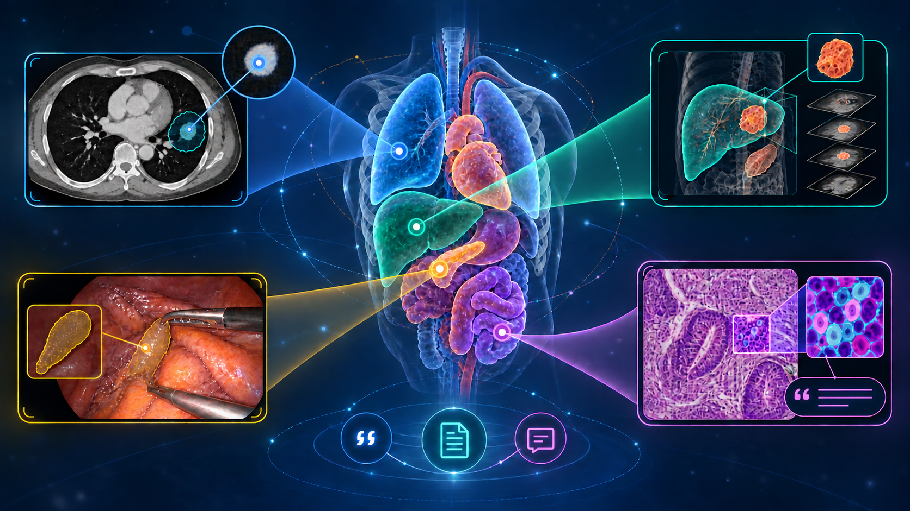

<h1 align="center">Medical Referring Segmentation: A Survey&nbsp;&#129517;</h1>

<p align="center"><a href="https://github.com/alialsalamaa">Ali Alsalama</a></p>

<p align="center">&#128293;A curated survey of methods that segment medical images using referring expressions, clinical descriptions, reports, and other linguistic prompts.&#128293;</p>

<p align="center">&#128227; Papers, datasets, and corrections are welcome; open an <a href="https://github.com/alialsalamaa/Awesome-Medical-Referring-Segmentation/issues/new">issue</a> or submit a <a href="https://github.com/alialsalamaa/Awesome-Medical-Referring-Segmentation/pulls">pull request</a> using the <a href="CONTRIBUTING.md">contribution guide</a>. &#129309;</p>

<p align="center"><strong>Survey coverage through 1 September 2026</strong></p>

<p align="center">
  <a href="https://alialsalamaa.github.io/Awesome-Medical-Referring-Segmentation/"></a>
</p>

<p align="center">
  
</p>

## Contents

- [Dataset taxonomy](#dataset-taxonomy)
  - [2D medical imaging](#2d-medical-imaging)
  - [3D volumetric imaging](#3d-volumetric-imaging)
  - [Video and sequences](#video-and-sequences)
  - [Pathology and microscopy](#pathology-and-microscopy)
- [Paper taxonomy](#paper-taxonomy)
  - [2D medical imaging](#papers-2d-medical-imaging)
  - [3D volumetric imaging](#papers-3d-volumetric-imaging)
  - [Video and sequences](#papers-video-and-sequences)
  - [Pathology and microscopy](#papers-pathology-and-microscopy)
- [Contributing](#contributing)
- [Citation](#citation)

## Dataset taxonomy

Dataset names follow the canonical naming used in the survey appendix. Different releases and challenge tasks remain separate, while organ-specific result rows and spelling aliases map to their parent dataset. Links point to the original data portal, challenge, creator repository, authoritative project paper, or a disclosed archival mirror when the original host is unavailable.

> [!IMPORTANT]
> The dataset index includes named public, registration-gated, controlled-access, and request-based research datasets. Private or unnamed cohorts, aggregate-only result labels, and internal evaluation partitions are not shown as datasets.

<!-- BEGIN GENERATED DATASET CATALOG -->
<a id="2d-medical-imaging"></a>
<details>
<summary><strong>2D medical imaging</strong> (214 datasets)</summary>

| Dataset | Data | Origin | Annotation | Access |
|:--|:--|:--|:--|:--|
| [100+ 2D US Images and Tumor Segmentation Masks](<https://doi.org/10.13140/RG.2.2.36586.77761>)<br><sub>No version label stated</sub> | Ultrasound<br><sub>2D: 105 2D ultrasound images with paired tumor masks</sub> | Liver<br><sub>Liver metastases from pancreatic cancer</sub> | Pixel-level tumor segmentation masks | Registration |
| [3D-IRCADb-01](<https://www.ircad.fr/research-and-development/data-sets/liver-segmentation-3d-ircadb-01/>)<br><sub>3D-IRCADb-01 release</sub> | CT<br><sub>3D: 20 3D CT studies in DICOM plus labelled DICOM masks and VTK meshes</sub> | Liver<br><sub>Human liver; hepatic tumors in 75% of cases</sub> | Voxel masks and meshes for liver, tumors, vessels, and neighboring structures | Public |
| [A Composite Retinal Fundus and OCT Dataset with Detailed Clinical Markings of Retinal Layers and Retinal Lesions to Grade Macular and Glaucomatous Disorders](<https://data.mendeley.com/datasets/trghs22fpg/4>)<br><sub>Version 4</sub> | Fundus photography; OCT<br><sub>2D: 2D color-fundus and OCT images</sub> | Retina; Optic nerve head<br><sub>Human retina / optic nerve head</sub> | Optic disc and cup masks with glaucoma-related labels | Public |
| [A Multi-site Dataset for Prostate MRI Segmentation](<https://liuquande.github.io/SAML/>)<br><sub>No version label stated on the official dataset page</sub> | MRI<br><sub>3D: 3D/multi-slice prostate T2-weighted MRI standardized in the axial plane and distributed in NIfTI; six data sources from three public datasets</sub> | Prostate<br><sub>Human prostate</sub> | Prostate segmentation masks | Public |
| [AbdomenAtlas](<https://www.zongweiz.com/dataset>)<br><sub>AbdomenAtlas 1.0, 1.1, 2.0, and 3.0</sub> | CT<br><sub>3D: 3D CT volumes; successive releases add anatomy, lesions, and reports</sub> | Abdomen; Whole body<br><sub>Human abdomen, whole-body anatomy, and abdominal tumors</sub> | Voxel-level anatomy/tumor masks; 3.0 also includes structured and narrative reports | Registration |
| [AbdomenCT-1K](<https://github.com/JunMa11/AbdomenCT-1K>)<br><sub>Initial benchmark release; 2021-02-08 annotation-correction update; no numbered version stated</sub> | CT<br><sub>3D: More than 1,000 3D abdominal CT scans assembled from multiple source cohorts</sub> | Abdomen<br><sub>Human abdomen</sub> | Voxel-level masks for liver, kidneys, spleen, and pancreas; later extensions add multi-organ and pseudo-tumor labels | Registration |
| [ACDC — Automated Cardiac Diagnosis Challenge](<https://www.creatis.insa-lyon.fr/Challenge/acdc/>)<br><sub>ACDC 2017 challenge release</sub> | MRI<br><sub>3D: 150 3D cine cardiac MRI studies</sub> | Heart<br><sub>Human heart across five diagnostic groups</sub> | Voxel-level left/right ventricle and myocardium masks plus diagnosis labels | Registration |
| [AMOS22 — Multi-Modality Abdominal Multi-Organ Segmentation Challenge 2022](<https://amos22.grand-challenge.org/>)<br><sub>AMOS 2022 release</sub> | CT; MRI<br><sub>3D: 500 CT and 100 MRI 3D abdominal volumes</sub> | Abdomen<br><sub>Human abdomen</sub> | Voxel-level masks for 15 abdominal organs; evaluation labels hidden | Partial release |
| [Annotated Ultrasound Liver Images](<https://zenodo.org/records/7272660>)<br><sub>2022 release</sub> | Ultrasound<br><sub>2D: 2D liver ultrasound images</sub> | Liver<br><sub>Human liver; normal, benign mass, and malignant mass cases</sub> | Liver and mass contour masks plus image-level diagnosis | Public |
| [ARCADE](<https://arcade.grand-challenge.org/arcade/>)<br><sub>ARCADE 2023 release</sub> | X-ray<br><sub>2D: 2D X-ray coronary-angiography frames</sub> | Vasculature<br><sub>Human coronary arteries</sub> | Coronary-vessel masks and stenosis localization labels; evaluation labels hidden | Partial release |
| [ATLAS R2.0 — Anatomical Tracings of Lesions After Stroke](<https://atlas.grand-challenge.org/ATLAS/>)<br><sub>ATLAS Release 2.0</sub> | MRI<br><sub>3D: 3D T1-weighted MRI volumes</sub> | Brain<br><sub>Human brain after stroke</sub> | Expert voxel-level stroke-lesion masks | Registration |
| [AutoLaparo](<https://autolaparo.github.io/>)<br><sub>AutoLaparo 2022 release</sub> | Endoscopy<br><sub>Video: 21 full-length laparoscopic-hysterectomy videos</sub> | Pelvis<br><sub>Human gynecologic surgical field</sub> | Temporal phase/action labels plus instrument and key-anatomy annotations | Public |
| [Automatic Detection Challenge on Age-Related Macular Degeneration (ADAM)](<https://amd.grand-challenge.org/>)<br><sub>ADAM 2020 challenge release</sub> | Fundus photography<br><sub>2D: 2D color-fundus photographs</sub> | Retina<br><sub>Human retina with age-related macular degeneration</sub> | AMD class labels plus optic-disc, fovea, and lesion localization/segmentation annotations; test labels hidden | Partial release |
| [BBBC038v1 — Kaggle 2018 Data Science Bowl](<https://bbbc.broadinstitute.org/BBBC038>)<br><sub>BBBC038 version 1; 2018 Data Science Bowl release</sub> | Digital pathology; Microscopy<br><sub>2D: 841 2D microscopy and histopathology images</sub> | Multiple tissues<br><sub>Human, mouse, and fly nuclei from multiple tissues and experiments</sub> | Per-nucleus instance segmentation masks | Public |
| [BCSS-WSSS](<https://github.com/ChuHan89/WSSS-Tissue>)<br><sub>WSSS-Tissue / BCSS-WSSS release</sub> | Digital pathology<br><sub>2D: 2D H&amp;E pathology patches derived from BCSS</sub> | Breast<br><sub>Human breast cancer tissue</sub> | Patch-level labels for training and pixel-level four-class tissue masks for validation/test | Public |
| [BHSD: A 3D Multi-class Brain Hemorrhage Segmentation Dataset](<https://github.com/White65534/BHSD>)<br><sub>BHSD release; no version number stated</sub> | CT<br><sub>2D; 3D: 192 3D head CT volumes and derived 2D slices</sub> | Brain<br><sub>Human brain; intracranial hemorrhage</sub> | Voxel/pixel hemorrhage masks and five hemorrhage-type labels | Public |
| [BiomedParseData](<https://huggingface.co/datasets/microsoft/BiomedParseData>)<br><sub>Initial BiomedParseData release</sub> | CT; Dermoscopy; Digital pathology; Endoscopy; Fundus photography; MRI; Ultrasound; X-ray<br><sub>2D: More than one million 2D images or 2D slices assembled from 45 public datasets</sub> | Multiple organs<br><sub>Multiple human organs, tissues, and lesions</sub> | Semantic segmentation masks paired with biomedical text labels | Registration |
| [BKAI-IGH NeoPolyp](<https://www.kaggle.com/competitions/bkai-igh-neopolyp>)<br><sub>BKAI-IGH NeoPolyp 2023 challenge release</sub> | Endoscopy<br><sub>2D: 2D colonoscopy images</sub> | Colon<br><sub>Human colorectal polyps</sub> | Pixel-level polyp masks with neoplastic/non-neoplastic classes | Registration |
| [Bone Fracture](<https://universe.roboflow.com/roboflow-100/bone-fracture-7fylg>)<br><sub>Roboflow Universe dataset release; version shown on host</sub> | X-ray<br><sub>2D: 2D radiographs</sub> | Bone<br><sub>Human bones from multiple anatomical sites</sub> | Fracture localization annotations; host provides downloadable detection/segmentation formats | Registration |
| [Bone Fracture Detection: Computer Vision Project](<https://www.kaggle.com/datasets/pkdarabi/bone-fracture-detection-computer-vision-project>)<br><sub>Kaggle release; no stable version label stated</sub> | X-ray<br><sub>2D: 2D radiographs with object-detection/segmentation labels</sub> | Bone<br><sub>Human bones from multiple anatomical sites</sub> | Fracture bounding boxes and segmentation labels | Registration |
| [Brain MRI Segmentation — LGG MRI Dataset](<https://www.kaggle.com/datasets/mateuszbuda/lgg-mri-segmentation>)<br><sub>Kaggle release; no stable version label stated</sub> | MRI<br><sub>2D: 2D FLAIR MRI slices with clinical metadata</sub> | Brain<br><sub>Human brain; lower-grade glioma</sub> | Pixel-level tumor masks | Registration |
| [brain tumor dataset](<https://figshare.com/articles/dataset/brain_tumor_data-set/1512427>)<br><sub>Version 8; published 2024</sub> | MRI<br><sub>2D: 3,064 2D contrast-enhanced T1 MRI slices stored in MATLAB files</sub> | Brain<br><sub>Human brain; glioma, meningioma, and pituitary tumors</sub> | Tumor masks, class labels, and patient identifiers | Public |
| [Brain Tumor Segmentation (BraTS) Challenge datasets](<https://www.synapse.org/Synapse:syn51156910/wiki/622351>)<br><sub>BraTS 2019, 2020, 2021, and 2023 task releases represented in the survey</sub> | MRI<br><sub>3D: 3D multimodal brain MRI volumes</sub> | Brain<br><sub>Human brain tumors, including glioma, meningioma, metastasis, pediatric tumors, and sub-Saharan Africa cohorts</sub> | Voxel-level tumor-subregion masks; task-dependent clinical labels; evaluation labels hidden | Partial release |
| [Breast Cancer Semantic Segmentation (BCSS) Dataset](<https://github.com/PathologyDataScience/BCSS>)<br><sub>BCSS public release; no version number stated</sub> | Digital pathology<br><sub>2D: H&amp;E whole-slide-derived RGB regions and annotation files</sub> | Breast<br><sub>Human breast cancer tissue from TCGA</sub> | Pixel-level labels for tumor, stroma, lymphocytes, necrosis, and other tissue regions | Public |
| [Breast Ultrasound Image Database](<https://qamebi.com/breast-ultrasound-images-database/>)<br><sub>No version label stated</sub> | Ultrasound<br><sub>2D: 2D breast ultrasound images</sub> | Breast<br><sub>Human breast tumors</sub> | Expert lesion masks and benign/malignant labels | Public |
| [Breast Ultrasound Images (BUSI) Dataset](<https://scholar.cu.edu.eg/?q=afahmy/pages/dataset>)<br><sub>2020 Data in Brief release</sub> | Ultrasound<br><sub>2D: 780 2D PNG breast ultrasound images from 600 patients</sub> | Breast<br><sub>Human breast; normal, benign, and malignant cases</sub> | Pixel-level lesion masks and three-class diagnosis labels | Public |
| [BREAST-LESIONS-USG](<https://www.cancerimagingarchive.net/collection/breast-lesions-usg/>)<br><sub>TCIA collection release; no version number stated</sub> | Ultrasound<br><sub>2D: 2D B-mode and Doppler ultrasound images with clinical/pathology metadata</sub> | Breast<br><sub>Human breast lesions</sub> | Lesion segmentations, BI-RADS/pathology and clinical labels | Public |
| [BRISC 2025](<https://www.kaggle.com/datasets/briscdataset/brisc2025>)<br><sub>BRISC 2025 release</sub> | MRI<br><sub>2D: 2D contrast-enhanced T1-weighted MRI slices in JPEG plus PNG masks and manifests</sub> | Brain<br><sub>Human brain; glioma, meningioma, pituitary tumor, and no-tumor cases</sub> | Pixel-level tumor masks and four-class image labels | Registration |
| [BUS-BRA: A Breast Ultrasound Dataset for Assessing Computer-Aided Diagnosis Systems](<https://zenodo.org/records/8231412>)<br><sub>2023 release; record updated 2024</sub> | Ultrasound<br><sub>2D: 1,875 2D PNG breast ultrasound images from 1,064 patients plus CSV metadata</sub> | Breast<br><sub>Human breast lesions</sub> | Tumor masks, benign/malignant labels, and BI-RADS categories | Public |
| [BUS-UCLM: Breast Ultrasound Lesion Segmentation Dataset](<https://data.mendeley.com/datasets/7fvgj4jsp7/3>)<br><sub>Version 3</sub> | Ultrasound<br><sub>2D: 683 2D PNG breast ultrasound images from 38 scans</sub> | Breast<br><sub>Human breast; normal, benign, and malignant findings</sub> | RGB lesion masks and image-level diagnostic class | Public |
| [BUS_UC](<https://data.mendeley.com/datasets/3ksd7w7jkx/1>)<br><sub>Version 1</sub> | Ultrasound<br><sub>2D: 811 2D PNG breast ultrasound images</sub> | Breast<br><sub>Human breast tumors</sub> | Radiologist lesion masks and benign/malignant labels | Public |
| [BUU-LSPINE](<https://services.informatics.buu.ac.th/spine/>)<br><sub>Version 0.1</sub> | X-ray<br><sub>2D: 400 paired AP/lateral lumbar-spine radiographs in JPG with CSV coordinates</sub> | Spine<br><sub>Human lumbar spine</sub> | Vertebral edge coordinates and four disorder diagnosis labels | Request |
| [Calgary-Campinas-359 (CC-359) Dataset](<https://www.ccdataset.com/download>)<br><sub>Calgary-Campinas version 1.0</sub> | MRI<br><sub>3D: 359 3D T1-weighted brain MRI volumes; NIfTI/HDF5 and selected raw k-space releases</sub> | Brain<br><sub>Adult human brain across vendors and field strengths</sub> | Brain masks; selected derivative releases add hippocampus or other structure masks | Public |
| [CAMUS](<https://www.creatis.insa-lyon.fr/Challenge/camus/>)<br><sub>CAMUS 2019 release</sub> | Ultrasound<br><sub>2D; Video: 2D apical two- and four-chamber echocardiography sequences from 500 patients</sub> | Heart<br><sub>Human heart</sub> | LV endocardium, myocardium, and left-atrium masks at end diastole/systole plus clinical measurements | Public |
| [CANDID-PTX](<https://figshare.com/articles/dataset/CANDID-PTX/14173982>)<br><sub>2024-03-18 dataset posting</sub> | X-ray<br><sub>2D: 19,237 2D chest radiographs in DICOM plus free-text reports and CSV annotations</sub> | Thorax<br><sub>Human thorax; pneumothorax, acute rib fracture, and chest tubes</sub> | RLE pixel masks and image/report labels | Controlled |
| [cardiacUDC_dataset](<https://www.kaggle.com/datasets/xiaoweixumedicalai/cardiacudc-dataset>)<br><sub>Kaggle release posted 2023-11-01; no numbered version stated</sub> | Ultrasound<br><sub>2D; Video: 992 echocardiography videos from two sites, four standard views, and more than 100 frames per video</sub> | Heart<br><sub>Human heart</sub> | Pixel-level cardiac-structure masks; five labeled frames per training video and every frame labeled in validation/test videos | Registration |
| [CC-TUMOR-HETEROGENEITY](<https://www.cancerimagingarchive.net/collection/cc-tumor-heterogeneity/>)<br><sub>TCIA versions 1 and 2; current version 2 updated 2023-02-23</sub> | CT; MRI; PET<br><sub>3D: 23 longitudinal 3D multimodal imaging studies in DICOM plus clinical data</sub> | Cervix<br><sub>Human uterine cervix with advanced cervical cancer</sub> | Tumor-volume RTSTRUCT contours, image registrations, and clinical follow-up/classification fields | Public |
| [CDD-CESM](<https://www.cancerimagingarchive.net/collection/cdd-cesm/>)<br><sub>CDD-CESM release, updated 2022</sub> | Mammography<br><sub>2D: 2,006 2D contrast-enhanced spectral mammography images with tabular metadata</sub> | Breast<br><sub>Human breast lesions</sub> | Lesion regions plus pathology, BI-RADS, and clinical labels | Public |
| [CHAOS — Combined CT-MR Healthy Abdominal Organ Segmentation](<https://chaos.grand-challenge.org/>)<br><sub>CHAOS 2019 release</sub> | CT; MRI<br><sub>3D: 3D abdominal CT and T1/T2 MRI</sub> | Abdomen<br><sub>Human abdomen</sub> | Voxel-level liver, kidneys, and spleen masks; evaluation labels hidden | Partial release |
| [CHASE_DB1 Retinal Vessel Reference Dataset](<https://researchinnovation.kingston.ac.uk/en/datasets/chasedb1-retinal-vessel-reference-dataset-4/>)<br><sub>Kingston University release made available in 2012; no numbered version stated</sub> | Fundus photography<br><sub>2D: 28 2D color retinal images from both eyes of 14 children</sub> | Retina<br><sub>Human retina from multi-ethnic schoolchildren in the CHASE study</sub> | Two independent pixel-level manual vessel segmentations per image | Public |
| [Chest Xray Masks and Labels](<https://www.kaggle.com/datasets/nikhilpandey360/chest-xray-masks-and-labels>)<br><sub>Kaggle release; no stable version label stated</sub> | X-ray<br><sub>2D: 704 2D chest radiographs with lung masks</sub> | Lung<br><sub>Human lungs; Montgomery County and Shenzhen cohorts</sub> | Expert left/right lung segmentation masks plus source labels | Registration |
| [ChestX-Det-Dataset](<https://github.com/Deepwise-AILab/ChestX-Det-Dataset>)<br><sub>ChestX-Det10 and ChestX-Det14 releases</sub> | X-ray<br><sub>2D: 3,578 2D chest radiographs</sub> | Thorax<br><sub>Human thorax</sub> | Instance-level bounding boxes and masks for common thoracic abnormalities | Public |
| [CheXlocalize](<https://aimi.stanford.edu/datasets/chexlocalize>)<br><sub>CheXlocalize release accompanying the 2022 paper; dataset DOI 10.71718/hap9-kn94</sub> | X-ray<br><sub>2D: 902 2D frontal chest radiographs from the CheXpert validation (234) and test (668) sets</sub> | Thorax<br><sub>Human thorax</sub> | Radiologist pixel-level segmentations and most-representative points for ten pathologies | Registration |
| [CholecSeg8k](<https://www.kaggle.com/datasets/newslab/cholecseg8k>)<br><sub>2020 release</sub> | Endoscopy<br><sub>2D; Video: 8,080 2D frames sampled from 17 Cholec80 videos</sub> | Abdomen<br><sub>Human laparoscopic cholecystectomy field</sub> | Pixel-level semantic masks for 13 anatomy/instrument classes | Registration |
| [CMRxMotion 2022](<http://cmr.miccai.cloud/>)<br><sub>CMRxMotion 2022 challenge release</sub> | MRI<br><sub>3D: 3D cardiac MRI with respiratory and cardiac motion conditions</sub> | Heart<br><sub>Human heart</sub> | Cardiac-structure masks and motion-quality labels; evaluation labels hidden | Partial release |
| [CoCaHis Dataset — Colon Cancer Histopathological Dataset](<https://cocahis.irb.hr/>)<br><sub>2021 release</sub> | Digital pathology<br><sub>2D: 2D H&amp;E histopathology tiles and HDF5 data</sub> | Liver<br><sub>Human colorectal-cancer liver metastasis tissue</sub> | Pixel-level tissue/cell segmentation and classification labels | Public |
| [COLORECTAL-LIVER-METASTASES](<https://www.cancerimagingarchive.net/collection/colorectal-liver-metastases/>)<br><sub>TCIA versions 1 and 2; current version 2 updated 2023-04-25</sub> | CT<br><sub>3D: 197 preoperative 3D CT studies with DICOM segmentations and CSV clinical/survival data</sub> | Liver<br><sub>Human liver with colorectal liver metastases</sub> | DICOM SEG annotations supplied with the images plus demographic, measurement, treatment, and survival variables | Public |
| [ComLesion-14K](<https://huggingface.co/datasets/silver1024/ComLesion-14K>)<br><sub>Initial release; 13,678 samples</sub> | CT; Dermoscopy; Digital pathology; Endoscopy; Fundus photography; MRI; OCT; Ultrasound; X-ray<br><sub>2D: 2D images, masks, bounding boxes, questions, answers, and chain-of-thought text</sub> | Multiple organs<br><sub>Multiple organs and lesion types</sub> | Pixel masks, boxes, class labels, referring prompts, and reasoning text | Public |
| [Common Carotid Artery Ultrasound Images](<https://data.mendeley.com/datasets/d4xt63mgjm/1>)<br><sub>Version 1</sub> | Ultrasound<br><sub>2D: 2D common-carotid ultrasound images</sub> | Vasculature<br><sub>Human common carotid artery</sub> | Pixel-level artery segmentation masks | Public |
| [CoNIC: Colon Nuclei Identification and Counting Challenge 2022](<https://conic-challenge.grand-challenge.org/>)<br><sub>CoNIC 2022 release</sub> | Digital pathology<br><sub>2D: 4,981 H&amp;E colon image tiles</sub> | Colon<br><sub>Human colorectal tissue</sub> | Per-nucleus instance masks and six nucleus-type classes; evaluation labels hidden | Partial release |
| [CoNSeP](<https://warwick.ac.uk/fac/sci/dcs/research/tia/data/hovernet/>)<br><sub>CoNSeP public release</sub> | Digital pathology<br><sub>2D: 41 H&amp;E colorectal image tiles</sub> | Colon<br><sub>Human colorectal adenocarcinoma tissue</sub> | Per-nucleus instance masks and nucleus-type labels | Public |
| [COph100: A Comprehensive Fundus Image Registration Dataset from Infants Constituting the RIDIRP Database](<https://doi.org/10.6084/m9.figshare.27061084.v1>)<br><sub>Version 1</sub> | Fundus photography<br><sub>2D: 100 paired color-fundus images with correspondence data</sub> | Retina<br><sub>Human retina</sub> | Manual correspondence landmarks and automatically generated vessel masks | Public |
| [COVID-19 CT Segmentation Dataset](<https://www.medseg.ai/covid-19>)<br><sub>COVID-19 CT Segmentation Dataset release</sub> | CT<br><sub>2D; 3D: 3D chest CT volumes and 2D slices</sub> | Lung<br><sub>Human lungs with COVID-19</sub> | Voxel/pixel infection masks; some releases also provide lung/lobe masks | Public |
| [COVID-19 Radiography Database](<https://www.kaggle.com/datasets/tawsifurrahman/covid19-radiography-database>)<br><sub>Kaggle releases; current host version is mutable</sub> | X-ray<br><sub>2D: 2D chest radiographs in image folders</sub> | Lung<br><sub>Human lungs; COVID-19, viral pneumonia, other opacity, and normal cases</sub> | Image-level diagnosis labels; a subset includes lung masks | Registration |
| [COVID-QU-Ex](<https://www.kaggle.com/datasets/anasmohammedtahir/covidqu>)<br><sub>COVID-QU-Ex release</sub> | X-ray<br><sub>2D: 2D chest radiographs</sub> | Lung<br><sub>Human lungs; COVID-19, non-COVID infection, and normal</sub> | Lung masks, infection masks, and image-level class labels | Registration |
| [covid_rural_annot release folder (official standalone title not stated)](<https://github.com/haimingt/opacity_segmentation_covid_chest_X_ray/tree/master/covid_rural_annot>)<br><sub>Initial public release</sub> | X-ray<br><sub>2D: 221 2D chest radiographs</sub> | Lung<br><sub>Human lungs with COVID-19 opacity</sub> | Pixel-level lung-opacity masks | Public |
| [CPM-15](<https://doi.org/10.3389/fbioe.2019.00053>)<br><sub>MICCAI 2015 challenge release</sub> | Digital pathology<br><sub>2D: 15 2D H&amp;E histopathology image tiles from TCGA</sub> | Brain<br><sub>Human tumor tissue from two cancer types; specific types not stated by the cited source</sub> | Per-nucleus instance segmentation masks | Request |
| [CPM-17](<https://doi.org/10.3389/fbioe.2019.00053>)<br><sub>MICCAI 2017 Computational Precision Medicine challenge release</sub> | Digital pathology<br><sub>2D: 32 training and 32 test 2D H&amp;E histopathology image tiles from TCGA</sub> | Brain; Head and neck; Lung<br><sub>Human GBM, LGG, HNSCC, and NSCLC tumor tissue</sub> | Per-nucleus instance segmentation masks; test labels held back during challenge | Request |
| [CRAG](<https://warwick.ac.uk/fac/sci/dcs/research/tia/data/mildnet/>)<br><sub>CRAG release accompanying MILD-Net (2019); no numbered version stated</sub> | Digital pathology<br><sub>2D: 213 2D H&amp;E colorectal-adenocarcinoma images from 38 whole slides</sub> | Colon<br><sub>Human colorectal cancer glands</sub> | Pixel-level gland instance masks | Registration |
| [CryoNuSeg: A Dataset for Nuclei Segmentation of Cryosectioned H&amp;E-Stained Histological Images](<https://github.com/masih4/CryoNuSeg>)<br><sub>CryoNuSeg release; Kaggle mirror version 4</sub> | Digital pathology<br><sub>2D: 30 512×512 RGB cryosection H&amp;E images from ten organs</sub> | Multiple organs<br><sub>Human nuclei across ten organs</sub> | Per-nucleus instance masks with boundary information | Public |
| [CT Lung &amp; Heart &amp; Trachea Segmentation](<https://www.kaggle.com/datasets/sandorkonya/ct-lung-heart-trachea-segmentation>)<br><sub>Original Kaggle release; no stable version label stated</sub> | CT<br><sub>2D; 3D: 3D chest CT volumes and exported 2D slices</sub> | Thorax<br><sub>Human thorax</sub> | Lung, heart, and trachea segmentation masks | Registration |
| [CT2USforKidneySeg](<https://huggingface.co/datasets/MedOtter/CT2USforKidneySeg>)<br><sub>Initial Hugging Face release</sub> | CT; Ultrasound<br><sub>2D: 4,586 2D synthetic ultrasound-like kidney images derived from CT plus masks</sub> | Kidney<br><sub>Human kidneys</sub> | Pixel-level kidney segmentation masks | Public |
| [CVC-300](<https://polyp.grand-challenge.org/Databases/>)<br><sub>CVC-300 / EndoScene release</sub> | Endoscopy<br><sub>2D: 60 2D colonoscopy frames</sub> | Colon<br><sub>Human colorectal polyps</sub> | Pixel-level polyp masks | Public |
| [CVC-ClinicDB](<https://polyp.grand-challenge.org/Databases/>)<br><sub>CVC-ClinicDB release</sub> | Endoscopy<br><sub>2D: 612 2D colonoscopy frames</sub> | Colon<br><sub>Human colorectal polyps</sub> | Pixel-level polyp masks | Public |
| [CVC-ColonDB](<https://polyp.grand-challenge.org/Databases/>)<br><sub>CVC-ColonDB release</sub> | Endoscopy<br><sub>2D: 380 2D colonoscopy frames</sub> | Colon<br><sub>Human colorectal polyps</sub> | Pixel-level polyp masks | Public |
| [CVC-EndoSceneStill](<https://polyp.grand-challenge.org/Databases/>)<br><sub>CVC-EndoSceneStill release</sub> | Endoscopy<br><sub>2D: 912 2D colonoscopy frames</sub> | Colon<br><sub>Human colorectal polyps</sub> | Pixel-level polyp masks | Public |
| [CVPR-BiomedSegFM](<https://huggingface.co/datasets/junma/CVPR-BiomedSegFM>)<br><sub>MedSegFM 2025 competition release</sub> | CT; Microscopy; MRI; PET; Ultrasound<br><sub>2D; 3D: 2D and 3D NPZ-formatted medical images/volumes</sub> | Multiple organs<br><sub>Multiple human organs, lesions, and cell types</sub> | Semantic/instance masks with box and text prompts; hidden challenge test labels | Partial release |
| [DATASET for "Deep learning segmentation of transverse musculoskeletal ultrasound images for neuromuscular disease assessment"](<https://data.mendeley.com/datasets/3jykz7wz8d/1>)<br><sub>Version 1</sub> | Ultrasound<br><sub>2D: 2D transverse musculoskeletal ultrasound images</sub> | Musculoskeletal system<br><sub>Human musculoskeletal anatomy</sub> | Pixel-level muscle/anatomical structure masks and class labels described by the release | Public |
| [Diabetic Foot Ulcer Challenge 2022](<https://dfu-challenge.github.io/>)<br><sub>Diabetic Foot Ulcer Challenge 2022 release</sub> | Clinical photography<br><sub>2D: 2D clinical color photographs</sub> | Foot<br><sub>Human diabetic feet / ulcers</sub> | Ulcer bounding boxes; test labels are sequestered | Partial release |
| [DiagSeg](<https://huggingface.co/datasets/Caf0914/DiagSeg>)<br><sub>Initial 2026 paper release</sub> | CT; Dermoscopy; Digital pathology; Endoscopy; MRI; OCT; Ultrasound; X-ray<br><sub>2D: 2D images, masks, and diagnostic question-answer records</sub> | Multiple organs<br><sub>Multiple human organs, tissues, and lesions</sub> | Pixel masks paired with diagnostic reasoning/question-answer annotations | Public |
| [DigestPath2019](<https://digestpath2019.grand-challenge.org/Home/>)<br><sub>DigestPath 2019 release</sub> | Digital pathology<br><sub>2D: H&amp;E whole-slide images and patches</sub> | Stomach; Colon<br><sub>Human gastric and colorectal tissue</sub> | Signet-ring-cell point/region annotations and colon-tissue masks, task dependent; evaluation labels hidden | Partial release |
| [Digital Database of Thyroid Ultrasound Images (DDTI)](<http://cimalab.intec.co/applications/thyroid/>)<br><sub>Digital Database of Thyroid Images release</sub> | Ultrasound<br><sub>2D: 2D thyroid ultrasound images with XML/PNG annotations</sub> | Thyroid<br><sub>Human thyroid nodules</sub> | Expert nodule outlines and case metadata | Public |
| [Drishti-GS1](<https://cvit.iiit.ac.in/mip/datasets.html>)<br><sub>DRISHTI-GS 2014 release and DRISHTI-GS1 extension; no numbered version stated</sub> | Fundus photography<br><sub>2D: 101 2D retinal images split into 50 training and 51 testing images</sub> | Optic nerve head<br><sub>Human optic nerve head; normal and glaucoma cases from Aravind Eye Hospital</sub> | Expert optic-disc/cup boundaries, soft maps, cup-to-disc ratio, and (GS1) glaucoma/notching opinions | Request |
| [DRIVE: Digital Retinal Images for Vessel Extraction](<https://drive.grand-challenge.org/>)<br><sub>DRIVE 2004 release</sub> | Fundus photography<br><sub>2D: 40 2D color-fundus photographs</sub> | Retina<br><sub>Human retina</sub> | Two-observer retinal-vessel masks and field-of-view masks | Registration |
| [DUKE-BREAST-CANCER-MRI](<https://www.cancerimagingarchive.net/collection/duke-breast-cancer-mri/>)<br><sub>TCIA version 3 updated 2022-08-01; prior versions retained by TCIA</sub> | MRI<br><sub>3D: 922 preoperative 3D DCE-MRI studies in DICOM with spreadsheets, NRRD/DICOM segmentations, and clinical features</sub> | Breast<br><sub>Human breast with biopsy-confirmed invasive cancer</sub> | Radiologist lesion boxes, 2D/3D breast and fibroglandular-tissue masks, radiomic features, and clinical/pathology labels | Public |
| [EchoCP: An Echocardiography Dataset in Contrast Transthoracic Echocardiography for PFO Diagnosis](<https://github.com/XiaoweiXu/EchoCP-An-Echocardiography-Dataset-in-Contrast-Transthoracic-Echocardiography-for-PFO-diagnosis>)<br><sub>2021 release</sub> | Ultrasound<br><sub>2D; Video: Contrast transthoracic echocardiography video clips/frames</sub> | Heart<br><sub>Human heart; patent foramen ovale assessment</sub> | Video-level diagnosis labels and frame-level localization/segmentation metadata supplied by the release | Public |
| [EchoNet-Dynamic](<https://echonet.github.io/dynamic/index.html>)<br><sub>EchoNet-Dynamic release</sub> | Ultrasound<br><sub>Video: 10,030 apical-four-chamber echocardiography videos</sub> | Heart<br><sub>Adult human heart</sub> | LV tracings at end systole/diastole, volumes, and ejection-fraction labels | Registration |
| [EgoMed-IEMIS](<https://huggingface.co/datasets/daizywang/EgoMed-IEMIS>)<br><sub>Initial release</sub> | CT; Endoscopy; MRI; Ultrasound; X-ray<br><sub>2D; Video: 523 first-person medical videos / 173,657 frames synthesized from five source datasets</sub> | Multiple organs<br><sub>Multiple human organs and lesions</sub> | Frame-wise segmentation masks and task metadata | Public |
| [EMIDEC](<https://www.emidec.com/dataset>)<br><sub>EMIDEC 2020 challenge release</sub> | MRI<br><sub>3D: Multi-slice 3D delayed-enhancement cardiac MRI in NIfTI plus per-case clinical text; 100-case labeled dataset and 50-case challenge test set</sub> | Heart<br><sub>Human heart; normal and myocardial-infarction cases from the University Hospital of Dijon</sub> | Voxel-level masks for left-ventricular cavity, normal myocardium, myocardial infarction, and no-reflow plus clinical variables | Registration |
| [Endoscopic Ultrasound Database of the Pancreas](<https://github.com/Cimalab-unal/PancreaticCancerDetection-EndoscopyUltrasound>)<br><sub>2021 paper release</sub> | Endoscopy; Ultrasound<br><sub>Video: 55 B-mode endoscopic-ultrasound videos</sub> | Pancreas<br><sub>Human pancreas</sub> | Manual per-frame pancreas/cancer annotations described by the source | Request |
| [EndoVis 2017 Robotic Instrument Segmentation Sub-Challenge](<https://endovissub2017-roboticinstrumentsegmentation.grand-challenge.org/>)<br><sub>EndoVis 2017 robotic-instrument segmentation release</sub> | Endoscopy<br><sub>2D; Video: Robot-assisted surgery videos and extracted 2D frames</sub> | Pelvis<br><sub>Human pelvic surgical field</sub> | Binary, part-level, and instrument-type pixel masks | Registration |
| [EndoVis 2018 Robotic Scene Segmentation Sub-Challenge](<https://endovissub2018-roboticscenesegmentation.grand-challenge.org/>)<br><sub>EndoVis 2018 robotic-scene segmentation release</sub> | Endoscopy<br><sub>2D; Video: Robot-assisted surgery videos and extracted 2D frames</sub> | Pelvis<br><sub>Human pelvic surgical field</sub> | Pixel-level semantic labels for instruments and anatomy | Registration |
| [ETIS-LaribPolypDB](<https://polyp.grand-challenge.org/Databases/>)<br><sub>ETIS-Larib Polyp DB release</sub> | Endoscopy<br><sub>2D: 196 2D colonoscopy frames</sub> | Colon<br><sub>Human colorectal polyps</sub> | Pixel-level polyp masks | Public |
| [FairSeg](<https://huggingface.co/datasets/harvardairobotics/FairSeg>)<br><sub>Initial FairSeg release</sub> | Scanning laser ophthalmoscopy<br><sub>2D: 10,000 2D SLO images in NPZ plus metadata</sub> | Retina; Optic nerve head<br><sub>Human retina / optic nerve head</sub> | Optic disc and cup masks plus demographic attributes | Public |
| [FAME Benchmark](<https://huggingface.co/datasets/Kimokcheon/FAME_benchmark>)<br><sub>Initial FAME benchmark release</sub> | Multimodal (unspecified)<br><sub>2D: 2D multimodal medical images with masks and JSON/JSONL/Parquet metadata</sub> | Multiple anatomical sites<br><sub>Multiple human anatomical sites and lesions</sub> | Pixel-level segmentation masks with text/task metadata | Public |
| [FedBCa: A Multi-Center MRI Dataset for Bladder Cancer and Federated-Learning Evaluations](<https://zenodo.org/records/10409145>)<br><sub>Initial FedBCa release</sub> | MRI<br><sub>3D: Multi-center 3D T2-weighted bladder MRI in NIfTI</sub> | Bladder<br><sub>Human urinary bladder cancer</sub> | Voxel-level bladder-tumor masks and muscle-invasive status labels | Public |
| [Fetoscopy Placenta Dataset](<https://rdr.ucl.ac.uk/articles/dataset/Fetoscopy_Placenta_Dataset/30536171>)<br><sub>Version 1; published 2025</sub> | Endoscopy<br><sub>2D; Video: 483 annotated frames plus six unannotated fetoscopy video clips</sub> | Placenta<br><sub>Human placenta in twin-to-twin transfusion syndrome procedures</sub> | Pixel-level placental-vessel masks | Public |
| [Finding and Measuring Lungs in CT Data](<https://www.kaggle.com/datasets/kmader/finding-lungs-in-ct-data>)<br><sub>Kaggle release; surveyed 2D-slice protocol</sub> | CT<br><sub>2D: 2D slices derived from chest CT with masks</sub> | Lung<br><sub>Human lungs</sub> | Pixel-level lung masks | Registration |
| [FIVES: A Fundus Image Dataset for AI-Based Vessel Segmentation](<https://figshare.com/articles/figure/FIVES_A_Fundus_Image_Dataset_for_AI-based_Vessel_Segmentation/19688169>)<br><sub>Figshare version 1, posted 2022-05-01</sub> | Fundus photography<br><sub>2D: 800 high-resolution 2D multi-disease color fundus photographs</sub> | Retina<br><sub>Human retina</sub> | Pixel-wise manual retinal-vessel masks created through standardized medical-expert annotation, plus image-quality assessments | Public |
| [FracAtlas: A Dataset for Fracture Classification, Localization and Segmentation of Musculoskeletal Radiographs](<https://figshare.com/articles/dataset/FracAtlas/22363012>)<br><sub>Version 2 (Figshare record)</sub> | X-ray<br><sub>2D: 4,083 2D musculoskeletal radiographs</sub> | Bone<br><sub>Human upper and lower extremity bones</sub> | Fracture bounding boxes, segmentation masks, and image-level fracture labels | Public |
| [G1020: A Benchmark Retinal Fundus Image Dataset for Computer-Aided Glaucoma Detection](<https://www.dfki.de/en/web/research/projects-and-publications/publication/10840>)<br><sub>G1020 2020 release; no numbered version stated</sub> | Fundus photography<br><sub>2D: 1,020 high-resolution 2D color-fundus photographs</sub> | Retina; Optic nerve head<br><sub>Human retina / optic nerve head</sub> | Glaucoma diagnosis labels, optic-disc and optic-cup masks, vertical cup-to-disc ratio, neuroretinal-rim measurements, and optic-disc bounding boxes | Public |
| [Gland Segmentation in Colon Histology Images Challenge (GlaS)](<https://warwick.ac.uk/fac/cross_fac/tia/data/glascontest/>)<br><sub>MICCAI 2015 GlaS challenge release; no numbered version stated</sub> | Digital pathology<br><sub>2D: 165 2D H&amp;E histology image fields derived from 16 colorectal whole-slide sections</sub> | Colon<br><sub>Human colorectal adenocarcinoma tissue, with benign and malignant regions</sub> | Expert per-gland boundary masks and image-level benign/malignant grade | Registration |
| [GroundedSurg: A Multi-Procedure Benchmark for Language-Conditioned Surgical Tool Segmentation](<https://github.com/gaash-lab/GroundedSurg>)<br><sub>Initial benchmark release</sub> | Endoscopy<br><sub>2D: Approximately 612 surgical frames / 1,071 grounded instances from four procedures</sub> | Eye; Gallbladder; Kidney; Stomach<br><sub>Human operative anatomy and instruments</sub> | Instance masks, bounding boxes, centers, and referring-language descriptions | Public |
| [Guo et al. breast-ultrasound S1 Data (official standalone title not stated)](<https://doi.org/10.1371/journal.pone.0253202.s001>)<br><sub>S1 subset release used by the official study; no independent version</sub> | Ultrasound<br><sub>2D: 201 2D breast ultrasound images</sub> | Breast<br><sub>Human breast lesions</sub> | Pixel-level lesion masks | Public |
| [Harvard-FairDomain](<https://huggingface.co/datasets/harvardairobotics/FairDomain>)<br><sub>Initial code/data release</sub> | OCT; Scanning laser ophthalmoscopy<br><sub>2D: 2D SLO and en-face OCT images</sub> | Retina; Optic nerve head<br><sub>Human retina / optic nerve head</sub> | Optic disc and cup masks plus demographic attributes | Public |
| [Head Circumference Challenge (HC18)](<https://hc18.grand-challenge.org/Home/>)<br><sub>HC18 challenge / Zenodo 2018 release; no numbered version stated</sub> | Ultrasound<br><sub>2D: 1,334 2D fetal-head ultrasound images: 999 training and 335 test images</sub> | Head<br><sub>Human fetal head standard plane</sub> | Training images have sonographer-drawn head-circumference contours and measurements; test reference labels are withheld | Partial release |
| [High-Resolution Fundus Image Database](<https://www5.cs.fau.de/research/data/fundus-images/>)<br><sub>Current segmentation dataset and a preliminary version; no numbered release stated</sub> | Fundus photography<br><sub>2D: 45 high-resolution 2D fundus images: 15 healthy, 15 diabetic-retinopathy, and 15 glaucoma images</sub> | Retina<br><sub>Human retina</sub> | Expert binary vessel masks, field-of-view masks, and two-expert optic-disc center/radius labels | Public |
| [HMC-QU Dataset](<https://www.kaggle.com/datasets/aysendegerli/hmcqu-dataset>)<br><sub>HMC-QU public benchmark release; no numbered version stated</sub> | Ultrasound<br><sub>2D; Video: 322 A4C/A2C 2D echocardiography videos from 162 patients; 109 A4C videos include frame-wise masks</sub> | Heart<br><sub>Human heart / left ventricular wall; myocardial-infarction and non-MI subjects</sub> | MI class labels and frame-by-frame left-ventricular-wall masks for one cardiac cycle in the annotated subset | Request |
| [Indian Diabetic Retinopathy Image Dataset (IDRiD)](<https://idrid.grand-challenge.org/>)<br><sub>ISBI 2018 IDRiD release</sub> | Fundus photography<br><sub>2D: 516 2D color-fundus photographs</sub> | Retina<br><sub>Human retina with diabetic retinopathy</sub> | Pixel-level lesion masks, DR/DME grades, and optic-disc/fovea coordinates | Registration |
| [International Skin Imaging Collaboration Challenge Datasets](<https://challenge.isic-archive.com/>)<br><sub>ISIC challenge releases 2016, 2017, 2018, and 2019 represented in the survey</sub> | Dermoscopy<br><sub>2D: 2D dermoscopic skin-lesion images</sub> | Skin<br><sub>Human skin lesions</sub> | Lesion masks, dermoscopic-attribute masks, and diagnosis labels, depending on challenge task | Registration |
| [Intraretinal Cystoid Fluid](<https://www.kaggle.com/datasets/zeeshanahmed13/intraretinal-cystoid-fluid>)<br><sub>Kaggle release; no stable version label stated</sub> | OCT<br><sub>2D: 2D OCT B-scans</sub> | Retina<br><sub>Human macula / retina</sub> | Pixel-level intraretinal cystoid-fluid masks | Registration |
| [Ischemic Stroke Lesion Segmentation Challenge Datasets](<https://www.isles-challenge.org/>)<br><sub>ISLES 2022 and ISLES 2024 challenge releases</sub> | CT; MRI<br><sub>3D: 3D stroke imaging: 2022 multimodal MRI (DWI, ADC, FLAIR); 2024 acute CT (NCCT, CTP, CTA) plus clinical tabular data</sub> | Brain<br><sub>Human brain after ischemic stroke</sub> | Voxel-level infarct masks; evaluation/test cases are kept hidden for challenge scoring | Partial release |
| [ISPY1 — I-SPY 1/ACRIN 6657 Breast DCE-MRI Collection](<https://www.cancerimagingarchive.net/collection/ispy1/>)<br><sub>TCIA versions 1 and 2; current version 2 updated 2016-09-28</sub> | MRI<br><sub>Not stated: 847 longitudinal DCE-MRI studies from 222 subjects, supplied in complete and curated level-specific subsets</sub> | Breast<br><sub>Human breast with cancer in the I-SPY 1 / ACRIN 6657 trials</sub> | DICOM tumor segmentations and measurements with demographic, molecular, follow-up, and outcome labels | Public |
| [Janowczyk Nuclei Segmentation Data (official standalone title not stated)](<https://andrewjanowczyk.com/use-case-1-nuclei-segmentation/>)<br><sub>Nuclei-segmentation use-case release; no version number stated</sub> | Digital pathology<br><sub>2D: 2D H&amp;E pathology patches</sub> | Breast<br><sub>Human tumor tissue</sub> | Pixel-level nucleus masks | Public |
| [JSRT Database](<http://db.jsrt.or.jp/eng.php>)<br><sub>JSRT standard digital image database release</sub> | X-ray<br><sub>2D: 247 2D chest radiographs</sub> | Lung<br><sub>Human thorax with and without lung nodules</sub> | Image-level nodule status and nodule coordinates; lung/heart/clavicle masks come from the SCR derivative | Request |
| [KFGNet thyroid-ultrasound video data (official standalone title not stated)](<https://github.com/NeuronXJTU/KFGNet>)<br><sub>KFGNet 2022 release</sub> | Ultrasound<br><sub>2D; Video: Thyroid ultrasound video clips/frames</sub> | Thyroid<br><sub>Human thyroid nodules</sub> | Video diagnosis labels and key-frame/nodule localization annotations | Public |
| [Kidney Pathology Image Segmentation Challenge 2024](<https://sites.google.com/view/kpis2024>)<br><sub>KPIs 2024; corrected training data version 1.1</sub> | Digital pathology<br><sub>2D: PAS-stained kidney whole-slide images and extracted patches</sub> | Kidney<br><sub>Preclinical rodent kidneys across chronic-kidney-disease models</sub> | Pixel-level glomerulus masks for patch and WSI tasks | Request |
| [Kidney Tumor Segmentation Challenge datasets](<https://kits-challenge.org/kits23/>)<br><sub>KiTS 2019, 2021, and 2023 releases represented in the survey</sub> | CT<br><sub>3D: 3D abdominal CT volumes in NIfTI</sub> | Kidney<br><sub>Human kidneys, renal tumors, and cysts</sub> | Voxel-level kidney/tumor/cyst masks | Public |
| [Kumar et al. Generalized Nuclear-Segmentation Dataset (official standalone title not stated)](<https://nucleisegmentationbenchmark.weebly.com/>)<br><sub>2017 multi-organ nuclei release</sub> | Digital pathology<br><sub>2D: 30 training and 14 test 1000×1000 H&amp;E image tiles</sub> | Multiple organs<br><sub>Human nuclei across seven organs</sub> | Per-nucleus instance segmentation masks | Public |
| [Kvasir-SEG](<https://datasets.simula.no/kvasir-seg/>)<br><sub>Kvasir-SEG release</sub> | Endoscopy<br><sub>2D: 1,000 2D colonoscopy images</sub> | Colon<br><sub>Human colorectal polyps</sub> | Pixel-level polyp masks and bounding boxes | Public |
| [KvasirCapsule-SEG](<https://www.kaggle.com/datasets/debeshjha1/kvasircapsuleseg>)<br><sub>Kvasir-Capsule-SEG release</sub> | Endoscopy<br><sub>2D: 55 2D capsule-endoscopy frames</sub> | Gastrointestinal tract<br><sub>Human gastrointestinal tract / polyps</sub> | Pixel-level polyp masks | Registration |
| [LAScarQS](<https://zmiclab.github.io/projects/lascarqs22/data.html>)<br><sub>LAScarQS 2022 challenge release; training data released 2022-04-01</sub> | MRI<br><sub>3D: 194 3D late-gadolinium-enhanced cardiac MRI scans</sub> | Heart<br><sub>Human left atrium and atrial scar</sub> | Gold-standard voxel masks for the left-atrial blood pool and left-atrial scar | Registration |
| [LCTSC](<https://www.cancerimagingarchive.net/collection/lctsc/>)<br><sub>TCIA versions 1, 2, and 3; current version 3 updated 2020-02-25</sub> | CT<br><sub>3D: 60 3D thoracic CT studies with DICOM RTSTRUCT files from three institutions</sub> | Lung<br><sub>Human thorax in lung-cancer radiotherapy patients</sub> | Expert radiation-therapy structure contours for thoracic organs at risk | Public |
| [Learn2Reg](<https://learn2reg.grand-challenge.org/>)<br><sub>Learn2Reg 2020, 2021, and 2022 task releases represented in the survey</sub> | CT; MRI<br><sub>3D: Paired 3D medical-image volumes from multiple registration tasks</sub> | Brain; Thorax; Abdomen<br><sub>Brain, thorax, abdomen, and other task-specific anatomy</sub> | Landmarks, masks, and deformation/registration evaluation targets; hidden test labels | Partial release |
| [LIDC-IDRI](<https://www.cancerimagingarchive.net/collection/lidc-idri/>)<br><sub>TCIA versions 1 through 4; current version 4 updated 2020-09-21</sub> | CT; X-ray<br><sub>2D: 1,010 subjects with thoracic CT plus some chest radiographs, XML annotations, and diagnosis spreadsheets</sub> | Lung<br><sub>Human chest / lungs, including cancer, non-cancer, and metastatic disease</sub> | Multi-reader pulmonary-nodule contours, characteristics and measurements, nodule counts, and patient diagnoses | Public |
| [Liver Tumor Segmentation Challenge (LiTS)](<https://competitions.codalab.org/competitions/17094>)<br><sub>LiTS 2017 release</sub> | CT<br><sub>3D: 201 3D contrast-enhanced abdominal CT studies</sub> | Liver<br><sub>Human liver and liver tumors</sub> | Voxel-level liver and tumor masks; test labels hidden | Partial release |
| [Lizard](<https://warwick.ac.uk/fac/cross_fac/tia/data/lizard/>)<br><sub>Lizard release 1</sub> | Digital pathology<br><sub>2D: 291 H&amp;E image regions / about half a million nuclei</sub> | Colon<br><sub>Human colonic tissue</sub> | Per-nucleus instance masks and six nucleus-type classes | Public |
| [LNDb Challenge Dataset](<https://lndb.grand-challenge.org/>)<br><sub>LNDb release</sub> | CT<br><sub>3D: 294 3D chest CT scans</sub> | Lung<br><sub>Human lungs and pulmonary nodules</sub> | Multi-rater nodule marks, contours, and texture labels | Registration |
| [LUMINOUS Database: Lumbar Multifidus Muscle Segmentation From Ultrasound](<https://users.encs.concordia.ca/~impact/luminous-database/>)<br><sub>2020 release</sub> | Ultrasound<br><sub>2D: 2D B-mode ultrasound images in TIFF</sub> | Skeletal muscle<br><sub>Human lumbar multifidus muscle at L5</sub> | Binary muscle segmentation masks | Public |
| [Lung Ultrasound COVID Phantom Dataset Used for Training a Machine-Learning Model](<https://archive.researchdata.leeds.ac.uk/1263/>)<br><sub>LUSS phantom release; DOI 10.5518/1485</sub> | Ultrasound<br><sub>2D: 2D lung-ultrasound phantom images</sub> | Thorax; Lung<br><sub>Commercial thoracic/lung phantom</sub> | Masks for rib, pleural line, A-lines, B-lines, and B-line confluence | Public |
| [LUNG-PET-CT-DX](<https://www.cancerimagingarchive.net/collection/lung-pet-ct-dx/>)<br><sub>TCIA versions 1 through 5; current version 5 updated 2020-12-22</sub> | CT; PET<br><sub>Not stated: 355 subjects with CT and PET/CT DICOM images, XML annotation files, and clinical data</sub> | Lung<br><sub>Human lungs in biopsy-evaluated suspected lung-cancer cases</sub> | XML tumor bounding boxes plus histopathologic diagnosis and clinical fields | Public |
| [M&amp;Ms-2 Challenge](<https://www.ub.edu/mnms-2/>)<br><sub>M&amp;Ms-2 2021 release</sub> | MRI<br><sub>3D: Multi-center 3D cine cardiac MRI</sub> | Heart<br><sub>Human heart with congenital and acquired disease</sub> | Voxel-level cardiac-structure masks; evaluation labels hidden | Partial release |
| [m2caiSeg](<https://www.kaggle.com/datasets/salmanmaq/m2caiseg>)<br><sub>2020 dataset release; no numbered version stated</sub> | Endoscopy<br><sub>2D; Video: 307 annotated 2D frames extracted from laparoscopic surgical videos</sub> | Abdomen<br><sub>Human abdominal surgical field during cholecystectomy</sub> | Pixel-level semantic masks for organs/tissues, instruments, fluids, clips, and obscured/background regions | Registration |
| [MAMA-MIA: A Large-Scale Multi-Center Breast Cancer DCE-MRI Benchmark Dataset with Expert Segmentations](<https://www.synapse.org/Synapse:syn60868042>)<br><sub>MAMA-MIA public challenge release</sub> | MRI<br><sub>3D: 1,506 pre-treatment 3D DCE-MRI studies</sub> | Breast<br><sub>Human breast; primary breast cancer</sub> | Voxel-level primary-tumor masks | Registration |
| [MeCoVQA-G](<https://github.com/ShawnHuang497/MedPLIB>)<br><sub>2025-01-09 public release</sub> | Multimodal (unspecified)<br><sub>2D: 2D medical images with masks and grounded visual-question-answer records</sub> | Multiple organs<br><sub>Multiple human organs and lesions</sub> | Pixel masks, bounding boxes, grounding expressions, and VQA text | Public |
| [MeCoVQA-G-Plus](<https://huggingface.co/datasets/jdh-algo/MeCoVQA-G-Plus>)<br><sub>Expanded/reannotated MeCoVQA-G+ release</sub> | Multimodal (unspecified)<br><sub>2D: 2D medical images with masks and grounded visual-question-answer records</sub> | Multiple organs<br><sub>Multiple human organs and lesions</sub> | Pixel masks, boxes, grounding expressions, and expanded VQA annotations | Public |
| [Medical Segmentation Decathlon](<https://medicaldecathlon.com/>)<br><sub>MSD challenge release; ten tasks</sub> | CT; MRI<br><sub>3D: 3D NIfTI volumes across ten tasks</sub> | Brain; Heart; Liver; Prostate; Lung; Pancreas; Colon; Vasculature; Spleen<br><sub>Brain, heart, liver, hippocampus, prostate, lung, pancreas, colon, hepatic vessels, and spleen</sub> | Voxel-level semantic masks for task-specific organs and tumors | Public |
| [MI-SegNet carotid-ultrasound data (official standalone title not stated)](<https://github.com/yuhaoliu7456/MI-SegNet>)<br><sub>CCA release used by MI-SegNet; no version number stated</sub> | Ultrasound<br><sub>2D: 2D carotid ultrasound images</sub> | Vasculature<br><sub>Human common carotid artery</sub> | Pixel-level carotid lumen/intima-region masks | Public |
| [MICCAI FLARE 2022](<https://flare22.grand-challenge.org/>)<br><sub>FLARE 2021, 2022, and 2023 releases represented in the survey</sub> | CT<br><sub>3D: 3D abdominal CT volumes</sub> | Abdomen<br><sub>Human abdominal organs and lesions</sub> | Voxel-level multi-organ and lesion masks; challenge test labels remain hidden | Partial release |
| [MICCAI Grand Challenge: Prostate MR Image Segmentation 2012 (PROMISE12)](<https://promise12.grand-challenge.org/>)<br><sub>PROMISE12 release</sub> | MRI<br><sub>3D: 3D T2-weighted prostate MRI from multiple centers</sub> | Prostate<br><sub>Human prostate</sub> | Whole-prostate voxel masks; test labels hidden | Partial release |
| [MICCAI-MIDOG 2021 Training Data](<https://zenodo.org/records/4643381>)<br><sub>MIDOG 2021 challenge release</sub> | Digital pathology<br><sub>2D: 2D H&amp;E breast-cancer pathology patches from multiple scanners</sub> | Breast<br><sub>Human breast cancer tissue</sub> | Mitotic-figure point/bounding-box annotations; test labels are hidden | Partial release |
| [Micro-Ultrasound Prostate Segmentation Dataset (MicroSeg)](<https://zenodo.org/records/10475293>)<br><sub>v1; published 2024-01-09</sub> | Ultrasound<br><sub>Not stated: NIfTI micro-ultrasound scans from 75 patients (55 training; 20 test); dimensionality not stated on the official record</sub> | Prostate<br><sub>Human prostate</sub> | Expert prostate segmentation masks; graduate-student non-expert masks in training; master's-student, medical-student, and limited-experience-urologist masks in test | Public |
| [MM-WHS: Multi-Modality Whole Heart Segmentation](<https://zmiclab.github.io/zxh/0/mmwhs/>)<br><sub>MM-WHS 2017 release</sub> | CT; MRI<br><sub>3D: 3D cardiac CT and MRI volumes</sub> | Heart<br><sub>Human whole heart</sub> | Voxel-level masks for seven cardiac structures; challenge test labels are hidden | Partial release |
| [MMOTU — OTU_2d Subset](<https://github.com/cv516Buaa/MMOTU_DS2Net>)<br><sub>MMOTU / OTU_2d release</sub> | Ultrasound<br><sub>2D: 1,469 2D ovarian ultrasound images</sub> | Ovary<br><sub>Human ovaries and ovarian tumors</sub> | Pixel-level tumor masks and global tumor-category labels | Public |
| [Montgomery County X-ray Set](<https://lhncbc.nlm.nih.gov/LHC-downloads/dataset.html>)<br><sub>Montgomery County chest X-ray release</sub> | X-ray<br><sub>2D: 138 2D frontal chest radiographs</sub> | Lung<br><sub>Human lungs; tuberculosis and normal cases</sub> | Left/right lung masks and image-level tuberculosis labels | Public |
| [MoNuSAC 2020](<https://monusac-2020.grand-challenge.org/>)<br><sub>MoNuSAC 2020 release</sub> | Digital pathology<br><sub>2D: H&amp;E image patches from lung, prostate, kidney, and breast tumors</sub> | Multiple organs<br><sub>Human tumor nuclei across four organs</sub> | Per-nucleus instance masks and four nucleus-type classes; evaluation labels hidden | Partial release |
| [MoNuSeg](<https://monuseg.grand-challenge.org/Home/>)<br><sub>MoNuSeg 2018 release</sub> | Digital pathology<br><sub>2D: 51 H&amp;E image tiles from TCGA whole slides</sub> | Multiple organs<br><sub>Human nuclei across multiple organs</sub> | Per-nucleus instance masks; evaluation labels hidden | Partial release |
| [MosMed++](<https://github.com/arya-domain/UA-VLS>)<br><sub>UA-VLS MosMed++ release; no independent version number</sub> | CT<br><sub>2D: Preprocessed 2D CT images and masks with train/test text spreadsheets</sub> | Lung<br><sub>Human lungs with COVID-19 infection</sub> | Binary infection masks plus text annotations | Registration |
| [MosMedData](<https://journals.rcsi.science/DD/article/view/46826/en_US>)<br><sub>Version 1.0 (2020)</sub> | CT<br><sub>3D: 1,110 3D chest CT studies in NIfTI</sub> | Lung<br><sub>Human lungs with suspected COVID-19</sub> | Five-level CT severity class; 50 studies include infection masks | Public |
| [MosMedData+](<https://github.com/HUANGLIZI/LViT>)<br><sub>LViT MosMedData+ release</sub> | CT<br><sub>2D: 2,729 2D CT slices in PNG with masks and XLSX text</sub> | Lung<br><sub>Human lungs with COVID-19 infection</sub> | Binary infection masks plus per-image expert text | Public |
| [MR-MedSeg](<https://huggingface.co/datasets/Carryyy/MR-MedSeg>)<br><sub>Initial MediRound/MR-MedSeg release</sub> | Multimodal (unspecified)<br><sub>Not stated: About 177,000 multi-round image-mask-text dialogue records</sub> | Multiple organs<br><sub>Multiple human organs and lesions</sub> | Pixel masks paired with multi-turn referring/diagnostic dialogue in JSON | Public |
| [MS-CMRSeg 2019 Challenge Dataset](<https://zmiclab.github.io/zxh/0/mscmrseg19/data.html>)<br><sub>MS-CMRSeg 2019 challenge release; gold-standard test segmentations subsequently released</sub> | MRI<br><sub>3D: 3D/multi-slice short-axis cardiac MRI from 45 patients; LGE, T2-weighted, and bSSFP sequences with labeled and unlabeled subsets</sub> | Heart<br><sub>Human heart; cardiomyopathy patients</sub> | Expert-validated manual masks of the left ventricle, right ventricle, and ventricular myocardium | Request |
| [MS-CXR](<https://physionet.org/content/ms-cxr/1.1.0/>)<br><sub>MS-CXR 1.1.0</sub> | X-ray<br><sub>2D: 2D MIMIC-CXR chest radiographs plus text/localization files</sub> | Thorax<br><sub>Human thorax</sub> | Phrase-grounding bounding boxes and report-derived labels | Credentialed |
| [Multi-Atlas Labeling Beyond the Cranial Vault (BTCV)](<https://www.synapse.org/Synapse:syn3193805/wiki/217752>)<br><sub>Beyond the Cranial Vault 2015 release</sub> | CT<br><sub>3D: 30 public training and 20 held-out abdominal CT volumes</sub> | Abdomen<br><sub>Human abdomen</sub> | Voxel-level masks for 13 abdominal organs; test labels hidden | Partial release |
| [Multi-Centre, Multi-Vendor and Multi-Disease Cardiac Image Segmentation Challenge](<https://www.ub.edu/mnms/>)<br><sub>M&amp;Ms 2020 release</sub> | MRI<br><sub>3D: 375 3D cine cardiac MRI studies from multiple vendors and centers</sub> | Heart<br><sub>Human heart across several cardiac conditions</sub> | Voxel-level LV, RV, and myocardium masks; evaluation labels hidden | Partial release |
| [Multimodal Multi-Disease Medical Diagnosis Segmentation (M3DS)](<https://huggingface.co/datasets/SongLingRan2001/M3DS>)<br><sub>Initial M3DS release</sub> | Dermoscopy; Endoscopy; Fundus photography; Ultrasound; X-ray<br><sub>2D: Ten 2D medical image subsets with masks, prompts, diagnosis, and reasoning text</sub> | Multiple organs<br><sub>Multiple human organs and lesions</sub> | Pixel masks, class labels, referring queries, bounding boxes, and chain-of-thought text | Public |
| [Myopic Maculopathy Analysis Challenge 2023](<https://codalab.lisn.upsaclay.fr/competitions/12476>)<br><sub>MMAC 2023 release</sub> | Fundus photography<br><sub>2D: 2D color-fundus photographs</sub> | Retina<br><sub>Human retina with pathologic myopia</sub> | Masks for lacquer cracks, choroidal neovascularization, and Fuchs spot plus myopia grades; test labels hidden | Partial release |
| [NLSTseg](<https://github.com/irene2023study/NLSTseg>)<br><sub>2025 release</sub> | CT<br><sub>2D; 3D: 3D low-dose chest CT and derived 2D slices based on NLST</sub> | Lung<br><sub>Human lungs with lung cancer</sub> | Pixel/voxel-level lung-cancer lesion masks | Controlled / public |
| [NSCLC-RADIOGENOMICS](<https://www.cancerimagingarchive.net/collection/nsclc-radiogenomics/>)<br><sub>TCIA versions 1 through 4; current version 4 updated 2021-06-01</sub> | CT; PET<br><sub>3D: 211 subjects with 3D CT and PET, DICOM SEG, AIM XML, and clinical/genomic tables</sub> | Lung<br><sub>Human chest / lungs with non-small-cell lung cancer</sub> | Tumor segmentations, AIM classification/measurement annotations, and clinical, treatment, follow-up, and molecular labels | Public |
| [NuCLS](<https://nucls.grand-challenge.org/>)<br><sub>NuCLS release</sub> | Digital pathology<br><sub>2D: 3,944 H&amp;E image regions from TCGA breast-cancer slides</sub> | Breast<br><sub>Human breast cancer tissue</sub> | Nucleus instance masks, centers, and nucleus-type labels from crowd and expert annotation | Registration |
| [OCTA-500](<https://ieee-dataport.org/open-access/octa-500>)<br><sub>OCTA-500 release</sub> | OCT<br><sub>2D; 3D: 500 3D OCT angiography volumes with 2D projections</sub> | Retina; Vasculature<br><sub>Human retina and retinal vasculature</sub> | Layer masks, vessel masks, foveal-avascular-zone labels, and disease labels | Registration |
| [OIA-DDR](<https://github.com/nkicsl/DDR-dataset>)<br><sub>DDR public benchmark release; no version number stated</sub> | Fundus photography<br><sub>2D: 13,673 2D color-fundus photographs</sub> | Retina<br><sub>Human retina with diabetic retinopathy</sub> | Image-level DR grades, lesion bounding boxes, and pixel-level lesion masks | Request |
| [PALM](<https://palm.grand-challenge.org/>)<br><sub>PALM 2019 release</sub> | Fundus photography<br><sub>2D: 800 2D color-fundus photographs</sub> | Retina<br><sub>Human retina with pathologic myopia</sub> | Pathologic-myopia labels plus optic-disc and retinal-lesion masks; evaluation labels hidden | Partial release |
| [PanNuke](<https://warwick.ac.uk/fac/sci/dcs/research/tia/data/pannuke>)<br><sub>PanNuke folds 1, 2, and 3</sub> | Digital pathology<br><sub>2D: 7,901 H&amp;E image patches containing about 200,000 nuclei</sub> | Multiple organs<br><sub>Human tissue from 19 organs</sub> | Per-nucleus instance masks and five nucleus-type classes | Public |
| [Panoramic Dental X-rays With Segmented Mandibles](<https://data.mendeley.com/datasets/hxt48yk462/1>)<br><sub>Version 1</sub> | X-ray<br><sub>2D: 2D panoramic dental radiographs</sub> | Teeth; Mandible<br><sub>Human teeth and mandible</sub> | Pixel-level tooth and jaw masks | Public |
| [PAPILA: Fundus Images and Clinical Data of Both Eyes for Glaucoma Assessment](<https://doi.org/10.6084/m9.figshare.14798004.v1>)<br><sub>Version 1</sub> | Fundus photography<br><sub>2D: 488 2D color-fundus photographs from 244 patients</sub> | Retina; Optic nerve head<br><sub>Human retina / optic nerve head</sub> | Optic disc/cup masks plus glaucoma diagnosis | Public |
| [PCLT20K](<https://github.com/mj129/CIPA>)<br><sub>Initial PCLT20K release</sub> | CT; PET<br><sub>2D: 21,930 paired 2D PET/CT slices from 605 patients</sub> | Lung<br><sub>Human lungs with tumors</sub> | Pixel-level lung-tumor masks | Request |
| [Pelvic Bone Fragment Reconstruction Challenge (PENGWIN)](<https://pengwin.grand-challenge.org/data/>)<br><sub>PENGWIN 2024 and 2026 challenge editions</sub> | CT; X-ray<br><sub>2D; 3D: 3D pelvic CT and 2D synthetic pelvic radiographs</sub> | Pelvis<br><sub>Human pelvis with fracture fragments</sub> | Voxel/pixel masks for bones and fracture fragments; evaluation cohorts hidden | Partial release |
| [PH² Database](<https://www.fc.up.pt/addi/PH2%20Browser%20Form.html>)<br><sub>PH² release; no version number stated</sub> | Dermoscopy<br><sub>2D: 200 8-bit RGB dermoscopic images</sub> | Skin<br><sub>Human melanocytic skin lesions</sub> | Manual lesion masks, clinical criteria, and benign/melanoma diagnosis | Registration |
| [PKTN](<https://github.com/jayxjsun/CLIP-TNseg>)<br><sub>Initial PKTN release</sub> | Ultrasound<br><sub>2D: 1,005 paired 2D thyroid-ultrasound JPG images and masks</sub> | Thyroid<br><sub>Human thyroid nodules from Beijing cohort</sub> | Pixel-level thyroid-nodule masks | Public |
| [PolypGen](<https://www.synapse.org/#!Synapse:syn26376615/wiki/613312>)<br><sub>PolypGen release</sub> | Endoscopy<br><sub>2D: 2D colonoscopy images and video frames from six centers</sub> | Colon<br><sub>Human colorectal polyps</sub> | Pixel-level polyp masks with center/source metadata | Registration |
| [PosMed: Position-Reasoning Medical Dataset](<https://huggingface.co/datasets/huyquoctrinh/PRS-Med>)<br><sub>Initial PRS-Med / PosMed release</sub> | Clinical photography; CT; Endoscopy; MRI; Ultrasound; X-ray<br><sub>2D: About 38,731 2D images and 116,000 spatial-reasoning QA records</sub> | Multiple organs<br><sub>Multiple human organs and lesions</sub> | Pixel masks, bounding boxes, spatial prompts, and reasoning QA text | Public |
| [Prostate158](<https://github.com/kbressem/prostate158>)<br><sub>2022 release</sub> | MRI<br><sub>Not stated: 158 3T biparametric prostate MRI studies with T2W, DWI, and ADC</sub> | Prostate<br><sub>Human prostate and prostate cancer</sub> | Expert central-gland, peripheral-zone, and suspicious-lesion masks | Public |
| [PSFHS: Intrapartum ultrasound image dataset for AI-based segmentation of pubic symphysis and fetal head](<https://zenodo.org/records/10969427>)<br><sub>Version V1; published 2024</sub> | Ultrasound<br><sub>2D: 2D intrapartum transperineal ultrasound images</sub> | Head; Pelvis<br><sub>Human fetal head and maternal pubic symphysis</sub> | Pixel-level fetal-head and pubic-symphysis masks plus angle-of-progression landmarks | Public |
| [PTX-498: A multi-center pneumothorax segmentation chest X-ray image dataset](<https://zenodo.org/records/8266529>)<br><sub>Version v2-fix; published 2021</sub> | X-ray<br><sub>2D: 498 2D chest radiographs</sub> | Pleura<br><sub>Human thorax; pneumothorax</sub> | Pixel-level pneumothorax masks | Public |
| [QaTa-COV19](<https://www.kaggle.com/datasets/aysendegerli/qatacov19-dataset>)<br><sub>QaTa-COV19 release</sub> | X-ray<br><sub>2D: 9,258 2D chest radiographs with text records</sub> | Lung<br><sub>Human lungs with COVID-19</sub> | Pixel-level infection masks plus per-image text descriptions | Registration |
| [Quantification of Uncertainties in Biomedical Image Quantification Challenge 2020](<https://qubiq.grand-challenge.org/participation/>)<br><sub>QUBIQ 2020 and 2021 releases</sub> | CT; MRI<br><sub>2D: 2D slices stored as NIfTI from CT/MRI tasks</sub> | Prostate; Brain; Kidney<br><sub>Prostate, brain tumor/growth, and kidney</sub> | Multiple expert pixel masks representing annotation uncertainty | Registration |
| [Ref-EndoVis17](<https://huggingface.co/datasets/HeverLaw/Ref-EndoVis17>)<br><sub>Ref-EndoVis17 refined release</sub> | Endoscopy<br><sub>2D: EndoVis 2017 surgical video frames with refined masks and referring expressions</sub> | Pelvis<br><sub>Human pelvic surgical field</sub> | Refined instance masks paired with text expressions | Public |
| [Ref-EndoVis18](<https://huggingface.co/datasets/HeverLaw/Ref-EndoVis18>)<br><sub>Ref-EndoVis18 refined release</sub> | Endoscopy<br><sub>2D: EndoVis 2018 surgical video frames with refined masks and referring expressions</sub> | Pelvis<br><sub>Human pelvic surgical field</sub> | Refined instance masks paired with text expressions | Public |
| [Rethinking Abdominal Organ Segmentation (RAOS)](<https://github.com/Luoxd1996/RAOS>)<br><sub>RAOS 2024 release; no numbered version stated</sub> | CT; MRI<br><sub>3D: 413 real clinical 3D CT scans and nine synthesized MRI volumes per CT (4,130 volumes total)</sub> | Abdomen<br><sub>Human abdomen, including challenging postoperative and abnormal clinical cases</sub> | Senior-oncologist voxel masks for 19 abdominal organs; missing postoperative organs are explicitly recorded | Request |
| [Retinal Fundus Glaucoma Challenge (REFUGE)](<https://refuge.grand-challenge.org/>)<br><sub>REFUGE 2018 and REFUGE2 2020 releases represented in the survey</sub> | Fundus photography<br><sub>2D: 2D color-fundus photographs</sub> | Retina; Optic nerve head<br><sub>Human retina / optic nerve head</sub> | Optic disc/cup masks and glaucoma labels; test labels hidden | Partial release |
| [Retinal Fundus Glaucoma Image dataset](<https://figshare.com/articles/dataset/Retinal_Fundus_Glaucoma_Image_dataset/24549217>)<br><sub>Version 1; published 2023</sub> | Fundus photography<br><sub>2D: 650 2D color-fundus photographs</sub> | Retina; Optic nerve head<br><sub>Human retina / optic nerve head</sub> | Optic-disc and optic-cup masks plus glaucoma and image-sign labels | Public |
| [RIGA+: Retinal Images for Glaucoma Analysis Plus](<https://zenodo.org/records/6325549>)<br><sub>RIGA+ release; no version number stated</sub> | Fundus photography<br><sub>2D: 2D color-fundus photographs from multiple sources</sub> | Retina; Optic nerve head<br><sub>Human retina / optic nerve head</sub> | Multi-rater optic disc and cup masks | Public |
| [Right Ventricle Segmentation Challenge (RVSC)](<https://sourceforge.net/projects/rvsc/files/>)<br><sub>Right Ventricle Segmentation Challenge 2012 release</sub> | MRI<br><sub>2D; 3D: 3D cine cardiac MRI (2D slices over time)</sub> | Heart<br><sub>Human right ventricle</sub> | Expert endocardial/epicardial contour masks | Public |
| [RIM-ONE DL](<https://github.com/miag-ull/rim-one-dl>)<br><sub>RIM-ONE r1, r2, and r3; RIM-ONE DL 2020 unified release</sub> | Fundus photography<br><sub>2D: 2D color-fundus photographs; RIM-ONE DL contains 485 images</sub> | Retina; Optic nerve head<br><sub>Human retina / optic nerve head</sub> | Expert optic-disc and optic-cup masks plus glaucoma class labels | Public |
| [RINGS Algorithm Dataset](<https://data.mendeley.com/datasets/h8bdwrtnr5/1>)<br><sub>Version 1</sub> | Digital pathology<br><sub>2D: 2D prostate H&amp;E histopathology images</sub> | Prostate<br><sub>Human prostate tissue</sub> | Manual gland segmentation masks | Public |
| [Robust Medical Instrument Segmentation (ROBUST-MIS) Challenge 2019](<https://www.synapse.org/Synapse:syn18779624/wiki/592660>)<br><sub>ROBUST-MIS 2019 release</sub> | Endoscopy<br><sub>2D: Laparoscopic surgery video frames from multiple procedures</sub> | Colon; Rectum<br><sub>Human surgical field</sub> | Pixel-level surgical-instrument masks; evaluation labels hidden | Partial release |
| [RSNA Pneumonia Detection Challenge](<https://www.kaggle.com/competitions/rsna-pneumonia-detection-challenge/data>)<br><sub>RSNA challenge Stage 1 and Stage 2 releases (2018)</sub> | X-ray<br><sub>2D: 2D frontal chest radiographs in DICOM with CSV files; Stage 2 has updated train and unseen test images</sub> | Lung<br><sub>Human chest / lungs</sub> | Pneumonia-opacity bounding boxes, binary target labels, and detailed class labels for training; test labels withheld | Partial release |
| [SegPath](<https://dakomura.github.io/SegPath/>)<br><sub>Initial 2023 release</sub> | Digital pathology<br><sub>2D: 2D H&amp;E pathology patches aligned with immunofluorescence</sub> | Multiple organs<br><sub>Human tissue across multiple organs</sub> | Eight cell-type pixel masks derived from restaining/alignment | Public |
| [SegRap 2023](<https://segrap2023.grand-challenge.org/>)<br><sub>SegRap 2023 release</sub> | CT<br><sub>3D: 3D head-and-neck CT volumes</sub> | Head and neck<br><sub>Human nasopharyngeal carcinoma and organs at risk</sub> | Voxel-level masks for tumors and 45 organs at risk; evaluation labels hidden | Partial release |
| [SegTHOR](<https://competitions.codalab.org/competitions/21145>)<br><sub>SegTHOR 2019 release</sub> | CT<br><sub>3D: 60 3D thoracic CT volumes</sub> | Thorax<br><sub>Human thorax</sub> | Voxel-level masks for heart, aorta, trachea, and esophagus; test labels hidden | Partial release |
| [SegThy](<https://www.cs.cit.tum.de/camp/publications/segthy-dataset/>)<br><sub>SegThy release; no version number stated</sub> | Ultrasound<br><sub>2D: 2D thyroid ultrasound images</sub> | Thyroid<br><sub>Human thyroid and surrounding neck structures</sub> | Pixel-level thyroid segmentation masks | Public |
| [Shenzhen Hospital X-ray Set](<https://lhncbc.nlm.nih.gov/LHC-downloads/dataset.html>)<br><sub>Shenzhen tuberculosis chest X-ray release</sub> | X-ray<br><sub>2D: 662 2D frontal chest radiographs</sub> | Lung<br><sub>Human lungs; tuberculosis and normal cases</sub> | Image-level tuberculosis labels; lung masks are supplied by a separate derivative release | Public |
| [SICAPv2](<https://data.mendeley.com/datasets/9xxm58dvs3/1>)<br><sub>Mendeley Data version 1, published 2020-07-20</sub> | Digital pathology<br><sub>2D: Prostate histology whole-slide images with associated image regions and annotation files</sub> | Prostate<br><sub>Human prostate biopsy tissue</sub> | Global Gleason scores and region/patch-level Gleason-grade annotations | Public |
| [SIIM-ACR Pneumothorax Segmentation](<https://www.kaggle.com/c/siim-acr-pneumothorax-segmentation/data>)<br><sub>SIIM-ACR challenge Stage 1 and Stage 2 releases (2019)</sub> | X-ray<br><sub>2D: 2D chest radiographs in DICOM with CSV annotations encoded as run-length masks</sub> | Pleura<br><sub>Human chest / pleural space</sub> | Pneumothorax presence and pixel masks for training; Stage 2 test reference masks withheld | Partial release |
| [STARE](<https://cecas.clemson.edu/~ahoover/stare/>)<br><sub>STARE project archive; no numbered dataset version stated</sub> | Fundus photography<br><sub>2D: About 400 raw 2D retinal images; task-specific subsets provide vessel, artery/vein, optic-nerve, and manifestation data</sub> | Retina<br><sub>Human retina from the Shiley Eye Center and VA Medical Center in San Diego</sub> | Clinical manifestation codes, expert vessel maps, artery/vein labels on 10 images, and optic-nerve ground truth on 80 images | Public |
| [STU-Hospital](<https://github.com/xbhlk/STU-Hospital>)<br><sub>STU-Hospital 2024 release</sub> | Ultrasound<br><sub>2D: 42 2D breast ultrasound images</sub> | Breast<br><sub>Human breast lesions</sub> | Pixel-level lesion masks | Public |
| [SUN-SEG](<https://github.com/GewelsJI/VPS>)<br><sub>Initial 2022 release; refined seen/unseen splits 2022-07-03, bounding-box update 2023-01-30, and video attributes 2023-10-26</sub> | Endoscopy<br><sub>2D; Video: 1,106 colonoscopy video clips totaling 158,690 frames (49,136 polyp and 109,554 non-polyp frames)</sub> | Colon<br><sub>Human colon / colorectal polyps</sub> | Per-frame object masks, boundaries, boxes, scribbles, polygons, category labels, pathology/location/shape labels, and visual attributes | Request |
| [TG3K](<https://github.com/haifangong/TRFE-Net-for-thyroid-nodule-segmentation>)<br><sub>TG3K release</sub> | Ultrasound<br><sub>2D: 3,585 2D thyroid ultrasound images</sub> | Thyroid<br><sub>Human thyroid gland</sub> | Pixel-level thyroid-gland masks | Public |
| [The FIREFLY Dataset](<https://ailab.kookmin.ac.kr/research/firefly-dataset/>)<br><sub>FIREFLY release; no version number stated</sub> | Fluorescein angiography; Fundus photography<br><sub>2D: Paired 2D color-fundus and fluorescein-angiography images</sub> | Retina<br><sub>Human retina</sub> | Retinal-vessel masks and artery/vein labels | Request |
| [The Open Kidney Ultrasound Data Set](<https://github.com/rsingla92/kidneyUS>)<br><sub>Open Kidney Ultrasound Data Set release</sub> | Ultrasound<br><sub>2D: 2D B-mode kidney ultrasound images</sub> | Kidney<br><sub>Human kidneys</sub> | Pixel-level kidney segmentation masks | Registration |
| [The Universal Lesion Segmentation '23 Challenge — DeepLesion subset](<https://uls23.grand-challenge.org/uls23/>)<br><sub>ULS23 release</sub> | CT<br><sub>3D: 3D CT lesion volumes derived from DeepLesion</sub> | Thorax; Abdomen; Pelvis<br><sub>Human chest, abdomen, and pelvis</sub> | Voxel-level universal-lesion masks; evaluation labels hidden | Partial release |
| [Thoracic Volume and Pleural Effusion Segmentations in Diseased Lungs for Benchmarking Chest CT Processing Pipelines (PleThora)](<https://www.cancerimagingarchive.net/analysis-result/plethora/>)<br><sub>TCIA versions 1 through 3; current version 3 updated 2020-07-28</sub> | CT<br><sub>Not stated: NIfTI segmentations for 402 NSCLC-Radiomics CT scans plus CSV features; pleural-effusion masks cover 78 subjects</sub> | Lung<br><sub>Human thorax / diseased lungs with non-small-cell lung cancer</sub> | Left/right thoracic-cavity masks, pleural-effusion masks, volume measurements, tumor location, and image metadata | Public |
| [Thyroid Nodule Segmentation and Classification in Ultrasound Images](<https://doi.org/10.5281/zenodo.3715942>)<br><sub>TN-SCUI 2020 release</sub> | Ultrasound<br><sub>2D: 4,554 2D thyroid ultrasound images</sub> | Thyroid<br><sub>Human thyroid nodules</sub> | Nodule masks and benign/malignant labels | Public |
| [Thyroid Ultrasound Cine-clip](<https://aimi.stanford.edu/datasets/thyroid-ultrasound-cine-clip>)<br><sub>Stanford Thyroid Ultrasound Cine-clip release</sub> | Ultrasound<br><sub>2D; Video: Thyroid ultrasound cine clips / extracted frames</sub> | Thyroid<br><sub>Human thyroid nodules</sub> | Nodule masks and biopsy-linked labels described by the portal | Registration |
| [TN3K](<https://github.com/haifangong/TRFE-Net-for-thyroid-nodule-segmentation>)<br><sub>TN3K 2021 release with TRFE+ project updates; no numbered version stated</sub> | Ultrasound<br><sub>2D: 3,493 2D thyroid-nodule ultrasound images acquired across devices and views</sub> | Thyroid<br><sub>Human thyroid nodules</sub> | High-quality pixel-level thyroid-nodule masks | Public |
| [TNBC Nuclei Segmentation Dataset](<https://zenodo.org/record/1175282/files/TNBC_NucleiSegmentation.zip>)<br><sub>2017 nuclei-segmentation benchmark release</sub> | Digital pathology<br><sub>2D: 50 512×512 H&amp;E image patches</sub> | Breast<br><sub>Human triple-negative breast cancer tissue</sub> | Per-nucleus instance segmentation masks | Public |
| [TotalSegmentator](<https://github.com/wasserth/TotalSegmentator>)<br><sub>TotalSegmentator v1 and v2 CT releases; TotalSegmentator MRI release</sub> | CT; MRI<br><sub>3D: 3D CT and MRI volumes in NIfTI</sub> | Whole body<br><sub>Whole human body</sub> | Voxel-level masks for 100+ anatomical structures and selected lesions | Public |
| [U-MRG-14K: A Multimodal Radiology Grounding Dataset](<https://huggingface.co/datasets/zzzyzh/U_MRG_14k>)<br><sub>Initial U-MRG-14K release</sub> | Multimodal (unspecified)<br><sub>2D: 14,000 2D image-mask pairs with questions and chain-of-thought text</sub> | Multiple organs<br><sub>Multiple human organs and lesions in 15 supercategories / 108 categories</sub> | Pixel masks, boxes, referring questions, and reasoning text | Public |
| [UDIAT Breast Ultrasound Dataset B](<https://www2.docm.mmu.ac.uk/STAFF/m.yap/dataset.php>)<br><sub>BUS Dataset B / UDIAT release</sub> | Ultrasound<br><sub>2D: 163 2D breast ultrasound images</sub> | Breast<br><sub>Human breast lesions</sub> | Pixel-level lesion masks and benign/malignant labels | Public |
| [Ultrasonic Brachial Plexus Dataset (UBPD)](<https://ubpd.worldwidetracing.com:9443/>)<br><sub>UPBD public portal release; no version number stated</sub> | Ultrasound<br><sub>2D: 2D brachial-plexus ultrasound images</sub> | Brachial plexus<br><sub>Human brachial plexus / neck</sub> | Pixel-level nerve masks | Public |
| [Ultrasound Normal KIdney Image Dataset](<https://universe.roboflow.com/jeevaws/ultrasound-normal-kidney-image>)<br><sub>Roboflow versions 1 and 2</sub> | Ultrasound<br><sub>2D: 1,080 2D kidney ultrasound images</sub> | Kidney<br><sub>Human normal kidneys</sub> | Kidney instance-segmentation masks | Registration |
| [UMD — Uterine MRI Dataset](<https://doi.org/10.6084/m9.figshare.23541312.v3>)<br><sub>Version 3</sub> | MRI<br><sub>Not stated: 300 sagittal T2-weighted pelvic MRI studies in DICOM/NIfTI</sub> | Uterus; Pelvis<br><sub>Human uterus and pelvis</sub> | Masks for uterine wall, cavity, myoma, and nabothian cyst plus FIGO labels | Public |
| [Unity Imaging Echocardiography Model Development Dataset](<https://data.unityimaging.net/>)<br><sub>Latest dated release 2020-12-05</sub> | Ultrasound<br><sub>2D: More than 7,500 2D echocardiography images with downloadable labels</sub> | Heart<br><sub>Human heart</sub> | Expert view/measurement labels and task-specific cardiac annotations | Public |
| [University of Waterloo Skin Image Data Sets](<https://vip.uwaterloo.ca/skin-cancer-detection/>)<br><sub>UWaterloo Skin Cancer release; no version number stated</sub> | Dermoscopy<br><sub>2D: 167 2D dermoscopic images</sub> | Skin<br><sub>Human skin lesions</sub> | Pixel-level lesion masks | Public |
| [UPENN-GBM](<https://www.cancerimagingarchive.net/collection/upenn-gbm/>)<br><sub>TCIA versions 1 and 2; current version 2 updated 2022-10-24</sub> | Digital pathology; MRI<br><sub>2D; 3D: 630 subjects with multiparametric 3D MRI in DICOM/NIfTI plus 71 NDPI histopathology slides from 34 subjects</sub> | Brain<br><sub>Human brain with de novo glioblastoma</sub> | Tumor segmentations, radiomic features, clinical/genomic labels, and radiology-to-histopathology mapping | Public |
| [US simulation &amp; segmentation](<https://www.kaggle.com/datasets/ignaciorlando/ussimandsegm>)<br><sub>2018 release; real-image and simulated-image subsets</sub> | Ultrasound<br><sub>2D: 2D real and simulated abdominal ultrasound images with paired masks</sub> | Abdomen<br><sub>Abdominal organs</sub> | Pixel-level multi-organ segmentation masks | Registration |
| [UW-Madison GI Tract Image Segmentation](<https://www.kaggle.com/competitions/uw-madison-gi-tract-image-segmentation>)<br><sub>2022 Kaggle competition release</sub> | MRI<br><sub>2D; 3D: 2D MRI slices from 3D abdominal scans</sub> | Gastrointestinal tract<br><sub>Human gastrointestinal tract</sub> | Pixel-level stomach, small-bowel, and large-bowel masks; competition test labels hidden | Partial release |
| [UWM/AZH 2D wound-segmentation data (official standalone title not stated)](<https://github.com/uwm-bigdata/wound-segmentation>)<br><sub>Public DFU wound-segmentation release</sub> | Clinical photography<br><sub>2D: 2D clinical color photographs</sub> | Foot<br><sub>Human diabetic feet / ulcers</sub> | Pixel-level ulcer masks | Public |
| [VESSEL12 — VESsel SEgmentation in the Lung 2012](<https://vessel12.grand-challenge.org/>)<br><sub>VESSEL12 2012 release</sub> | CT<br><sub>3D: 20 3D chest CT scans</sub> | Vasculature<br><sub>Human pulmonary vasculature</sub> | Voxel-level pulmonary-vessel masks; evaluation labels hidden | Partial release |
| [WBC Image Dataset](<https://github.com/zxaoyou/segmentation_WBC>)<br><sub>2018 release</sub> | Microscopy<br><sub>2D: 2D light-microscopy blood-cell images</sub> | Blood<br><sub>Human peripheral-blood white cells</sub> | Pixel-level nucleus and cytoplasm masks | Public |
| [WORD: A large scale dataset, benchmark and clinical applicable study for abdominal organ segmentation from CT image](<https://github.com/HiLab-git/WORD>)<br><sub>WORD release with V0.1.0 test-label package; no later numbered dataset version stated</sub> | CT<br><sub>3D: 150 3D abdominal CT volumes in NIfTI format, split 100 training, 20 validation, and 30 test</sub> | Abdomen<br><sub>Human whole abdomen</sub> | Voxel-level masks for 16 abdominal organs; test labels are now released | Public |
| [WSSS4LUAD](<https://wsss4luad.grand-challenge.org/>)<br><sub>WSSS4LUAD 2021 release</sub> | Digital pathology<br><sub>2D: 10,091 H&amp;E patches from lung-adenocarcinoma whole slides</sub> | Lung<br><sub>Human lung adenocarcinoma tissue</sub> | Patch labels and pixel masks for tumor epithelial tissue, tumor-associated stroma, and normal tissue; test labels hidden | Partial release |
| [μ-RegPro](<https://muregpro.github.io/data.html>)<br><sub>µ-RegPro 2023 challenge release</sub> | MRI; Ultrasound<br><sub>3D: Paired 3D multiparametric MRI and transrectal ultrasound</sub> | Prostate<br><sub>Human prostate in biopsy patients</sub> | Prostate masks and anatomical point landmarks, including lesions and zonal structures | Registration |

</details>

<a id="3d-volumetric-imaging"></a>
<details>
<summary><strong>3D volumetric imaging</strong> (114 datasets)</summary>

| Dataset | Data | Origin | Annotation | Access |
|:--|:--|:--|:--|:--|
| [1000 Functional Connectomes Project — Classic Data Sharing Samples](<http://fcon_1000.projects.nitrc.org/fcpClassic/FcpTable.html>)<br><sub>1000 Functional Connectomes Project classic release</sub> | MRI<br><sub>3D: 3D structural MRI and resting-state fMRI; surveyed masks are derived rather than native</sub> | Brain<br><sub>Human brain</sub> | No native segmentation labels; surveyed benchmark uses atlas-derived masks | Registration |
| [2018 Atria Segmentation Data](<https://www.cardiacatlas.org/atriaseg2018-challenge/atria-seg-data/>)<br><sub>2018 Atria Segmentation Challenge release</sub> | MRI<br><sub>3D: 154 3D LGE-MRI studies in NRRD format: 100 training scans with masks and 54 test scans</sub> | Heart<br><sub>Human left atrium; patients with atrial fibrillation</sub> | Expert manual binary left-atrial-cavity masks for training; test labels withheld | Partial release |
| [3D-IRCADb-01](<https://www.ircad.fr/research-and-development/data-sets/liver-segmentation-3d-ircadb-01/>)<br><sub>3D-IRCADb-01 release</sub> | CT<br><sub>3D: 20 3D CT studies in DICOM plus labelled DICOM masks and VTK meshes</sub> | Liver<br><sub>Human liver; hepatic tumors in 75% of cases</sub> | Voxel masks and meshes for liver, tumors, vessels, and neighboring structures | Public |
| [A Multi-site Dataset for Prostate MRI Segmentation](<https://liuquande.github.io/SAML/>)<br><sub>No version label stated on the official dataset page</sub> | MRI<br><sub>3D: 3D/multi-slice prostate T2-weighted MRI standardized in the axial plane and distributed in NIfTI; six data sources from three public datasets</sub> | Prostate<br><sub>Human prostate</sub> | Prostate segmentation masks | Public |
| [A preclinical micro-computed tomography database including 3D whole body organ segmentations](<https://springernature.figshare.com/collections/A_preclinical_micro-computed_tomography_database_including_3D_whole_body_organ_segmentations/4224377>)<br><sub>Collection version 1; published 2018</sub> | CT<br><sub>3D: 225 3D whole-body micro-CT scans</sub> | Whole body<br><sub>Laboratory mice</sub> | Manual voxel-level multi-organ masks | Public |
| [AbdomenAtlas](<https://www.zongweiz.com/dataset>)<br><sub>AbdomenAtlas 1.0, 1.1, 2.0, and 3.0</sub> | CT<br><sub>3D: 3D CT volumes; successive releases add anatomy, lesions, and reports</sub> | Abdomen; Whole body<br><sub>Human abdomen, whole-body anatomy, and abdominal tumors</sub> | Voxel-level anatomy/tumor masks; 3.0 also includes structured and narrative reports | Registration |
| [AbdomenCT-1K](<https://github.com/JunMa11/AbdomenCT-1K>)<br><sub>Initial benchmark release; 2021-02-08 annotation-correction update; no numbered version stated</sub> | CT<br><sub>3D: More than 1,000 3D abdominal CT scans assembled from multiple source cohorts</sub> | Abdomen<br><sub>Human abdomen</sub> | Voxel-level masks for liver, kidneys, spleen, and pancreas; later extensions add multi-organ and pseudo-tumor labels | Registration |
| [ACDC — Automated Cardiac Diagnosis Challenge](<https://www.creatis.insa-lyon.fr/Challenge/acdc/>)<br><sub>ACDC 2017 challenge release</sub> | MRI<br><sub>3D: 150 3D cine cardiac MRI studies</sub> | Heart<br><sub>Human heart across five diagnostic groups</sub> | Voxel-level left/right ventricle and myocardium masks plus diagnosis labels | Registration |
| [AeroPath: An Airway Segmentation Benchmark Dataset with Challenging Pathology](<https://zenodo.org/records/10069289>)<br><sub>2023 release</sub> | CT<br><sub>3D: 27 3D chest CT volumes in NIfTI format</sub> | Lung<br><sub>Human thorax; pathological airways</sub> | Voxel-level airway and lung masks | Public |
| [AIIB23](<https://codalab.lisn.upsaclay.fr/competitions/13238>)<br><sub>AIIB 2023 challenge release</sub> | CT<br><sub>3D: 3D chest CT volumes</sub> | Lung<br><sub>Human pulmonary airways in fibrotic lung disease</sub> | Voxel-level airway masks; evaluation labels hidden | Partial release |
| [Alzheimer's Disease Neuroimaging Initiative (ADNI)](<https://adni.loni.usc.edu/data-samples/adni-data/>)<br><sub>ADNI1, ADNIGO, ADNI2, ADNI3, and ADNI4</sub> | MRI; PET<br><sub>3D: Longitudinal 3D brain MRI and PET plus clinical, cognitive, genetic, biofluid-biomarker, demographic, and imaging-derived tabular data</sub> | Brain<br><sub>Adult and older-adult human brain; cognitively unimpaired, mild cognitive impairment, and Alzheimer's disease/dementia cohorts</sub> | Clinical diagnoses, cognitive assessments, imaging quality-control records, and imaging-derived measures | Controlled |
| [AMOS22 — Multi-Modality Abdominal Multi-Organ Segmentation Challenge 2022](<https://amos22.grand-challenge.org/>)<br><sub>AMOS 2022 release</sub> | CT; MRI<br><sub>3D: 500 CT and 100 MRI 3D abdominal volumes</sub> | Abdomen<br><sub>Human abdomen</sub> | Voxel-level masks for 15 abdominal organs; evaluation labels hidden | Partial release |
| [Aortic Vessel Tree (AVT) CTA Datasets and Segmentations](<https://figshare.com/articles/dataset/Aortic_Vessel_Tree_AVT_CTA_Datasets_and_Segmentations/14806362>)<br><sub>Initial 2021/2022 release; no version number stated</sub> | CT<br><sub>3D: 56 3D CTA volumes with segmentations</sub> | Vasculature<br><sub>Human aorta and branch vessels</sub> | Voxel-level aortic vessel-tree masks | Public |
| [ATLAS R2.0 — Anatomical Tracings of Lesions After Stroke](<https://atlas.grand-challenge.org/ATLAS/>)<br><sub>ATLAS Release 2.0</sub> | MRI<br><sub>3D: 3D T1-weighted MRI volumes</sub> | Brain<br><sub>Human brain after stroke</sub> | Expert voxel-level stroke-lesion masks | Registration |
| [autoPET](<https://autopet.grand-challenge.org/>)<br><sub>AutoPET 2022 and AutoPET-III 2024 challenge releases represented by the official series</sub> | CT; PET<br><sub>3D: Paired whole-body 3D PET/CT studies</sub> | Whole body<br><sub>Human whole body with FDG-avid lesions</sub> | Voxel-level lesion masks; evaluation labels hidden | Partial release |
| [BHSD: A 3D Multi-class Brain Hemorrhage Segmentation Dataset](<https://github.com/White65534/BHSD>)<br><sub>BHSD release; no version number stated</sub> | CT<br><sub>2D; 3D: 192 3D head CT volumes and derived 2D slices</sub> | Brain<br><sub>Human brain; intracranial hemorrhage</sub> | Voxel/pixel hemorrhage masks and five hemorrhage-type labels | Public |
| [Brain MRI Segmentation — LGG MRI Dataset](<https://www.kaggle.com/datasets/mateuszbuda/lgg-mri-segmentation>)<br><sub>Kaggle release; no stable version label stated</sub> | MRI<br><sub>2D: 2D FLAIR MRI slices with clinical metadata</sub> | Brain<br><sub>Human brain; lower-grade glioma</sub> | Pixel-level tumor masks | Registration |
| [Brain Tumor Segmentation (BraTS) Challenge datasets](<https://www.synapse.org/Synapse:syn51156910/wiki/622351>)<br><sub>BraTS 2019, 2020, 2021, and 2023 task releases represented in the survey</sub> | MRI<br><sub>3D: 3D multimodal brain MRI volumes</sub> | Brain<br><sub>Human brain tumors, including glioma, meningioma, metastasis, pediatric tumors, and sub-Saharan Africa cohorts</sub> | Voxel-level tumor-subregion masks; task-dependent clinical labels; evaluation labels hidden | Partial release |
| [BrainMetShare](<https://aimi.stanford.edu/brainmetshare>)<br><sub>BrainMetShare release; no version number stated</sub> | MRI<br><sub>3D: 3D contrast-enhanced brain MRI studies</sub> | Brain<br><sub>Human brain metastases</sub> | Expert voxel-level metastasis masks | Registration |
| [BrainPTM 2021](<https://brainptm-2021.grand-challenge.org/>)<br><sub>BrainPTM 2021 release</sub> | MRI<br><sub>3D: 3D multimodal brain MRI</sub> | Brain<br><sub>Human primary brain tumors</sub> | Voxel-level tumor masks; evaluation labels hidden | Partial release |
| [Breast_Cancer_DCE-MRI_Data](<https://zenodo.org/records/8068383>)<br><sub>2023 Zenodo release; no version number stated</sub> | MRI<br><sub>Not stated: 100 case archives with six DCE-MRI phases per case (one pre-contrast and five post-contrast)</sub> | Breast<br><sub>Human breast cancer; Yunnan Cancer Hospital</sub> | Whole-breast and breast-tumor segmentation masks | Public |
| [Calgary-Campinas-359 (CC-359) Dataset](<https://www.ccdataset.com/download>)<br><sub>Calgary-Campinas version 1.0</sub> | MRI<br><sub>3D: 359 3D T1-weighted brain MRI volumes; NIfTI/HDF5 and selected raw k-space releases</sub> | Brain<br><sub>Adult human brain across vendors and field strengths</sub> | Brain masks; selected derivative releases add hippocampus or other structure masks | Public |
| [CANDI Neuroimaging Access Point](<https://www.nitrc.org/projects/candi_share/>)<br><sub>CANDIShare Schizophrenia Bulletin 2008 v1.2; CANDIShare Atlases v1.1</sub> | MRI<br><sub>3D: 3D NIfTI-1 structural brain MRI with anatomical segmentations, demographic and behavioral data, and static/dynamic atlases</sub> | Brain<br><sub>Human child and adolescent brain; bipolar disorder, schizophrenia, and comparison groups</sub> | Anatomical brain segmentations plus demographic and behavioral labels | Registration |
| [CC-TUMOR-HETEROGENEITY](<https://www.cancerimagingarchive.net/collection/cc-tumor-heterogeneity/>)<br><sub>TCIA versions 1 and 2; current version 2 updated 2023-02-23</sub> | CT; MRI; PET<br><sub>3D: 23 longitudinal 3D multimodal imaging studies in DICOM plus clinical data</sub> | Cervix<br><sub>Human uterine cervix with advanced cervical cancer</sub> | Tumor-volume RTSTRUCT contours, image registrations, and clinical follow-up/classification fields | Public |
| [CHAOS — Combined CT-MR Healthy Abdominal Organ Segmentation](<https://chaos.grand-challenge.org/>)<br><sub>CHAOS 2019 release</sub> | CT; MRI<br><sub>3D: 3D abdominal CT and T1/T2 MRI</sub> | Abdomen<br><sub>Human abdomen</sub> | Voxel-level liver, kidneys, and spleen masks; evaluation labels hidden | Partial release |
| [CMRxMotion 2022](<http://cmr.miccai.cloud/>)<br><sub>CMRxMotion 2022 challenge release</sub> | MRI<br><sub>3D: 3D cardiac MRI with respiratory and cardiac motion conditions</sub> | Heart<br><sub>Human heart</sub> | Cardiac-structure masks and motion-quality labels; evaluation labels hidden | Partial release |
| [Colin 27 2008](<https://www.mcgill.ca/bic/software/tools-data-analysis/anatomical-mri/atlases/colin-27-2008>)<br><sub>Original 1998 release; high-resolution 2008 release</sub> | MRI<br><sub>3D: 3D 0.5-mm isotropic averaged T1-, T2-, and proton-density MRI volumes with discrete and fuzzy tissue volumes in MINC and NIfTI</sub> | Brain<br><sub>Normal adult human brain; repeated scans of one subject</sub> | Twelve-class discrete tissue classification and fuzzy tissue-fraction maps | Public |
| [COLORECTAL-LIVER-METASTASES](<https://www.cancerimagingarchive.net/collection/colorectal-liver-metastases/>)<br><sub>TCIA versions 1 and 2; current version 2 updated 2023-04-25</sub> | CT<br><sub>3D: 197 preoperative 3D CT studies with DICOM segmentations and CSV clinical/survival data</sub> | Liver<br><sub>Human liver with colorectal liver metastases</sub> | DICOM SEG annotations supplied with the images plus demographic, measurement, treatment, and survival variables | Public |
| [Couinaud liver annotation release (official standalone title not stated)](<https://github.com/GLCUnet/dataset>)<br><sub>2023 release; no version number stated</sub> | CT<br><sub>3D: 3D contrast-enhanced CT volumes in NIfTI</sub> | Liver<br><sub>Human liver</sub> | Dense voxel masks for eight Couinaud liver segments | Public |
| [COVID-19 CT Segmentation Dataset](<https://www.medseg.ai/covid-19>)<br><sub>COVID-19 CT Segmentation Dataset release</sub> | CT<br><sub>2D; 3D: 3D chest CT volumes and 2D slices</sub> | Lung<br><sub>Human lungs with COVID-19</sub> | Voxel/pixel infection masks; some releases also provide lung/lobe masks | Public |
| [CoWTalk](<https://github.com/HINTLab/CowTalk>)<br><sub>Initial paper/code release; dataset files not posted on the verified repository</sub> | Angiography<br><sub>3D: 3D Circle of Willis vascular-anatomy cases with synthesized errors and corrective dialogue</sub> | Vasculature<br><sub>Human intracranial arterial circulation</sub> | Vessel segmentation/error states paired with verbal repair instructions | Partial release |
| [Cross-Modality Domain Adaptation Image Segmentation 2021](<https://crossmoda.grand-challenge.org/CrossMoDA/>)<br><sub>CrossMoDA 2021 release</sub> | MRI<br><sub>3D: 3D contrast-enhanced T1 and high-resolution T2 brain MRI</sub> | Brain; Inner ear<br><sub>Human vestibular schwannoma and cochlea</sub> | Voxel-level tumor and cochlea masks; evaluation labels hidden | Partial release |
| [CT Lung &amp; Heart &amp; Trachea Segmentation](<https://www.kaggle.com/datasets/sandorkonya/ct-lung-heart-trachea-segmentation>)<br><sub>Original Kaggle release; no stable version label stated</sub> | CT<br><sub>2D; 3D: 3D chest CT volumes and exported 2D slices</sub> | Thorax<br><sub>Human thorax</sub> | Lung, heart, and trachea segmentation masks | Registration |
| [CT-ORG](<https://www.cancerimagingarchive.net/collection/ct-org/>)<br><sub>TCIA version 1 updated 2020-01-09</sub> | CT<br><sub>3D: 140 3D CT volumes with NIfTI organ masks and a text data description</sub> | Bladder; Bone; Brain; Kidney; Liver; Lung<br><sub>Human bladder, bone, brain, kidneys, liver, and lungs; cases selected for lesions in labeled organs</sub> | Voxel masks for lungs, bones, liver, kidneys, and bladder; brain masks on the scans that include it | Public |
| [CTPelvic1K](<https://github.com/MIRACLE-Center/CTPelvic1K>)<br><sub>Initial 2020 release; corrected-annotation update dated 2021-02-08</sub> | CT<br><sub>3D: 1,184 3D pelvic CT volumes (about 320,000 slices) from seven constituent cohorts, with DICOM and NIfTI data</sub> | Pelvis<br><sub>Human pelvis, including preoperative, postoperative-metal, and public-source cohorts</sub> | Pelvic-bone voxel masks with mapped-back masks for source cohorts | Public |
| [CVPR-BiomedSegFM](<https://huggingface.co/datasets/junma/CVPR-BiomedSegFM>)<br><sub>MedSegFM 2025 competition release</sub> | CT; Microscopy; MRI; PET; Ultrasound<br><sub>2D; 3D: 2D and 3D NPZ-formatted medical images/volumes</sub> | Multiple organs<br><sub>Multiple human organs, lesions, and cell types</sub> | Semantic/instance masks with box and text prompts; hidden challenge test labels | Partial release |
| [Dallas Lifespan Brain Study (DLBS)](<http://fcon_1000.projects.nitrc.org/indi/retro/dlbs.html>)<br><sub>Dallas Lifespan Brain Study public release; no version number stated</sub> | MRI<br><sub>3D: 3D structural brain MRI; benchmark masks are derived rather than native</sub> | Brain<br><sub>Human brain across the adult lifespan</sub> | No native segmentation labels; surveyed benchmark uses atlas-derived masks | Registration |
| [DAP — Dense Anatomical Prediction Atlas Dataset](<https://github.com/alexanderjaus/AtlasDataset>)<br><sub>Initial public release</sub> | CT<br><sub>3D: 533 whole-body CT volumes derived from AutoPET</sub> | Whole body<br><sub>Whole human body</sub> | Voxel-level masks for 142 anatomical structures | Public |
| [DUKE-BREAST-CANCER-MRI](<https://www.cancerimagingarchive.net/collection/duke-breast-cancer-mri/>)<br><sub>TCIA version 3 updated 2022-08-01; prior versions retained by TCIA</sub> | MRI<br><sub>3D: 922 preoperative 3D DCE-MRI studies in DICOM with spreadsheets, NRRD/DICOM segmentations, and clinical features</sub> | Breast<br><sub>Human breast with biopsy-confirmed invasive cancer</sub> | Radiologist lesion boxes, 2D/3D breast and fibroglandular-tissue masks, radiomic features, and clinical/pathology labels | Public |
| [EMIDEC](<https://www.emidec.com/dataset>)<br><sub>EMIDEC 2020 challenge release</sub> | MRI<br><sub>3D: Multi-slice 3D delayed-enhancement cardiac MRI in NIfTI plus per-case clinical text; 100-case labeled dataset and 50-case challenge test set</sub> | Heart<br><sub>Human heart; normal and myocardial-infarction cases from the University Hospital of Dijon</sub> | Voxel-level masks for left-ventricular cavity, normal myocardium, myocardial infarction, and no-reflow plus clinical variables | Registration |
| [EPISURG: A Dataset of Postoperative MRI for Quantitative Analysis of Resection Neurosurgery for Refractory Epilepsy](<https://rdr.ucl.ac.uk/articles/dataset/EPISURG_a_dataset_of_postoperative_magnetic_resonance_images_MRI_for_quantitative_analysis_of_resection_neurosurgery_for_refractory_epilepsy/9996158>)<br><sub>Version 1, posted 2020</sub> | MRI<br><sub>3D: 430 postoperative and 269 paired preoperative 3D T1-weighted MRI volumes in NIfTI</sub> | Brain<br><sub>Human brain after epilepsy resection surgery</sub> | Resection-cavity masks from three human raters on overlapping subsets | Public |
| [FedBCa: A Multi-Center MRI Dataset for Bladder Cancer and Federated-Learning Evaluations](<https://zenodo.org/records/10409145>)<br><sub>Initial FedBCa release</sub> | MRI<br><sub>3D: Multi-center 3D T2-weighted bladder MRI in NIfTI</sub> | Bladder<br><sub>Human urinary bladder cancer</sub> | Voxel-level bladder-tumor masks and muscle-invasive status labels | Public |
| [FeTA 2022 — Fetal Tissue Annotation Challenge](<https://feta.grand-challenge.org/feta-2022/>)<br><sub>FeTA 2022 release</sub> | MRI<br><sub>3D: 80 3D reconstructed fetal-brain MRI volumes</sub> | Brain<br><sub>Human fetal brain</sub> | Voxel-level masks for seven developing-brain tissues; evaluation labels hidden | Partial release |
| [FUMPE](<https://figshare.com/collections/FUMPE/4107803/1>)<br><sub>Figshare collection version 1, posted 2018-05-22</sub> | CT<br><sub>Not stated: Computed-tomography angiography images from 35 subjects with pulmonary embolism</sub> | Vasculature; Lung<br><sub>Human pulmonary arteries / lungs</sub> | Pulmonary-embolism ground truth supplied by two radiologists using a semi-automated tool | Public |
| [HCC-TACE-Seg](<https://www.cancerimagingarchive.net/collection/hcc-tace-seg/>)<br><sub>TCIA version 1 updated 2022-08-17</sub> | CT<br><sub>Not stated: Pre- and post-procedure CT from 105 patients with DICOM SEG files and spreadsheet outcomes</sub> | Liver<br><sub>Human liver with hepatocellular carcinoma treated by TACE</sub> | Semiautomatic liver, tumor, and vessel masks manually curated by clinicians, plus treatment-outcome labels | Public |
| [Head and Neck Organ-at-Risk CT &amp; MR Segmentation Challenge](<https://han-seg2023.grand-challenge.org/>)<br><sub>HaN-Seg 2023 release</sub> | CT; MRI<br><sub>3D: 3D paired head-and-neck CT and MRI</sub> | Head and neck<br><sub>Human head and neck</sub> | Voxel-level masks for 30 organs at risk; evaluation labels hidden | Partial release |
| [ILD Database (HUG-ILD)](<https://www.hug.ch/en/radiology/ILDdatabase>)<br><sub>HUG-ILD release; no version number stated</sub> | CT<br><sub>3D: 3D high-resolution chest CT volumes</sub> | Lung<br><sub>Human lungs with interstitial lung disease</sub> | Disease-pattern labels; lung masks used by surveyed derivatives are not a complete native release | Request |
| [Individual Adult Brain Atlases — 30 Subjects, 95 Regions](<https://brain-development.org/brain-atlases/adult-brain-atlases/individual-adult-brain-atlases-new/>)<br><sub>No single version label stated on the atlas portal</sub> | MRI<br><sub>3D: 3D developmental brain MRI atlas volumes</sub> | Brain<br><sub>Developing human brain</sub> | Voxel-level anatomical tissue/structure labels | Public |
| [INSTANCE2022 — Intracranial Hemorrhage Segmentation Challenge on Non-Contrast Head CT](<https://instance.grand-challenge.org/>)<br><sub>INSTANCE 2022 release</sub> | CT<br><sub>3D: 3D non-contrast head CT volumes</sub> | Brain<br><sub>Human brain; intracranial hemorrhage</sub> | Voxel-level hemorrhage masks; challenge test labels are hidden | Partial release |
| [Ischemic Stroke Lesion Segmentation Challenge Datasets](<https://www.isles-challenge.org/>)<br><sub>ISLES 2022 and ISLES 2024 challenge releases</sub> | CT; MRI<br><sub>3D: 3D stroke imaging: 2022 multimodal MRI (DWI, ADC, FLAIR); 2024 acute CT (NCCT, CTP, CTA) plus clinical tabular data</sub> | Brain<br><sub>Human brain after ischemic stroke</sub> | Voxel-level infarct masks; evaluation/test cases are kept hidden for challenge scoring | Partial release |
| [Kidney Tumor Segmentation Challenge datasets](<https://kits-challenge.org/kits23/>)<br><sub>KiTS 2019, 2021, and 2023 releases represented in the survey</sub> | CT<br><sub>3D: 3D abdominal CT volumes in NIfTI</sub> | Kidney<br><sub>Human kidneys, renal tumors, and cysts</sub> | Voxel-level kidney/tumor/cyst masks | Public |
| [KiPA22 — Kidney Parsing Challenge 2022](<https://kipa22.grand-challenge.org/>)<br><sub>KiPA 2022 release</sub> | CT<br><sub>3D: 3D contrast-enhanced abdominal CT volumes</sub> | Kidney<br><sub>Human kidneys and renal tumors</sub> | Voxel-level kidney, renal mass, artery, and vein masks; hidden evaluation labels | Partial release |
| [LAScarQS](<https://zmiclab.github.io/projects/lascarqs22/data.html>)<br><sub>LAScarQS 2022 challenge release; training data released 2022-04-01</sub> | MRI<br><sub>3D: 194 3D late-gadolinium-enhanced cardiac MRI scans</sub> | Heart<br><sub>Human left atrium and atrial scar</sub> | Gold-standard voxel masks for the left-atrial blood pool and left-atrial scar | Registration |
| [LCTSC](<https://www.cancerimagingarchive.net/collection/lctsc/>)<br><sub>TCIA versions 1, 2, and 3; current version 3 updated 2020-02-25</sub> | CT<br><sub>3D: 60 3D thoracic CT studies with DICOM RTSTRUCT files from three institutions</sub> | Lung<br><sub>Human thorax in lung-cancer radiotherapy patients</sub> | Expert radiation-therapy structure contours for thoracic organs at risk | Public |
| [Learn2Reg](<https://learn2reg.grand-challenge.org/>)<br><sub>Learn2Reg 2020, 2021, and 2022 task releases represented in the survey</sub> | CT; MRI<br><sub>3D: Paired 3D medical-image volumes from multiple registration tasks</sub> | Brain; Thorax; Abdomen<br><sub>Brain, thorax, abdomen, and other task-specific anatomy</sub> | Landmarks, masks, and deformation/registration evaluation targets; hidden test labels | Partial release |
| [LIDC-IDRI](<https://www.cancerimagingarchive.net/collection/lidc-idri/>)<br><sub>TCIA versions 1 through 4; current version 4 updated 2020-09-21</sub> | CT; X-ray<br><sub>2D: 1,010 subjects with thoracic CT plus some chest radiographs, XML annotations, and diagnosis spreadsheets</sub> | Lung<br><sub>Human chest / lungs, including cancer, non-cancer, and metastatic disease</sub> | Multi-reader pulmonary-nodule contours, characteristics and measurements, nodule counts, and patient diagnoses | Public |
| [Liver Tumor Segmentation Challenge (LiTS)](<https://competitions.codalab.org/competitions/17094>)<br><sub>LiTS 2017 release</sub> | CT<br><sub>3D: 201 3D contrast-enhanced abdominal CT studies</sub> | Liver<br><sub>Human liver and liver tumors</sub> | Voxel-level liver and tumor masks; test labels hidden | Partial release |
| [LNDb Challenge Dataset](<https://lndb.grand-challenge.org/>)<br><sub>LNDb release</sub> | CT<br><sub>3D: 294 3D chest CT scans</sub> | Lung<br><sub>Human lungs and pulmonary nodules</sub> | Multi-rater nodule marks, contours, and texture labels | Registration |
| [LUNA16](<https://luna16.grand-challenge.org/>)<br><sub>LUNA16 release</sub> | CT<br><sub>3D: 888 3D low-dose chest CT scans derived from LIDC-IDRI</sub> | Lung<br><sub>Human lungs and pulmonary nodules</sub> | Nodule coordinates and malignancy-related annotations; evaluation candidates/labels governed by challenge | Registration |
| [M&amp;Ms-2 Challenge](<https://www.ub.edu/mnms-2/>)<br><sub>M&amp;Ms-2 2021 release</sub> | MRI<br><sub>3D: Multi-center 3D cine cardiac MRI</sub> | Heart<br><sub>Human heart with congenital and acquired disease</sub> | Voxel-level cardiac-structure masks; evaluation labels hidden | Partial release |
| [MAMA-MIA: A Large-Scale Multi-Center Breast Cancer DCE-MRI Benchmark Dataset with Expert Segmentations](<https://www.synapse.org/Synapse:syn60868042>)<br><sub>MAMA-MIA public challenge release</sub> | MRI<br><sub>3D: 1,506 pre-treatment 3D DCE-MRI studies</sub> | Breast<br><sub>Human breast; primary breast cancer</sub> | Voxel-level primary-tumor masks | Registration |
| [Medical Segmentation Decathlon](<https://medicaldecathlon.com/>)<br><sub>MSD challenge release; ten tasks</sub> | CT; MRI<br><sub>3D: 3D NIfTI volumes across ten tasks</sub> | Brain; Heart; Liver; Prostate; Lung; Pancreas; Colon; Vasculature; Spleen<br><sub>Brain, heart, liver, hippocampus, prostate, lung, pancreas, colon, hepatic vessels, and spleen</sub> | Voxel-level semantic masks for task-specific organs and tumors | Public |
| [MICCAI FLARE 2022](<https://flare22.grand-challenge.org/>)<br><sub>FLARE 2021, 2022, and 2023 releases represented in the survey</sub> | CT<br><sub>3D: 3D abdominal CT volumes</sub> | Abdomen<br><sub>Human abdominal organs and lesions</sub> | Voxel-level multi-organ and lesion masks; challenge test labels remain hidden | Partial release |
| [MICCAI Grand Challenge: Prostate MR Image Segmentation 2012 (PROMISE12)](<https://promise12.grand-challenge.org/>)<br><sub>PROMISE12 release</sub> | MRI<br><sub>3D: 3D T2-weighted prostate MRI from multiple centers</sub> | Prostate<br><sub>Human prostate</sub> | Whole-prostate voxel masks; test labels hidden | Partial release |
| [MICCAI HECKTOR 2022](<https://hecktor.grand-challenge.org/>)<br><sub>HECKTOR 2022 challenge release</sub> | CT; PET<br><sub>3D: 3D head-and-neck FDG-PET/CT studies</sub> | Head and neck<br><sub>Human head-and-neck cancer</sub> | Primary-tumor and metastatic-lymph-node masks plus outcome labels; evaluation labels hidden | Controlled |
| [MM-WHS: Multi-Modality Whole Heart Segmentation](<https://zmiclab.github.io/zxh/0/mmwhs/>)<br><sub>MM-WHS 2017 release</sub> | CT; MRI<br><sub>3D: 3D cardiac CT and MRI volumes</sub> | Heart<br><sub>Human whole heart</sub> | Voxel-level masks for seven cardiac structures; challenge test labels are hidden | Partial release |
| [MosMedData](<https://journals.rcsi.science/DD/article/view/46826/en_US>)<br><sub>Version 1.0 (2020)</sub> | CT<br><sub>3D: 1,110 3D chest CT studies in NIfTI</sub> | Lung<br><sub>Human lungs with suspected COVID-19</sub> | Five-level CT severity class; 50 studies include infection masks | Public |
| [MRSpineSeg](<https://www.cg.informatik.uni-siegen.de/en/spine-segmentation-and-analysis>)<br><sub>Public spine MRI segmentation release; no version number stated</sub> | MRI<br><sub>3D: 3D spine MRI volumes</sub> | Spine<br><sub>Human spine and vertebral structures</sub> | Voxel-level spine/vertebra segmentation masks | Public |
| [MS-CMRSeg 2019 Challenge Dataset](<https://zmiclab.github.io/zxh/0/mscmrseg19/data.html>)<br><sub>MS-CMRSeg 2019 challenge release; gold-standard test segmentations subsequently released</sub> | MRI<br><sub>3D: 3D/multi-slice short-axis cardiac MRI from 45 patients; LGE, T2-weighted, and bSSFP sequences with labeled and unlabeled subsets</sub> | Heart<br><sub>Human heart; cardiomyopathy patients</sub> | Expert-validated manual masks of the left ventricle, right ventricle, and ventricular myocardium | Request |
| [Multi-Atlas Labeling Beyond the Cranial Vault (BTCV)](<https://www.synapse.org/Synapse:syn3193805/wiki/217752>)<br><sub>Beyond the Cranial Vault 2015 release</sub> | CT<br><sub>3D: 30 public training and 20 held-out abdominal CT volumes</sub> | Abdomen<br><sub>Human abdomen</sub> | Voxel-level masks for 13 abdominal organs; test labels hidden | Partial release |
| [Multi-Centre, Multi-Vendor and Multi-Disease Cardiac Image Segmentation Challenge](<https://www.ub.edu/mnms/>)<br><sub>M&amp;Ms 2020 release</sub> | MRI<br><sub>3D: 375 3D cine cardiac MRI studies from multiple vendors and centers</sub> | Heart<br><sub>Human heart across several cardiac conditions</sub> | Voxel-level LV, RV, and myocardium masks; evaluation labels hidden | Partial release |
| [MyoPS 2020 Challenge](<https://zmiclab.github.io/zxh/0/myops20/>)<br><sub>MyoPS 2020 release</sub> | MRI<br><sub>3D: 45 3D multi-sequence cardiac MRI studies</sub> | Heart<br><sub>Human myocardium after infarction</sub> | Voxel-level LV/RV/myocardium plus scar and edema masks | Public |
| [NasalSeg Dataset for Nasal Cavity and Paranasal Sinuses Segmentation from CT Images](<https://zenodo.org/records/13893419>)<br><sub>Version v2; published 2024</sub> | CT<br><sub>3D: 130 3D head CT scans</sub> | Nasal cavity; Paranasal sinuses<br><sub>Human nasal cavity and paranasal sinuses</sub> | Voxel-level masks for five nasal/sinus structures | Public |
| [NCI-ISBI 2013 Challenge: Automated Segmentation of Prostate Structures](<https://wiki.cancerimagingarchive.net/pages/viewpage.action?pageId=21267207>)<br><sub>NCI-ISBI 2013 Challenge release; Version 1 (current), 2015-08-20</sub> | MRI<br><sub>3D: 80 subjects with 3D axial T2-weighted prostate MRI in DICOM and challenge contours in NRRD</sub> | Prostate<br><sub>Human prostate</sub> | Expert central-gland and peripheral-zone outlines | Public |
| [NLSTseg](<https://github.com/irene2023study/NLSTseg>)<br><sub>2025 release</sub> | CT<br><sub>2D; 3D: 3D low-dose chest CT and derived 2D slices based on NLST</sub> | Lung<br><sub>Human lungs with lung cancer</sub> | Pixel/voxel-level lung-cancer lesion masks | Controlled / public |
| [NSCLC-RADIOGENOMICS](<https://www.cancerimagingarchive.net/collection/nsclc-radiogenomics/>)<br><sub>TCIA versions 1 through 4; current version 4 updated 2021-06-01</sub> | CT; PET<br><sub>3D: 211 subjects with 3D CT and PET, DICOM SEG, AIM XML, and clinical/genomic tables</sub> | Lung<br><sub>Human chest / lungs with non-small-cell lung cancer</sub> | Tumor segmentations, AIM classification/measurement annotations, and clinical, treatment, follow-up, and molecular labels | Public |
| [NSCLC-RADIOMICS](<https://www.cancerimagingarchive.net/collection/nsclc-radiomics/>)<br><sub>TCIA versions 1 through 4; current version 4 updated 2020-10-22</sub> | CT<br><sub>3D: 422 pretreatment 3D CT studies with DICOM SEG/RTSTRUCT and clinical-outcome CSV</sub> | Lung<br><sub>Human lungs with non-small-cell lung cancer</sub> | Radiation-oncologist primary-GTV and selected organ-at-risk contours plus diagnosis and follow-up labels | Public |
| [OCTA-500](<https://ieee-dataport.org/open-access/octa-500>)<br><sub>OCTA-500 release</sub> | OCT<br><sub>2D; 3D: 500 3D OCT angiography volumes with 2D projections</sub> | Retina; Vasculature<br><sub>Human retina and retinal vasculature</sub> | Layer masks, vessel masks, foveal-avascular-zone labels, and disease labels | Registration |
| [OPC-RADIOMICS](<https://www.cancerimagingarchive.net/collection/opc-radiomics/>)<br><sub>TCIA version 1 updated 2020-01-29</sub> | CT<br><sub>3D: 606 3D head-and-neck CT studies with RTSTRUCT and clinical spreadsheets</sub> | Head and neck<br><sub>Human head and neck with oropharyngeal carcinoma</sub> | Radiation-therapy structure contours plus demographic, diagnosis, exposure, treatment, and follow-up labels | Controlled |
| [Open Access Series of Imaging Studies (OASIS)](<https://sites.wustl.edu/oasisbrains/>)<br><sub>OASIS-1, OASIS-2, OASIS-3 Data Release 2.0, and OASIS-4</sub> | MRI; PET<br><sub>3D: Cross-sectional and longitudinal 3D brain MRI; later releases also include PET and clinical, cognitive, and biomarker data</sub> | Brain<br><sub>Adult human brain across normal aging, cognitive decline, Alzheimer's disease, and memory-disorder cohorts</sub> | Clinical and cognitive labels; OASIS-3 includes FreeSurfer-derived volumetric segmentations and processed imaging measures | Controlled |
| [PANCREAS-CT](<https://www.cancerimagingarchive.net/collection/pancreas-ct/>)<br><sub>TCIA versions 1 and 2; current version 2 updated 2020-09-10</sub> | CT<br><sub>3D: 80 contrast-enhanced 3D abdominal CT scans in DICOM with NIfTI manual annotations</sub> | Pancreas<br><sub>Human pancreas in healthy kidney donors and patients without major abdominal pathology or pancreatic cancer</sub> | Slice-by-slice pancreas masks made by a medical student and verified/modified by an experienced radiologist | Public |
| [PANORAMA Challenge Dataset](<https://panorama.grand-challenge.org/datasets-imaging-labels/>)<br><sub>PANORAMA public training/development release</sub> | CT<br><sub>3D: 2,238 public 3D portal-venous contrast-enhanced CT cases; validation/test cohorts hidden</sub> | Pancreas<br><sub>Human pancreas; PDAC and non-PDAC cases</sub> | Case-level PDAC labels plus expert or AI-derived pancreas/tumor masks | Partial release |
| [PediMS: A Pediatric Multiple Sclerosis MRI Dataset for Lesion Segmentation](<https://figshare.com/articles/dataset/PediMS_A_Pediatric_Multiple_Sclerosis_Lesion_Segmentation_Dataset/28701065>)<br><sub>2025 release</sub> | MRI<br><sub>3D: 28 longitudinal 3D MRI scans from nine pediatric patients</sub> | Brain<br><sub>Pediatric human brain with multiple sclerosis</sub> | Expert-consensus voxel-level white-matter-lesion masks | Public |
| [Pelvic Bone Fragment Reconstruction Challenge (PENGWIN)](<https://pengwin.grand-challenge.org/data/>)<br><sub>PENGWIN 2024 and 2026 challenge editions</sub> | CT; X-ray<br><sub>2D; 3D: 3D pelvic CT and 2D synthetic pelvic radiographs</sub> | Pelvis<br><sub>Human pelvis with fracture fragments</sub> | Voxel/pixel masks for bones and fracture fragments; evaluation cohorts hidden | Partial release |
| [PRETREAT-METSTOBRAIN-MASKS](<https://www.cancerimagingarchive.net/collection/pretreat-metstobrain-masks/>)<br><sub>TCIA analysis-result release; no version number stated</sub> | MRI<br><sub>3D: 3D pre-treatment brain MRI with derived segmentations</sub> | Brain<br><sub>Human brain metastases</sub> | Voxel-level brain-metastasis masks | Public |
| [Public Domain Database for Computational Anatomy](<https://www.imagenglab.com/newsite/pddca/>)<br><sub>PDDCA 2015 release</sub> | CT<br><sub>3D: 48 3D head-and-neck radiotherapy CT studies</sub> | Head and neck<br><sub>Human head and neck</sub> | Voxel-level masks for brainstem, mandible, optic nerves/chiasm, and parotid glands | Request |
| [Pulmonary Artery Segmentation Challenge 2022](<https://parse2022.grand-challenge.org/>)<br><sub>PARSE 2022 release</sub> | CT<br><sub>3D: 3D contrast-enhanced chest CT volumes</sub> | Vasculature<br><sub>Human pulmonary arteries</sub> | Voxel-level pulmonary-artery masks; evaluation labels hidden | Partial release |
| [Quantification of Uncertainties in Biomedical Image Quantification Challenge 2020](<https://qubiq.grand-challenge.org/participation/>)<br><sub>QUBIQ 2020 and 2021 releases</sub> | CT; MRI<br><sub>2D: 2D slices stored as NIfTI from CT/MRI tasks</sub> | Prostate; Brain; Kidney<br><sub>Prostate, brain tumor/growth, and kidney</sub> | Multiple expert pixel masks representing annotation uncertainty | Registration |
| [RADCURE](<https://www.cancerimagingarchive.net/collection/radcure/>)<br><sub>TCIA versions 1 through 4; current version 4 updated 2024-12-19</sub> | CT<br><sub>3D: 3,346 radiotherapy-planning 3D CT volumes with DICOM RTSTRUCT and clinical tables</sub> | Head and neck<br><sub>Human head and neck with oropharyngeal cancer</sub> | Current TG263-standardized primary gross-tumor RTSTRUCT contours, clinical/demographic/treatment labels, and contour-name mapping | Controlled |
| [RadGenome-ChestCT](<https://huggingface.co/datasets/RadGenome/RadGenome-ChestCT>)<br><sub>RadGenome-ChestCT initial release</sub> | CT<br><sub>3D: 25,692 3D non-contrast chest CT studies with reports and region files</sub> | Thorax<br><sub>Human thorax</sub> | 197-category anatomical masks, grounded regional reports, and grounded VQA pairs | Registration |
| [Rethinking Abdominal Organ Segmentation (RAOS)](<https://github.com/Luoxd1996/RAOS>)<br><sub>RAOS 2024 release; no numbered version stated</sub> | CT; MRI<br><sub>3D: 413 real clinical 3D CT scans and nine synthesized MRI volumes per CT (4,130 volumes total)</sub> | Abdomen<br><sub>Human abdomen, including challenging postoperative and abnormal clinical cases</sub> | Senior-oncologist voxel masks for 19 abdominal organs; missing postoperative organs are explicitly recorded | Request |
| [ReXGroundingCT](<https://huggingface.co/datasets/rajpurkarlab/ReXGroundingCT>)<br><sub>2025 base release; 2026 MICCAI challenge update</sub> | CT<br><sub>3D: 3,142 3D non-contrast chest CT volumes with reports</sub> | Lung; Pleura<br><sub>Human lungs and pleura</sub> | Manual 3D masks for 8,028 free-text findings across 14 categories; some challenge test masks withheld | Registration |
| [RIDER Breast MRI](<https://www.cancerimagingarchive.net/collection/rider-breast-mri/>)<br><sub>TCIA version 1 updated 2011-11-08</sub> | MRI<br><sub>Not stated: Ten longitudinal DCE/DW-MRI studies from five primary breast-cancer patients</sub> | Breast<br><sub>Human breast with primary cancer during neoadjuvant chemotherapy</sub> | No segmentation or label file is listed; repeat-scan timing supports quantitative change/repeatability analysis | Public |
| [RIDER Lung CT](<https://www.cancerimagingarchive.net/collection/rider-lung-ct/>)<br><sub>TCIA versions 1 through 3; current version 3 updated 2024-06-25</sub> | CT<br><sub>3D: Coffee-break repeat 3D lung CT reconstructed with multiple parameter settings from 32 subjects</sub> | Lung<br><sub>Human chest / lungs with non-small-cell lung cancer</sub> | DICOM SEG lesion annotations and lesion-note/measurement metadata | Public |
| [Right Ventricle Segmentation Challenge (RVSC)](<https://sourceforge.net/projects/rvsc/files/>)<br><sub>Right Ventricle Segmentation Challenge 2012 release</sub> | MRI<br><sub>2D; 3D: 3D cine cardiac MRI (2D slices over time)</sub> | Heart<br><sub>Human right ventricle</sub> | Expert endocardial/epicardial contour masks | Public |
| [SEG.A. 2023 — Segmentation of the Aorta](<https://multicenteraorta.grand-challenge.org/>)<br><sub>SEG.A 2023 release</sub> | CT<br><sub>3D: 3D CTA volumes</sub> | Vasculature<br><sub>Human aorta and branch vessels</sub> | Voxel-level aortic vessel-tree masks; evaluation cohort hidden | Partial release |
| [SegRap 2023](<https://segrap2023.grand-challenge.org/>)<br><sub>SegRap 2023 release</sub> | CT<br><sub>3D: 3D head-and-neck CT volumes</sub> | Head and neck<br><sub>Human nasopharyngeal carcinoma and organs at risk</sub> | Voxel-level masks for tumors and 45 organs at risk; evaluation labels hidden | Partial release |
| [SegTHOR](<https://competitions.codalab.org/competitions/21145>)<br><sub>SegTHOR 2019 release</sub> | CT<br><sub>3D: 60 3D thoracic CT volumes</sub> | Thorax<br><sub>Human thorax</sub> | Voxel-level masks for heart, aorta, trachea, and esophagus; test labels hidden | Partial release |
| [SKI10](<https://ski10.grand-challenge.org/Home/>)<br><sub>SKI10 2010 release</sub> | MRI<br><sub>3D: 150 3D knee MRI studies</sub> | Knee<br><sub>Human knee bones and cartilage</sub> | Femur/tibia and cartilage masks; evaluation labels hidden | Partial release |
| [SLIVER07](<https://sliver07.grand-challenge.org/>)<br><sub>SLIVER07 2007 release</sub> | CT<br><sub>3D: 30 3D abdominal CT studies</sub> | Liver<br><sub>Human liver</sub> | Voxel-level liver masks; evaluation labels hidden | Partial release |
| [StructSeg 2019](<https://structseg2019.grand-challenge.org/>)<br><sub>StructSeg 2019 release</sub> | CT<br><sub>3D: 3D head-and-neck and thoracic CT volumes</sub> | Multiple organs<br><sub>Human organs at risk and tumors for radiotherapy</sub> | Voxel-level organ-at-risk and gross-tumor masks; test labels hidden | Partial release |
| [The Universal Lesion Segmentation '23 Challenge — DeepLesion subset](<https://uls23.grand-challenge.org/uls23/>)<br><sub>ULS23 release</sub> | CT<br><sub>3D: 3D CT lesion volumes derived from DeepLesion</sub> | Thorax; Abdomen; Pelvis<br><sub>Human chest, abdomen, and pelvis</sub> | Voxel-level universal-lesion masks; evaluation labels hidden | Partial release |
| [ToothFairy: Cone-Beam Computed Tomography Segmentation Challenge](<https://toothfairy.grand-challenge.org/toothfairy/>)<br><sub>ToothFairy 2023 release</sub> | CT<br><sub>3D: 443 3D CBCT volumes</sub> | Mandible<br><sub>Human mandible and inferior alveolar canal</sub> | Voxel-level inferior-alveolar-canal masks; evaluation labels hidden | Partial release |
| [TotalSegmentator](<https://github.com/wasserth/TotalSegmentator>)<br><sub>TotalSegmentator v1 and v2 CT releases; TotalSegmentator MRI release</sub> | CT; MRI<br><sub>3D: 3D CT and MRI volumes in NIfTI</sub> | Whole body<br><sub>Whole human body</sub> | Voxel-level masks for 100+ anatomical structures and selected lesions | Public |
| [UNC/UMN Baby Connectome Project (BCP)](<https://nda.nih.gov/edit_collection.html?id=2848>)<br><sub>NDA Collection 2848; DOI 10.15154/nshn-2b72; no numbered release stated</sub> | MRI<br><sub>Not stated: Longitudinal and cross-sectional multimodal brain MRI plus behavioral assessments</sub> | Brain<br><sub>Typically developing human infants and young children from birth to five years</sub> | Behavioral assessment variables and processed imaging-derived measures | Controlled |
| [UPENN-GBM](<https://www.cancerimagingarchive.net/collection/upenn-gbm/>)<br><sub>TCIA versions 1 and 2; current version 2 updated 2022-10-24</sub> | Digital pathology; MRI<br><sub>2D; 3D: 630 subjects with multiparametric 3D MRI in DICOM/NIfTI plus 71 NDPI histopathology slides from 34 subjects</sub> | Brain<br><sub>Human brain with de novo glioblastoma</sub> | Tumor segmentations, radiomic features, clinical/genomic labels, and radiology-to-histopathology mapping | Public |
| [UW-Madison GI Tract Image Segmentation](<https://www.kaggle.com/competitions/uw-madison-gi-tract-image-segmentation>)<br><sub>2022 Kaggle competition release</sub> | MRI<br><sub>2D; 3D: 2D MRI slices from 3D abdominal scans</sub> | Gastrointestinal tract<br><sub>Human gastrointestinal tract</sub> | Pixel-level stomach, small-bowel, and large-bowel masks; competition test labels hidden | Partial release |
| [VasBench](<https://github.com/mileswyn/VasCab>)<br><sub>VasBench initial release</sub> | Angiography; CT; MRI<br><sub>3D: 845 3D vascular scans assembled into nine subsets</sub> | Vasculature<br><sub>Human vascular trees across multiple anatomical regions</sub> | Voxel-level vessel masks | Registration |
| [VerSe](<https://verse2020.grand-challenge.org/>)<br><sub>VerSe 2019 and VerSe 2020 releases</sub> | CT<br><sub>3D: 3D spine CT volumes</sub> | Spine<br><sub>Human vertebral column</sub> | Vertebral centroids and per-vertebra masks; evaluation labels hidden | Partial release |
| [VESSEL12 — VESsel SEgmentation in the Lung 2012](<https://vessel12.grand-challenge.org/>)<br><sub>VESSEL12 2012 release</sub> | CT<br><sub>3D: 20 3D chest CT scans</sub> | Vasculature<br><sub>Human pulmonary vasculature</sub> | Voxel-level pulmonary-vessel masks; evaluation labels hidden | Partial release |
| [VESTIBULAR-SCHWANNOMA-SEG](<https://www.cancerimagingarchive.net/collection/vestibular-schwannoma-seg/>)<br><sub>TCIA versions 1 and 2; current version 2 updated 2021-03-17</sub> | MRI<br><sub>Not stated: 242 subjects with ceT1/hrT2 MRI, radiotherapy DICOM, registration matrices, and JSON contours</sub> | Brain<br><sub>Human brain / vestibular schwannoma</sub> | Consensus manual tumor segmentations, RT structures/plans/doses, registration matrices, and contour lines | Public |
| [WMH Segmentation Challenge](<https://wmh.isi.uu.nl/>)<br><sub>WMH Segmentation Challenge 2017 release</sub> | MRI<br><sub>3D: 3D T1 and FLAIR brain MRI</sub> | Brain<br><sub>Human brain white matter across three centers</sub> | Voxel-level white-matter-hyperintensity masks; evaluation labels hidden | Partial release |
| [WORD: A large scale dataset, benchmark and clinical applicable study for abdominal organ segmentation from CT image](<https://github.com/HiLab-git/WORD>)<br><sub>WORD release with V0.1.0 test-label package; no later numbered dataset version stated</sub> | CT<br><sub>3D: 150 3D abdominal CT volumes in NIfTI format, split 100 training, 20 validation, and 30 test</sub> | Abdomen<br><sub>Human whole abdomen</sub> | Voxel-level masks for 16 abdominal organs; test labels are now released | Public |
| [μ-RegPro](<https://muregpro.github.io/data.html>)<br><sub>µ-RegPro 2023 challenge release</sub> | MRI; Ultrasound<br><sub>3D: Paired 3D multiparametric MRI and transrectal ultrasound</sub> | Prostate<br><sub>Human prostate in biopsy patients</sub> | Prostate masks and anatomical point landmarks, including lesions and zonal structures | Registration |

</details>

<a id="video-and-sequences"></a>
<details>
<summary><strong>Video and sequences</strong> (28 datasets)</summary>

| Dataset | Data | Origin | Annotation | Access |
|:--|:--|:--|:--|:--|
| [ASU-Mayo Clinic Colonoscopy Video Database](<https://polyp.grand-challenge.org/AsuMayo/>)<br><sub>MICCAI 2015 Endoscopic Vision Challenge release</sub> | Endoscopy<br><sub>Video: 38 colonoscopy videos: 20 training videos and 18 test videos</sub> | Colon<br><sub>Human colon; polyp-positive and polyp-negative examinations from Mayo Clinic Arizona</sub> | Binary polyp masks for training frames; test ground truth unavailable | Request |
| [AutoLaparo](<https://autolaparo.github.io/>)<br><sub>AutoLaparo 2022 release</sub> | Endoscopy<br><sub>Video: 21 full-length laparoscopic-hysterectomy videos</sub> | Pelvis<br><sub>Human gynecologic surgical field</sub> | Temporal phase/action labels plus instrument and key-anatomy annotations | Public |
| [BREAST-LESIONS-USG](<https://www.cancerimagingarchive.net/collection/breast-lesions-usg/>)<br><sub>TCIA collection release; no version number stated</sub> | Ultrasound<br><sub>2D: 2D B-mode and Doppler ultrasound images with clinical/pathology metadata</sub> | Breast<br><sub>Human breast lesions</sub> | Lesion segmentations, BI-RADS/pathology and clinical labels | Public |
| [CAMUS](<https://www.creatis.insa-lyon.fr/Challenge/camus/>)<br><sub>CAMUS 2019 release</sub> | Ultrasound<br><sub>2D; Video: 2D apical two- and four-chamber echocardiography sequences from 500 patients</sub> | Heart<br><sub>Human heart</sub> | LV endocardium, myocardium, and left-atrium masks at end diastole/systole plus clinical measurements | Public |
| [cardiacUDC_dataset](<https://www.kaggle.com/datasets/xiaoweixumedicalai/cardiacudc-dataset>)<br><sub>Kaggle release posted 2023-11-01; no numbered version stated</sub> | Ultrasound<br><sub>2D; Video: 992 echocardiography videos from two sites, four standard views, and more than 100 frames per video</sub> | Heart<br><sub>Human heart</sub> | Pixel-level cardiac-structure masks; five labeled frames per training video and every frame labeled in validation/test videos | Registration |
| [CholecSeg8k](<https://www.kaggle.com/datasets/newslab/cholecseg8k>)<br><sub>2020 release</sub> | Endoscopy<br><sub>2D; Video: 8,080 2D frames sampled from 17 Cholec80 videos</sub> | Abdomen<br><sub>Human laparoscopic cholecystectomy field</sub> | Pixel-level semantic masks for 13 anatomy/instrument classes | Registration |
| [CVC-ClinicDB](<https://polyp.grand-challenge.org/Databases/>)<br><sub>CVC-ClinicDB release</sub> | Endoscopy<br><sub>2D: 612 2D colonoscopy frames</sub> | Colon<br><sub>Human colorectal polyps</sub> | Pixel-level polyp masks | Public |
| [CVC-ColonDB](<https://polyp.grand-challenge.org/Databases/>)<br><sub>CVC-ColonDB release</sub> | Endoscopy<br><sub>2D: 380 2D colonoscopy frames</sub> | Colon<br><sub>Human colorectal polyps</sub> | Pixel-level polyp masks | Public |
| [EchoCP: An Echocardiography Dataset in Contrast Transthoracic Echocardiography for PFO Diagnosis](<https://github.com/XiaoweiXu/EchoCP-An-Echocardiography-Dataset-in-Contrast-Transthoracic-Echocardiography-for-PFO-diagnosis>)<br><sub>2021 release</sub> | Ultrasound<br><sub>2D; Video: Contrast transthoracic echocardiography video clips/frames</sub> | Heart<br><sub>Human heart; patent foramen ovale assessment</sub> | Video-level diagnosis labels and frame-level localization/segmentation metadata supplied by the release | Public |
| [EchoNet Pediatric](<https://echonet.github.io/pediatric/index.html>)<br><sub>EchoNet-Pediatric release; no version number stated</sub> | Ultrasound<br><sub>Video: 7,643 pediatric echocardiography videos and CSV metadata</sub> | Heart<br><sub>Pediatric human heart</sub> | End-systolic/end-diastolic LV tracings, measurements, and ejection-fraction labels | Registration |
| [EchoNet-Dynamic](<https://echonet.github.io/dynamic/index.html>)<br><sub>EchoNet-Dynamic release</sub> | Ultrasound<br><sub>Video: 10,030 apical-four-chamber echocardiography videos</sub> | Heart<br><sub>Adult human heart</sub> | LV tracings at end systole/diastole, volumes, and ejection-fraction labels | Registration |
| [EgoMed-IEMIS](<https://huggingface.co/datasets/daizywang/EgoMed-IEMIS>)<br><sub>Initial release</sub> | CT; Endoscopy; MRI; Ultrasound; X-ray<br><sub>2D; Video: 523 first-person medical videos / 173,657 frames synthesized from five source datasets</sub> | Multiple organs<br><sub>Multiple human organs and lesions</sub> | Frame-wise segmentation masks and task metadata | Public |
| [Endoscopic Ultrasound Database of the Pancreas](<https://github.com/Cimalab-unal/PancreaticCancerDetection-EndoscopyUltrasound>)<br><sub>2021 paper release</sub> | Endoscopy; Ultrasound<br><sub>Video: 55 B-mode endoscopic-ultrasound videos</sub> | Pancreas<br><sub>Human pancreas</sub> | Manual per-frame pancreas/cancer annotations described by the source | Request |
| [EndoVis 2017 Robotic Instrument Segmentation Sub-Challenge](<https://endovissub2017-roboticinstrumentsegmentation.grand-challenge.org/>)<br><sub>EndoVis 2017 robotic-instrument segmentation release</sub> | Endoscopy<br><sub>2D; Video: Robot-assisted surgery videos and extracted 2D frames</sub> | Pelvis<br><sub>Human pelvic surgical field</sub> | Binary, part-level, and instrument-type pixel masks | Registration |
| [EndoVis 2018 Robotic Scene Segmentation Sub-Challenge](<https://endovissub2018-roboticscenesegmentation.grand-challenge.org/>)<br><sub>EndoVis 2018 robotic-scene segmentation release</sub> | Endoscopy<br><sub>2D; Video: Robot-assisted surgery videos and extracted 2D frames</sub> | Pelvis<br><sub>Human pelvic surgical field</sub> | Pixel-level semantic labels for instruments and anatomy | Registration |
| [Fetoscopy Placenta Dataset](<https://rdr.ucl.ac.uk/articles/dataset/Fetoscopy_Placenta_Dataset/30536171>)<br><sub>Version 1; published 2025</sub> | Endoscopy<br><sub>2D; Video: 483 annotated frames plus six unannotated fetoscopy video clips</sub> | Placenta<br><sub>Human placenta in twin-to-twin transfusion syndrome procedures</sub> | Pixel-level placental-vessel masks | Public |
| [GroundedSurg: A Multi-Procedure Benchmark for Language-Conditioned Surgical Tool Segmentation](<https://github.com/gaash-lab/GroundedSurg>)<br><sub>Initial benchmark release</sub> | Endoscopy<br><sub>2D: Approximately 612 surgical frames / 1,071 grounded instances from four procedures</sub> | Eye; Gallbladder; Kidney; Stomach<br><sub>Human operative anatomy and instruments</sub> | Instance masks, bounding boxes, centers, and referring-language descriptions | Public |
| [HMC-QU Dataset](<https://www.kaggle.com/datasets/aysendegerli/hmcqu-dataset>)<br><sub>HMC-QU public benchmark release; no numbered version stated</sub> | Ultrasound<br><sub>2D; Video: 322 A4C/A2C 2D echocardiography videos from 162 patients; 109 A4C videos include frame-wise masks</sub> | Heart<br><sub>Human heart / left ventricular wall; myocardial-infarction and non-MI subjects</sub> | MI class labels and frame-by-frame left-ventricular-wall masks for one cardiac cycle in the annotated subset | Request |
| [KFGNet thyroid-ultrasound video data (official standalone title not stated)](<https://github.com/NeuronXJTU/KFGNet>)<br><sub>KFGNet 2022 release</sub> | Ultrasound<br><sub>2D; Video: Thyroid ultrasound video clips/frames</sub> | Thyroid<br><sub>Human thyroid nodules</sub> | Video diagnosis labels and key-frame/nodule localization annotations | Public |
| [m2caiSeg](<https://www.kaggle.com/datasets/salmanmaq/m2caiseg>)<br><sub>2020 dataset release; no numbered version stated</sub> | Endoscopy<br><sub>2D; Video: 307 annotated 2D frames extracted from laparoscopic surgical videos</sub> | Abdomen<br><sub>Human abdominal surgical field during cholecystectomy</sub> | Pixel-level semantic masks for organs/tissues, instruments, fluids, clips, and obscured/background regions | Registration |
| [Micro-Ultrasound Prostate Segmentation Dataset (MicroSeg)](<https://zenodo.org/records/10475293>)<br><sub>v1; published 2024-01-09</sub> | Ultrasound<br><sub>Not stated: NIfTI micro-ultrasound scans from 75 patients (55 training; 20 test); dimensionality not stated on the official record</sub> | Prostate<br><sub>Human prostate</sub> | Expert prostate segmentation masks; graduate-student non-expert masks in training; master's-student, medical-student, and limited-experience-urologist masks in test | Public |
| [Ref-EndoVis17](<https://huggingface.co/datasets/HeverLaw/Ref-EndoVis17>)<br><sub>Ref-EndoVis17 refined release</sub> | Endoscopy<br><sub>2D: EndoVis 2017 surgical video frames with refined masks and referring expressions</sub> | Pelvis<br><sub>Human pelvic surgical field</sub> | Refined instance masks paired with text expressions | Public |
| [Ref-EndoVis18](<https://huggingface.co/datasets/HeverLaw/Ref-EndoVis18>)<br><sub>Ref-EndoVis18 refined release</sub> | Endoscopy<br><sub>2D: EndoVis 2018 surgical video frames with refined masks and referring expressions</sub> | Pelvis<br><sub>Human pelvic surgical field</sub> | Refined instance masks paired with text expressions | Public |
| [Robust Medical Instrument Segmentation (ROBUST-MIS) Challenge 2019](<https://www.synapse.org/Synapse:syn18779624/wiki/592660>)<br><sub>ROBUST-MIS 2019 release</sub> | Endoscopy<br><sub>2D: Laparoscopic surgery video frames from multiple procedures</sub> | Colon; Rectum<br><sub>Human surgical field</sub> | Pixel-level surgical-instrument masks; evaluation labels hidden | Partial release |
| [SAR-RARP50 Train Set](<https://rdr.ucl.ac.uk/articles/dataset/SAR-RARP50_train_set/24932529>)<br><sub>EndoVis 2022 SAR-RARP50 release</sub> | Endoscopy<br><sub>Video: 50 robot-assisted radical-prostatectomy video clips</sub> | Pelvis; Prostate<br><sub>Human pelvic/prostate surgical field</sub> | Nine-class instrument masks and surgical-action labels | Public |
| [SUN-SEG](<https://github.com/GewelsJI/VPS>)<br><sub>Initial 2022 release; refined seen/unseen splits 2022-07-03, bounding-box update 2023-01-30, and video attributes 2023-10-26</sub> | Endoscopy<br><sub>2D; Video: 1,106 colonoscopy video clips totaling 158,690 frames (49,136 polyp and 109,554 non-polyp frames)</sub> | Colon<br><sub>Human colon / colorectal polyps</sub> | Per-frame object masks, boundaries, boxes, scribbles, polygons, category labels, pathology/location/shape labels, and visual attributes | Request |
| [Thyroid Ultrasound Cine-clip](<https://aimi.stanford.edu/datasets/thyroid-ultrasound-cine-clip>)<br><sub>Stanford Thyroid Ultrasound Cine-clip release</sub> | Ultrasound<br><sub>2D; Video: Thyroid ultrasound cine clips / extracted frames</sub> | Thyroid<br><sub>Human thyroid nodules</sub> | Nodule masks and biopsy-linked labels described by the portal | Registration |
| [Unity Imaging Echocardiography Model Development Dataset](<https://data.unityimaging.net/>)<br><sub>Latest dated release 2020-12-05</sub> | Ultrasound<br><sub>2D: More than 7,500 2D echocardiography images with downloadable labels</sub> | Heart<br><sub>Human heart</sub> | Expert view/measurement labels and task-specific cardiac annotations | Public |

</details>

<a id="pathology-and-microscopy"></a>
<details>
<summary><strong>Pathology and microscopy</strong> (36 datasets)</summary>

| Dataset | Data | Origin | Annotation | Access |
|:--|:--|:--|:--|:--|
| [AeroPath: An Airway Segmentation Benchmark Dataset with Challenging Pathology](<https://zenodo.org/records/10069289>)<br><sub>2023 release</sub> | CT<br><sub>3D: 27 3D chest CT volumes in NIfTI format</sub> | Lung<br><sub>Human thorax; pathological airways</sub> | Voxel-level airway and lung masks | Public |
| [BBBC038v1 — Kaggle 2018 Data Science Bowl](<https://bbbc.broadinstitute.org/BBBC038>)<br><sub>BBBC038 version 1; 2018 Data Science Bowl release</sub> | Digital pathology; Microscopy<br><sub>2D: 841 2D microscopy and histopathology images</sub> | Multiple tissues<br><sub>Human, mouse, and fly nuclei from multiple tissues and experiments</sub> | Per-nucleus instance segmentation masks | Public |
| [BCSS-WSSS](<https://github.com/ChuHan89/WSSS-Tissue>)<br><sub>WSSS-Tissue / BCSS-WSSS release</sub> | Digital pathology<br><sub>2D: 2D H&amp;E pathology patches derived from BCSS</sub> | Breast<br><sub>Human breast cancer tissue</sub> | Patch-level labels for training and pixel-level four-class tissue masks for validation/test | Public |
| [BiomedParseData](<https://huggingface.co/datasets/microsoft/BiomedParseData>)<br><sub>Initial BiomedParseData release</sub> | CT; Dermoscopy; Digital pathology; Endoscopy; Fundus photography; MRI; Ultrasound; X-ray<br><sub>2D: More than one million 2D images or 2D slices assembled from 45 public datasets</sub> | Multiple organs<br><sub>Multiple human organs, tissues, and lesions</sub> | Semantic segmentation masks paired with biomedical text labels | Registration |
| [Breast Cancer Semantic Segmentation (BCSS) Dataset](<https://github.com/PathologyDataScience/BCSS>)<br><sub>BCSS public release; no version number stated</sub> | Digital pathology<br><sub>2D: H&amp;E whole-slide-derived RGB regions and annotation files</sub> | Breast<br><sub>Human breast cancer tissue from TCGA</sub> | Pixel-level labels for tumor, stroma, lymphocytes, necrosis, and other tissue regions | Public |
| [CoCaHis Dataset — Colon Cancer Histopathological Dataset](<https://cocahis.irb.hr/>)<br><sub>2021 release</sub> | Digital pathology<br><sub>2D: 2D H&amp;E histopathology tiles and HDF5 data</sub> | Liver<br><sub>Human colorectal-cancer liver metastasis tissue</sub> | Pixel-level tissue/cell segmentation and classification labels | Public |
| [ComLesion-14K](<https://huggingface.co/datasets/silver1024/ComLesion-14K>)<br><sub>Initial release; 13,678 samples</sub> | CT; Dermoscopy; Digital pathology; Endoscopy; Fundus photography; MRI; OCT; Ultrasound; X-ray<br><sub>2D: 2D images, masks, bounding boxes, questions, answers, and chain-of-thought text</sub> | Multiple organs<br><sub>Multiple organs and lesion types</sub> | Pixel masks, boxes, class labels, referring prompts, and reasoning text | Public |
| [CoNIC: Colon Nuclei Identification and Counting Challenge 2022](<https://conic-challenge.grand-challenge.org/>)<br><sub>CoNIC 2022 release</sub> | Digital pathology<br><sub>2D: 4,981 H&amp;E colon image tiles</sub> | Colon<br><sub>Human colorectal tissue</sub> | Per-nucleus instance masks and six nucleus-type classes; evaluation labels hidden | Partial release |
| [CoNSeP](<https://warwick.ac.uk/fac/sci/dcs/research/tia/data/hovernet/>)<br><sub>CoNSeP public release</sub> | Digital pathology<br><sub>2D: 41 H&amp;E colorectal image tiles</sub> | Colon<br><sub>Human colorectal adenocarcinoma tissue</sub> | Per-nucleus instance masks and nucleus-type labels | Public |
| [CPM-15](<https://doi.org/10.3389/fbioe.2019.00053>)<br><sub>MICCAI 2015 challenge release</sub> | Digital pathology<br><sub>2D: 15 2D H&amp;E histopathology image tiles from TCGA</sub> | Brain<br><sub>Human tumor tissue from two cancer types; specific types not stated by the cited source</sub> | Per-nucleus instance segmentation masks | Request |
| [CPM-17](<https://doi.org/10.3389/fbioe.2019.00053>)<br><sub>MICCAI 2017 Computational Precision Medicine challenge release</sub> | Digital pathology<br><sub>2D: 32 training and 32 test 2D H&amp;E histopathology image tiles from TCGA</sub> | Brain; Head and neck; Lung<br><sub>Human GBM, LGG, HNSCC, and NSCLC tumor tissue</sub> | Per-nucleus instance segmentation masks; test labels held back during challenge | Request |
| [CRAG](<https://warwick.ac.uk/fac/sci/dcs/research/tia/data/mildnet/>)<br><sub>CRAG release accompanying MILD-Net (2019); no numbered version stated</sub> | Digital pathology<br><sub>2D: 213 2D H&amp;E colorectal-adenocarcinoma images from 38 whole slides</sub> | Colon<br><sub>Human colorectal cancer glands</sub> | Pixel-level gland instance masks | Registration |
| [CryoNuSeg: A Dataset for Nuclei Segmentation of Cryosectioned H&amp;E-Stained Histological Images](<https://github.com/masih4/CryoNuSeg>)<br><sub>CryoNuSeg release; Kaggle mirror version 4</sub> | Digital pathology<br><sub>2D: 30 512×512 RGB cryosection H&amp;E images from ten organs</sub> | Multiple organs<br><sub>Human nuclei across ten organs</sub> | Per-nucleus instance masks with boundary information | Public |
| [CVPR-BiomedSegFM](<https://huggingface.co/datasets/junma/CVPR-BiomedSegFM>)<br><sub>MedSegFM 2025 competition release</sub> | CT; Microscopy; MRI; PET; Ultrasound<br><sub>2D; 3D: 2D and 3D NPZ-formatted medical images/volumes</sub> | Multiple organs<br><sub>Multiple human organs, lesions, and cell types</sub> | Semantic/instance masks with box and text prompts; hidden challenge test labels | Partial release |
| [DiagSeg](<https://huggingface.co/datasets/Caf0914/DiagSeg>)<br><sub>Initial 2026 paper release</sub> | CT; Dermoscopy; Digital pathology; Endoscopy; MRI; OCT; Ultrasound; X-ray<br><sub>2D: 2D images, masks, and diagnostic question-answer records</sub> | Multiple organs<br><sub>Multiple human organs, tissues, and lesions</sub> | Pixel masks paired with diagnostic reasoning/question-answer annotations | Public |
| [DigestPath2019](<https://digestpath2019.grand-challenge.org/Home/>)<br><sub>DigestPath 2019 release</sub> | Digital pathology<br><sub>2D: H&amp;E whole-slide images and patches</sub> | Stomach; Colon<br><sub>Human gastric and colorectal tissue</sub> | Signet-ring-cell point/region annotations and colon-tissue masks, task dependent; evaluation labels hidden | Partial release |
| [Gland Segmentation in Colon Histology Images Challenge (GlaS)](<https://warwick.ac.uk/fac/cross_fac/tia/data/glascontest/>)<br><sub>MICCAI 2015 GlaS challenge release; no numbered version stated</sub> | Digital pathology<br><sub>2D: 165 2D H&amp;E histology image fields derived from 16 colorectal whole-slide sections</sub> | Colon<br><sub>Human colorectal adenocarcinoma tissue, with benign and malignant regions</sub> | Expert per-gland boundary masks and image-level benign/malignant grade | Registration |
| [Janowczyk Nuclei Segmentation Data (official standalone title not stated)](<https://andrewjanowczyk.com/use-case-1-nuclei-segmentation/>)<br><sub>Nuclei-segmentation use-case release; no version number stated</sub> | Digital pathology<br><sub>2D: 2D H&amp;E pathology patches</sub> | Breast<br><sub>Human tumor tissue</sub> | Pixel-level nucleus masks | Public |
| [Kidney Pathology Image Segmentation Challenge 2024](<https://sites.google.com/view/kpis2024>)<br><sub>KPIs 2024; corrected training data version 1.1</sub> | Digital pathology<br><sub>2D: PAS-stained kidney whole-slide images and extracted patches</sub> | Kidney<br><sub>Preclinical rodent kidneys across chronic-kidney-disease models</sub> | Pixel-level glomerulus masks for patch and WSI tasks | Request |
| [Kumar et al. Generalized Nuclear-Segmentation Dataset (official standalone title not stated)](<https://nucleisegmentationbenchmark.weebly.com/>)<br><sub>2017 multi-organ nuclei release</sub> | Digital pathology<br><sub>2D: 30 training and 14 test 1000×1000 H&amp;E image tiles</sub> | Multiple organs<br><sub>Human nuclei across seven organs</sub> | Per-nucleus instance segmentation masks | Public |
| [Lizard](<https://warwick.ac.uk/fac/cross_fac/tia/data/lizard/>)<br><sub>Lizard release 1</sub> | Digital pathology<br><sub>2D: 291 H&amp;E image regions / about half a million nuclei</sub> | Colon<br><sub>Human colonic tissue</sub> | Per-nucleus instance masks and six nucleus-type classes | Public |
| [MICCAI-MIDOG 2021 Training Data](<https://zenodo.org/records/4643381>)<br><sub>MIDOG 2021 challenge release</sub> | Digital pathology<br><sub>2D: 2D H&amp;E breast-cancer pathology patches from multiple scanners</sub> | Breast<br><sub>Human breast cancer tissue</sub> | Mitotic-figure point/bounding-box annotations; test labels are hidden | Partial release |
| [MoNuSAC 2020](<https://monusac-2020.grand-challenge.org/>)<br><sub>MoNuSAC 2020 release</sub> | Digital pathology<br><sub>2D: H&amp;E image patches from lung, prostate, kidney, and breast tumors</sub> | Multiple organs<br><sub>Human tumor nuclei across four organs</sub> | Per-nucleus instance masks and four nucleus-type classes; evaluation labels hidden | Partial release |
| [MoNuSeg](<https://monuseg.grand-challenge.org/Home/>)<br><sub>MoNuSeg 2018 release</sub> | Digital pathology<br><sub>2D: 51 H&amp;E image tiles from TCGA whole slides</sub> | Multiple organs<br><sub>Human nuclei across multiple organs</sub> | Per-nucleus instance masks; evaluation labels hidden | Partial release |
| [Myopic Maculopathy Analysis Challenge 2023](<https://codalab.lisn.upsaclay.fr/competitions/12476>)<br><sub>MMAC 2023 release</sub> | Fundus photography<br><sub>2D: 2D color-fundus photographs</sub> | Retina<br><sub>Human retina with pathologic myopia</sub> | Masks for lacquer cracks, choroidal neovascularization, and Fuchs spot plus myopia grades; test labels hidden | Partial release |
| [NuCLS](<https://nucls.grand-challenge.org/>)<br><sub>NuCLS release</sub> | Digital pathology<br><sub>2D: 3,944 H&amp;E image regions from TCGA breast-cancer slides</sub> | Breast<br><sub>Human breast cancer tissue</sub> | Nucleus instance masks, centers, and nucleus-type labels from crowd and expert annotation | Registration |
| [PALM](<https://palm.grand-challenge.org/>)<br><sub>PALM 2019 release</sub> | Fundus photography<br><sub>2D: 800 2D color-fundus photographs</sub> | Retina<br><sub>Human retina with pathologic myopia</sub> | Pathologic-myopia labels plus optic-disc and retinal-lesion masks; evaluation labels hidden | Partial release |
| [PANCREAS-CT](<https://www.cancerimagingarchive.net/collection/pancreas-ct/>)<br><sub>TCIA versions 1 and 2; current version 2 updated 2020-09-10</sub> | CT<br><sub>3D: 80 contrast-enhanced 3D abdominal CT scans in DICOM with NIfTI manual annotations</sub> | Pancreas<br><sub>Human pancreas in healthy kidney donors and patients without major abdominal pathology or pancreatic cancer</sub> | Slice-by-slice pancreas masks made by a medical student and verified/modified by an experienced radiologist | Public |
| [PanNuke](<https://warwick.ac.uk/fac/sci/dcs/research/tia/data/pannuke>)<br><sub>PanNuke folds 1, 2, and 3</sub> | Digital pathology<br><sub>2D: 7,901 H&amp;E image patches containing about 200,000 nuclei</sub> | Multiple organs<br><sub>Human tissue from 19 organs</sub> | Per-nucleus instance masks and five nucleus-type classes | Public |
| [RINGS Algorithm Dataset](<https://data.mendeley.com/datasets/h8bdwrtnr5/1>)<br><sub>Version 1</sub> | Digital pathology<br><sub>2D: 2D prostate H&amp;E histopathology images</sub> | Prostate<br><sub>Human prostate tissue</sub> | Manual gland segmentation masks | Public |
| [SegPath](<https://dakomura.github.io/SegPath/>)<br><sub>Initial 2023 release</sub> | Digital pathology<br><sub>2D: 2D H&amp;E pathology patches aligned with immunofluorescence</sub> | Multiple organs<br><sub>Human tissue across multiple organs</sub> | Eight cell-type pixel masks derived from restaining/alignment | Public |
| [SICAPv2](<https://data.mendeley.com/datasets/9xxm58dvs3/1>)<br><sub>Mendeley Data version 1, published 2020-07-20</sub> | Digital pathology<br><sub>2D: Prostate histology whole-slide images with associated image regions and annotation files</sub> | Prostate<br><sub>Human prostate biopsy tissue</sub> | Global Gleason scores and region/patch-level Gleason-grade annotations | Public |
| [TNBC Nuclei Segmentation Dataset](<https://zenodo.org/record/1175282/files/TNBC_NucleiSegmentation.zip>)<br><sub>2017 nuclei-segmentation benchmark release</sub> | Digital pathology<br><sub>2D: 50 512×512 H&amp;E image patches</sub> | Breast<br><sub>Human triple-negative breast cancer tissue</sub> | Per-nucleus instance segmentation masks | Public |
| [UPENN-GBM](<https://www.cancerimagingarchive.net/collection/upenn-gbm/>)<br><sub>TCIA versions 1 and 2; current version 2 updated 2022-10-24</sub> | Digital pathology; MRI<br><sub>2D; 3D: 630 subjects with multiparametric 3D MRI in DICOM/NIfTI plus 71 NDPI histopathology slides from 34 subjects</sub> | Brain<br><sub>Human brain with de novo glioblastoma</sub> | Tumor segmentations, radiomic features, clinical/genomic labels, and radiology-to-histopathology mapping | Public |
| [WBC Image Dataset](<https://github.com/zxaoyou/segmentation_WBC>)<br><sub>2018 release</sub> | Microscopy<br><sub>2D: 2D light-microscopy blood-cell images</sub> | Blood<br><sub>Human peripheral-blood white cells</sub> | Pixel-level nucleus and cytoplasm masks | Public |
| [WSSS4LUAD](<https://wsss4luad.grand-challenge.org/>)<br><sub>WSSS4LUAD 2021 release</sub> | Digital pathology<br><sub>2D: 10,091 H&amp;E patches from lung-adenocarcinoma whole slides</sub> | Lung<br><sub>Human lung adenocarcinoma tissue</sub> | Patch labels and pixel masks for tumor epithelial tissue, tumor-associated stroma, and normal tissue; test labels hidden | Partial release |

</details>
<!-- END GENERATED DATASET CATALOG -->

## Paper taxonomy

Each entry provides its authors, persistent identifier when available, authoritative publication page, and an official or author-maintained GitHub repository when found.
Paper inclusion is independent of dataset access: in-scope studies using private or institutional cohorts are listed here.

<!-- BEGIN GENERATED PAPER CATALOG -->
<a id="papers-2d-medical-imaging"></a>
<details>
<summary><strong>2D medical imaging</strong> (191 papers)</summary>

| Paper | Year | Venue | Links |
|:--|:--:|:--|:--|
| [Language-guided Medical Image Segmentation with Target-informed Multi-level Contrastive Alignments](<https://www.sciencedirect.com/science/article/pii/S0957417426024164>)<br><sub>Li, Mingjian; Meng, Mingyuan; Ye, Shuchang; Zou, Mingye; Fulham, Michael; Bi, Lei; Kim, Jinman</sub><br><sub>DOI: 10.1016/j.eswa.2026.133507; arXiv: 2412.13533</sub> | 2027 | Expert Systems with Applications | — |
| [Visual Instruction-Finetuned Language Model for Versatile Brain MR Image Tasks](<https://link.springer.com/chapter/10.1007/978-3-032-31335-5_2>)<br><sub>Jonghun Kim; Sinyoung Ra; Hyunjin Park</sub><br><sub>DOI: 10.1007/978-3-032-31335-5_2; arXiv: 2604.02748</sub> | 2027 | ICPR | [GitHub](<https://github.com/jongdory/LLaBIT>) |
| [A Fast and Efficient Modern BERT based Text-Conditioned Diffusion Model for Medical Image Segmentation](<https://arxiv.org/abs/2512.00084>)<br><sub>Venkata Siddharth Dhara; Pawan Kumar</sub><br><sub>arXiv: 2512.00084</sub> | 2026 | 10th International Conference on Computer Vision &amp; Image Processing (CVIP) | [GitHub](<https://github.com/siddharthdhara/FastTextDiff>) |
| [A Text-Image Fusion Method with Data Augmentation Capabilities for Referring Medical Image Segmentation](<https://ieeexplore.ieee.org/document/11463850/>)<br><sub>Shurong Chai; Rahul Kumar Jain; Rui Xu; Shaocong Mo; Ruibo Hou; Shiyu Teng; Jiaqing Liu; Lanfen Lin; Yen-Wei Chen</sub><br><sub>DOI: 10.1109/icassp55912.2026.11463850; arXiv: 2510.12482</sub> | 2026 | ICASSP | [GitHub](<https://github.com/11yxk/MedSeg_EarlyFusion>) |
| [A universal foundation model for grounded biomedical image interpretation](<https://www.nature.com/articles/s41467-026-73986-1>)<br><sub>Linshan Wu; Yuxiang Nie; Sunan He; Jiaxin Zhuang; Luyang Luo; Tao Li; Zhuoyao Xie; Dexuan Chen; Yinghua Zhao; Neeraj Mahboobani; Varut Vardhanabhuti; Ronald Cheong Kin Chan; Yifan Peng; Pranav Rajpurkar; Hao Chen</sub><br><sub>DOI: 10.1038/s41467-026-73986-1</sub> | 2026 | Nature Communications | [GitHub](<https://github.com/Luffy03/UniBiomed>) |
| [Adapting Segment Anything Model 3 for Concept-Driven Lesion Segmentation in Medical Images: An Experimental Study](<https://arxiv.org/abs/2603.25945>)<br><sub>Guoping Xu; Jayaram K. Udupa; Yubing Tong; Xin Long; Ying Zhang; Jie Deng; Weiguo Lu; You Zhang</sub><br><sub>arXiv: 2603.25945</sub> | 2026 | arXiv | [GitHub](<https://github.com/apple1986/lesion-sam3>) |
| [Attribute Retrieving for Open-Vocabulary Endoscopic Compositional Referring Segmentation](<https://arxiv.org/abs/2607.08397>)<br><sub>Shun Liu; Nan Xi; Yang Liu; Tianyu Luan; Xuan Gong; David Doermann</sub><br><sub>arXiv: 2607.08397</sub> | 2026 | arXiv | — |
| [Attribute-Modulated Geometric Alignment Attention for Language-Guided Medical Image Segmentation](<https://doi.org/10.1016/j.inffus.2026.104652>)<br><sub>Jie Cai; Haiyan Li; Guanbo Wang; Xin Shi; Pengfei Yu; Hao Zhou; Xiang Liu</sub><br><sub>DOI: 10.1016/j.inffus.2026.104652</sub> | 2026 | Information Fusion | [GitHub](<https://github.com/jiejiecc/AmGANet>) |
| [Benchmarking Foundation and Large Language Models for Few-Shot Medical Image Segmentation](<https://arxiv.org/abs/2607.27856>)<br><sub>Jinghong Liu; Yuchuan Deng; Fanping Liu; Meng Huang; Xirong Li</sub><br><sub>arXiv: 2607.27856</sub> | 2026 | arXiv | — |
| [BiCLIP: Bidirectional and Consistent Language-Image Processing for Robust Medical Image Segmentation](<https://arxiv.org/abs/2603.00156>)<br><sub>Saivan Talaei; Fatemeh Daneshfar; Abdulhady Abas Abdullah; Mustaqeem Khan</sub><br><sub>arXiv: 2603.00156</sub> | 2026 | arXiv | — |
| [BT-SAM: Fusing boundary and textual guidance for robust ultrasound segmentation](<https://www.sciencedirect.com/science/article/pii/S0031320326011350>)<br><sub>Wenhao Li; Fangyi Liu; Bo Du</sub><br><sub>DOI: 10.1016/j.patcog.2026.114170</sub> | 2026 | Pattern Recognition | [GitHub](<https://github.com/llwwhh4002/BT-SAM>) |
| [Causal-SAM-LLM: Large Language Models as Causal Reasoners for Robust Medical Segmentation](<https://ieeexplore.ieee.org/document/11460869/>)<br><sub>Zhixiang Lu; Shijie Xu; Yulong Li; Jionglong Su; Tao Tang</sub><br><sub>DOI: 10.1109/icassp55912.2026.11460869; arXiv: 2507.03585</sub> | 2026 | ICASSP | — |
| [CG-Reasoner: Centroid-Guided Positional Reasoning Segmentation for Medical Imaging with a Robust Visual-Text Consistency Metric](<https://openaccess.thecvf.com/content/CVPR2026/html/Polamreddy_CG-Reasoner_Centroid-Guided_Positional_Reasoning_Segmentation_for_Medical_Imaging_with_a_CVPR_2026_paper.html>)<br><sub>Polamreddy, Lakshmikar Reddy; Ma, Ming</sub> | 2026 | CVPR | [GitHub](<https://github.com/lpmm2025/CG-Reasoner>) |
| [Closed loop text guided framework for lung cancer lesion segmentation and quantification](<https://www.nature.com/articles/s41746-026-02422-x>)<br><sub>Wang, Shiyang; Wang, Ziyi; Men, Wanfu; Song, Zhenyu; Hu, Dayu; Liu, Tianyu; Wang, Boyang; Kong, Dexing; Li, Xuehao; Ren, Kaiming; Shao, Mingrui</sub><br><sub>DOI: 10.1038/s41746-026-02422-x</sub> | 2026 | npj Digital Medicine | — |
| [Concept Alignment Contrast and Long-Short Prompt Memory for Test-Time Adaptation of SAM3 in Medical Image Segmentation](<https://arxiv.org/abs/2606.22963>)<br><sub>Yubo Zhou; Jianghao Wu; Ping Ye; Shaoting Zhang; Guotai Wang</sub><br><sub>arXiv: 2606.22963</sub> | 2026 | arXiv | [GitHub](<https://github.com/SherlockZYB/CM-TTA>) |
| [CORE-Seg: Reasoning-Driven Segmentation for Complex Lesions via Reinforcement Learning](<https://arxiv.org/abs/2603.05911>)<br><sub>Yuxin Xie; Yuming Chen; Yishan Yang; Yi Zhou; Tao Zhou; Zhen Zhao; Jiacheng Liu; Huazhu Fu</sub><br><sub>arXiv: 2603.05911</sub> | 2026 | arXiv | — |
| [Decoupling Language Guidance from Backbones for Text-Guided Medical Segmentation](<https://arxiv.org/abs/2607.09481>)<br><sub>Yungeng Liu; Xuanzi Fang; Haijin Zeng; Qi Dai; Yongyong Chen</sub><br><sub>arXiv: 2607.09481</sub> | 2026 | arXiv | — |
| [Decoupling Target Semantics via Text-Anchored Visual Contrast for Semi-Supervised Medical Image Segmentation](<https://ieeexplore.ieee.org/document/11449407/>)<br><sub>Qingjie Zeng; Huan Luo; Xinke Ma; Zilin Lu; Yang Hu; Mengkang Lu; Yanning Zhang; Yong Xia</sub><br><sub>DOI: 10.1109/tip.2026.3674365</sub> | 2026 | IEEE Transactions on Image Processing | [GitHub](<https://github.com/jgfiuuuu/TeViD>) |
| [DescriptorMedSAM: language-image fusion with multi-aspect text guidance for medical image segmentation](<https://www.nature.com/articles/s41598-025-33843-5>)<br><sub>Zhang, Wenjie; Luo, Liming; He, Mengnan; Hai, Jiarui; Ye, Jiancheng</sub><br><sub>DOI: 10.1038/s41598-025-33843-5</sub> | 2026 | Scientific Reports | [GitHub](<https://github.com/Wenj1eee/Prompt-Dimensions-of-MedSAM>) |
| [Diffusion Model as a Generalist Segmentation Learner](<https://arxiv.org/abs/2604.24575>)<br><sub>Haoxiao Wang; Antao Xiang; Haiyang Sun; Peilin Sun; Changhao Pan; Yifu Chen; Minjie Hong; Weijie Wang; Shuang Chen; Yue Chen; Zhou Zhao</sub><br><sub>arXiv: 2604.24575</sub> | 2026 | ECCV | [GitHub](<https://github.com/wang-haoxiao/DiGSeg>) |
| [DistMedVL: Distributional Vision-Language Alignment for Uncertainty-Aware Medical Image Segmentation](<https://arxiv.org/abs/2608.05683>)<br><sub>Li, Jiaxuan; Xu, Qing; He, Xiangjian; Li, Yue; Zhang, Daokun; Tesema, Fiseha B.; Qu, Rong</sub><br><sub>arXiv: 2608.05683</sub> | 2026 | arXiv | — |
| [DMMSA Net: A Dual Multi-Modal Self-Attention Network for Lung Target Areas Segmentation Using Chest Radiology Images and Reports](<https://link.springer.com/10.1007/s44443-025-00402-x>)<br><sub>E, Longjiang; Cai, Yi; Zhao, Baisong; Zhang, Mingjie; Lin, Jiangguo; Wang, Tao</sub><br><sub>DOI: 10.1007/s44443-025-00402-x</sub> | 2026 | Journal of King Saud University - Computer and Information Sciences | — |
| [Dual-Adaptive SAM3: Hierarchical Routing over Low-Rank Expert Layers for Parameter-Efficient Medical Image Segmentation](<https://arxiv.org/abs/2607.02571>)<br><sub>Ying Chen; Jinyue Li; Kun Wang; Qiankun Li; Yang Liu</sub><br><sub>arXiv: 2607.02571</sub> | 2026 | MICCAI | [GitHub](<https://github.com/Reconsider80/DA-SAM3>) |
| [Dual-Domain Cross-Modal Decoding for Clinical Text-Guided Medical Image Segmentation](<https://arxiv.org/abs/2608.11335>)<br><sub>Md Maklachur Rahman; Tracy Hammond</sub><br><sub>arXiv: 2608.11335</sub> | 2026 | MICCAI | [GitHub](<https://github.com/maklachur/DD-CMD>) |
| [EliSeg: Verified Target Construction for Report-Grounded Abnormality Segmentation](<https://arxiv.org/abs/2608.07299>)<br><sub>Chengyi Peng; Haoyu Yang; Meixing Shi; Yuxiang Cai; Yankai Jiang</sub><br><sub>arXiv: 2608.07299</sub> | 2026 | arXiv | [GitHub](<https://github.com/Maybach-dream/EliSeg>) |
| [Energy-Guided Dual Domain-Invariant Prompting Framework with Fourier Regularization for Generalized Few-Shot Medical Segmentation](<https://ojs.aaai.org/index.php/AAAI/article/view/39554>)<br><sub>Shaolei Liu; Yuting Wu; Dongchen Zhu; Jiamao Li</sub><br><sub>DOI: 10.1609/aaai.v40i28.39554</sub> | 2026 | AAAI | — |
| [Enhancing SAM Prompt Generation With DINOv3 Representations for Referring Medical Image Segmentation](<https://ieeexplore.ieee.org/document/11515535/>)<br><sub>Jiaxu Jiang; Sen Lei; Heng-Chao Li</sub><br><sub>DOI: 10.1109/isbi61048.2026.11515535</sub> | 2026 | ISBI | [GitHub](<https://github.com/aticejiang/ReferDinoSAM>) |
| [FairVLM: Enhancing Fairness and Prompt Sensitivity in Vision Language Models for Medical Image Segmentation](<https://openaccess.thecvf.com/content/WACV2026/html/Rahman_FairVLM_Enhancing_Fairness_and_Prompt_Sensitivity_in_Vision_Language_Models_WACV_2026_paper.html>)<br><sub>Rahman, Md Motiur; Rahman, Saeka; Bhatt, Smriti; Faezipour, Miad</sub><br><sub>DOI: 10.1109/wacv61042.2026.00719</sub> | 2026 | WACV | [GitHub](<https://github.com/Rahman-Motiur/FairVLM>) |
| [From Image to Pixels: Towards Fine-Grained Medical Vision-Language Models](<https://ieeexplore.ieee.org/abstract/document/11482716>)<br><sub>Lingdong Shen; Xiaoshuang Huang; Fangxin Shang; Xudong Zhang; Yehui Yang; Bin Fan; Shiming Xiang</sub><br><sub>DOI: 10.1109/tpami.2026.3682684</sub> | 2026 | IEEE Transactions on Pattern Analysis and Machine Intelligence | [GitHub](<https://github.com/ShawnHuang497/MedPLIB>) |
| [GPS-SAM: Text-driven Grounded Polyp Segmentation SAM](<https://www.sciencedirect.com/science/article/pii/S092523122601461X>)<br><sub>Jiawei Gao; Jie Xu; Junhu Fu; Qin Wang; Shengli Lin; Yi Guo; Yuanyuan Wang</sub><br><sub>DOI: 10.1016/j.neucom.2026.134063</sub> | 2026 | Neurocomputing | [GitHub](<https://github.com/gjw0573/GPS-SAM>) |
| [GroundedSurg: A Multi-Procedure Benchmark for Language-Conditioned Surgical Tool Segmentation](<https://arxiv.org/abs/2603.01108>)<br><sub>Tajamul Ashraf; Abrar Ul Riyaz; Wasif Tak; Tavaheed Tariq; Sonia Yadav; Moloud Abdar; Janibul Bashir</sub><br><sub>arXiv: 2603.01108</sub> | 2026 | arXiv | [GitHub](<https://github.com/gaash-lab/GroundedSurg>) |
| [Grounding Radiology Report Findings into Medical Image Segmentation](<https://www.nature.com/articles/s41746-026-03051-0>)<br><sub>Suyang Xi; Songtao Hu; Shansong Wang; Hong Ding; Yuheng Li; Wenfeng He; Kuo Zhang; Luke Del Balzo; Chong Zhong; Mingzhe Hu; Catherine C. Liu; Yunhao Liu; Xiaofeng Yang</sub><br><sub>DOI: 10.1038/s41746-026-03051-0</sub> | 2026 | npj Digital Medicine | [GitHub](<https://github.com/Merwin520/Report-Guided-Segmentation>) |
| [HiMix: Hierarchical Visual-Textual Mixing Network for Lesion Segmentation](<https://openaccess.thecvf.com/content/WACV2026/html/Hwang_HiMix__Hierarchical_Visual-Textual_Mixing_Network_for_Lesion_Segmentation_WACV_2026_paper.html>)<br><sub>Hwang, Soojin; Sim, Jaeyoon; Kim, Won Hwa</sub><br><sub>DOI: 10.1109/wacv61042.2026.00517</sub> | 2026 | WACV | [GitHub](<https://github.com/JaeyoonSSim/HiMix>) |
| [IBISAgent: Reinforcing Pixel-Level Visual Reasoning in MLLMs for Universal Biomedical Object Referring and Segmentation](<https://openaccess.thecvf.com/content/CVPR2026/html/Jiang_IBISAgent_Reinforcing_Pixel-Level_Visual_Reasoning_in_MLLMs_for_Universal_Biomedical_CVPR_2026_paper.html>)<br><sub>Yankai Jiang; Qiaoru Li; Binlu Xu; Haoran Sun; Chao Ding; Junting Dong; Yuxiang Cai; Xuhong Zhang; Jianwei Yin</sub><br><sub>arXiv: 2601.03054</sub> | 2026 | CVPR | [GitHub](<https://github.com/Yankai96/IBISAgent>) |
| [Improvise, Adapt, Overcome — Telescopic Adapters for Efficient Fine-tuning of Vision Language Models in Medical Imaging](<https://openaccess.thecvf.com/content/WACV2026/html/Mishra_Improvise_Adapt_Overcome_--_Telescopic_Adapters_for_Efficient_Fine-tuning_of_WACV_2026_paper.html>)<br><sub>Mishra, Ujjwal; Shukla, Vinita; Hambarde, Praful; Shukla, Amit</sub><br><sub>DOI: 10.1109/wacv61042.2026.00734</sub> | 2026 | WACV | — |
| [Instruction-Focus-Prompt: Semantics-Driven Structural Prompts for Universal SAM Segmentation](<https://openaccess.thecvf.com/content/CVPR2026F/html/Xia_Instruction-Focus-PromptSemantics-Driven_Structural_Prompts_for_Universal_SAM_Segmentation_CVPRF_2026_paper.html>)<br><sub>Xia, Shuqi; Shi, Guangze; Cao, Jiarui; Shi, Aoyuan; Liu, Meilin; Zhang, Xiaoyi; Wang, Yujie; Liu, Xueyu; Zhao, Cai; He, Ziyuan; Wu, Yongfei; Wei, Mingqiang</sub> | 2026 | CVPR Findings | [GitHub](<https://github.com/L-AILab/IFP>) |
| [Instruction-Guided Lesion Segmentation for Chest X-rays with Automatically Generated Large-Scale Dataset](<https://openaccess.thecvf.com/content/CVPR2026/html/Choi_Instruction-Guided_Lesion_Segmentation_for_Chest_X-rays_with_Automatically_Generated_Large-Scale_CVPR_2026_paper.html>)<br><sub>Choi, Geon; Yoon, Hangyul; Shin, Hyunju; Park, Hyunki; Seo, Sang Hoon; Yang, Eunho; Choi, Edward</sub><br><sub>arXiv: 2511.15186</sub> | 2026 | CVPR | [GitHub](<https://github.com/checkoneee/ROSALIA>) |
| [Integrating visual and language cues via state space models for medical image segmentation](<https://www.sciencedirect.com/science/article/pii/S0893608026007537>)<br><sub>Mingyang Hou; Zhiyong Huang; Daidi Zhong; Zhi Yu; Xiaoyu Li; Jiahong Wang; Yan Yan; Yushi Liu; Min Yang</sub><br><sub>DOI: 10.1016/j.neunet.2026.109293</sub> | 2026 | Neural Networks | [GitHub](<https://github.com/394481125/ViLSSeg>) |
| [K-Prism: A Knowledge-Guided and Prompt Integrated Universal Medical Image Segmentation Model](<https://proceedings.iclr.cc/paper_files/paper/2026/hash/ecd294194d5155432aab533f7ce0f6fe-Abstract-Conference.html>)<br><sub>Bangwei Guo; Yunhe Gao; Meng Ye; Difei Gu; Yang Zhou; Leon Axel; Dimitris Metaxas</sub><br><sub>DOI: 10.48550/arxiv.2509.25594; arXiv: 2509.25594; OpenReview: gvRf95K4im</sub> | 2026 | ICLR | [GitHub](<https://github.com/bangwayne/K-Prism>) |
| [Leveraging Multi-Text Joint Prompts in SAM for Robust Medical Image Segmentation](<https://ieeexplore.ieee.org/document/11153032/>)<br><sub>Xu Zhang; Huangxuan Zhao; Lefei Zhang; Yuan Xiong</sub><br><sub>DOI: 10.1109/jbhi.2025.3607023</sub> | 2026 | IEEE Journal of Biomedical and Health Informatics | — |
| [Localization-Infused Vision-Language Semantic Fusion for Text-Guided Medical Image Segmentation](<https://arxiv.org/abs/2607.16327>)<br><sub>Han, Songyue; Zou, Mingye; Ye, Shuchang; Bi, Lei; Meng, Mingyuan</sub><br><sub>arXiv: 2607.16327</sub> | 2026 | arXiv | — |
| [Location-Aware Parameter Fine-Tuning for Multimodal Image Segmentation](<https://papers.miccai.org/miccai-2025/0507-Paper2608.html>)<br><sub>Gao, Sicong; Pagnucco, Maurice; Song, Yang</sub><br><sub>DOI: 10.1007/978-3-032-04927-8_29</sub> | 2026 | MICCAI | [GitHub](<https://github.com/Dukerious/MedSeg>) |
| [MASG-SAM: Enhancing Few-Shot Medical Image Segmentation With Multi-Scale Attention and Semantic Guidance](<https://ieeexplore.ieee.org/document/11006907/>)<br><sub>Wei Zhou; Guilin Guan; Mengjia Xu; Yuan Gao; Pengju Si; Qifeng Yan</sub><br><sub>DOI: 10.1109/jbhi.2025.3571430</sub> | 2026 | IEEE Journal of Biomedical and Health Informatics | [GitHub](<https://github.com/ggllllll/MASG-SAM>) |
| [MedCLIPSeg: Probabilistic Vision-Language Adaptation for Data-Efficient and Generalizable Medical Image Segmentation](<https://arxiv.org/abs/2602.20423>)<br><sub>Koleilat, Taha; Asgariandehkordi, Hojat; Nejatimanzari, Omid; Barile, Berardino; Xiao, Yiming; Rivaz, Hassan</sub><br><sub>arXiv: 2602.20423</sub> | 2026 | CVPR | [GitHub](<https://github.com/HealthX-Lab/MedCLIPSeg>) |
| [MedCRP-CL: Continual Medical Image Segmentation via Bayesian Nonparametric Semantic Modality Discovery](<https://arxiv.org/abs/2605.20297>)<br><sub>Ziyuan Gao</sub><br><sub>arXiv: 2605.20297</sub> | 2026 | ICML | [GitHub](<https://github.com/zygao930/MedCRP-CL>) |
| [Medical Referring Image Segmentation via Next-Token Mask Prediction](<https://ieeexplore.ieee.org/document/11574023>)<br><sub>Xinyu Chen; Yiran Wang; Gaoyang Pang; Jiafu Hao; Chentao Yue; Luping Zhou; Yonghui Li</sub><br><sub>DOI: 10.1109/tmi.2026.3705770; arXiv: 2511.05044</sub> | 2026 | IEEE Transactions on Medical Imaging | [GitHub](<https://github.com/c1oTTpD/MRIS>) |
| [Medical SAM3: A Foundation Model for Universal Prompt-Driven Medical Image Segmentation](<https://arxiv.org/abs/2601.10880>)<br><sub>Jiang, Chongcong; Ding, Tianxingjian; Song, Chuhan; Tu, Jiachen; Yan, Ziyang; Shao, Yihua; Wang, Zhenyi; Shang, Yuzhang; Han, Tianyu; Tian, Yu</sub><br><sub>arXiv: 2601.10880</sub> | 2026 | arXiv | [GitHub](<https://github.com/AIM-Research-Lab/Medical-SAM3>) |
| [MedPixel: A Unified Pixel-Language Model for Medical Reasoning and Segmentation](<https://arxiv.org/abs/2608.09818>)<br><sub>Yang, Haoyu; Shi, Meixing; Chen, Zengjie; Sun, Haoran; Leng, Haitao; Shi, Xiaoming; Cai, Yuxiang; Jiang, Yankai</sub><br><sub>arXiv: 2608.09818</sub> | 2026 | arXiv | [GitHub](<https://github.com/yhy-whu/Medpixel>) |
| [MedPrompt: LLM-CNN Fusion with Weight Routing for Medical Image Segmentation and Classification](<https://doi.org/10.1016/j.bspc.2025.109251>)<br><sub>Shadman Sobhan; Kazi Abrar Mahmud; Abduz Zami; Mohiuddin Ahmed; Md Palash Uddin</sub><br><sub>DOI: 10.1016/j.bspc.2025.109251; arXiv: 2506.21199</sub> | 2026 | Biomedical Signal Processing and Control | — |
| [MedSAM-Agent: Empowering Interactive Medical Image Segmentation with Multi-turn Agentic Reinforcement Learning](<https://arxiv.org/abs/2602.03320>)<br><sub>Liu, Shengyuan; Bao, Liuxin; Yang, Qi; Geng, Wanting; Zheng, Boyun; Li, Chenxin; Chen, Wenting; Peng, Houwen; Yuan, Yixuan</sub><br><sub>arXiv: 2602.03320</sub> | 2026 | arXiv | [GitHub](<https://github.com/CUHK-AIM-Group/MedSAM-Agent>) |
| [MedSIGHT: Towards Grounded Visual Comprehension in Medical Large Vision-Language Models](<https://arxiv.org/abs/2606.06760>)<br><sub>Aofei Chang; Le Huang; Alex James Boyd; Parminder Bhatia; Taha Kass-Hout; Fenglong Ma; Cao Xiao</sub><br><sub>arXiv: 2606.06760</sub> | 2026 | ICML | [GitHub](<https://github.com/Aofei-Chang/MedSIGHT>) |
| [MedUP: Awakening Unified Understanding and Perception in Medical Vision-Language Models](<https://arxiv.org/abs/2608.10635>)<br><sub>Yuan Wang; Hualiang Wang; Yixin Chen; Songtao Jiang; Shujian Gao; Jiaming Lin; Siming Fu; Jian Wu; Zuozhu Liu</sub><br><sub>arXiv: 2608.10635</sub> | 2026 | arXiv | — |
| [MedVeriSeg: Teaching LISA-Like Medical Segmentation Models to Verify Query Validity Without Extra Training](<https://arxiv.org/abs/2604.10242>)<br><sub>Qinyue Tong; Xiaozhen Wang; Ziqian Lu; Jun Liu; Yunlong Yu; Zheming Lu</sub><br><sub>arXiv: 2604.10242</sub> | 2026 | arXiv | [GitHub](<https://github.com/Edisonhimself/MedVeriSeg>) |
| [MedZeroSeg: Zero-shot medical image segmentation via vision foundation models](<https://journals.plos.org/plosone/article?id=10.1371%2Fjournal.pone.0344978>)<br><sub>Ronghui Zhang; Min Huang; Rui Li</sub><br><sub>DOI: 10.1371/journal.pone.0344978</sub> | 2026 | PLOS ONE | — |
| [MHG-Adapter: A parameter-efficient multimodal hypergraph adapter for text-driven medical image segmentation](<https://www.sciencedirect.com/science/article/pii/S0141938225003671>)<br><sub>Shaocong Mo; Ming Cai; Lanfen Lin; Ruofeng Tong; Fang Wang; Qingqing Chen; Yinhao Li; Hongjie Hu; Yen-Wei Chen</sub><br><sub>DOI: 10.1016/j.displa.2025.103330</sub> | 2026 | Displays | — |
| [MTGT: Multiscale Text Feature-Guided Transformer in medical image segmentation](<https://www.sciencedirect.com/science/article/pii/S0262885625004342>)<br><sub>Longxuan Zhao; Tao Wang; Xinlin Zhang; Yuanbin Chen; Ence Yang; Tong Tong</sub><br><sub>DOI: 10.1016/j.imavis.2025.105846</sub> | 2026 | Image and Vision Computing | [GitHub](<https://github.com/zlxokok/MTGT>) |
| [Multi-sequence parotid gland lesion segmentation via expert text-guided segment anything model](<https://doi.org/10.1016/j.eswa.2026.132368>)<br><sub>Zhongyuan Wu; Chuan-Xian Ren; Yu Wang; Xiaohua Ban; Jianning Xiao; Xiaohui Duan</sub><br><sub>DOI: 10.1016/j.eswa.2026.132368; arXiv: 2508.09645</sub> | 2026 | Expert Systems with Applications | — |
| [Perceiving Symmetry and Variability: A Probabilistic Vision-Language Framework for Medical Image Segmentation](<https://www.mdpi.com/2073-8994/18/5/859>)<br><sub>Jiang, Jiu; Zhou, Qi; He, Chu</sub><br><sub>DOI: 10.3390/sym18050859</sub> | 2026 | Symmetry | — |
| [ProGiDiff: Prompt-Guided Diffusion-Based Medical Image Segmentation](<https://ieeexplore.ieee.org/document/11515715/>)<br><sub>Lin, Yuan; Xu, Murong; Hölle, Marc; Prabhakar, Chinmay; Maier, Andreas; Belagiannis, Vasileios; Menze, Bjoern; Shit, Suprosanna</sub><br><sub>DOI: 10.1109/isbi61048.2026.11515715; arXiv: 2601.16060</sub> | 2026 | ISBI | — |
| [Progressive cross-scale semantic alignment for language-guided medical image segmentation](<https://www.sciencedirect.com/science/article/pii/S0950705126004776>)<br><sub>Hengzhi Xue; Yin Dai; Qingyong Li; Yudong Yao; Yueyang Teng</sub><br><sub>DOI: 10.1016/j.knosys.2026.115745</sub> | 2026 | Knowledge-Based Systems | [GitHub](<https://github.com/LDTS-lab/PCSA-Seg>) |
| [PRS-Med: Position Reasoning Segmentation in Medical Imaging](<https://openaccess.thecvf.com/content/CVPR2026W/CV4Clinic2026/html/Trinh_PRS-Med_Position_Reasoning_Segmentation_in_Medical_Imaging_CVPRW_2026_paper.html>)<br><sub>Quoc-Huy Trinh; Minh-Van Nguyen; Jun Zeng; Gorkem Durak; Ulas Bagci; Debesh Jha</sub><br><sub>arXiv: 2505.11872</sub> | 2026 | CVPR Workshops | [GitHub](<https://github.com/huyquoctrinh/PRS-Med>) |
| [Rad-VLSM: A Cross-Modal Framework with Semantics-Assisted Prompting for Medical Segmentation and Diagnosis](<https://arxiv.org/abs/2605.18130>)<br><sub>Zhang, Fengyi; Zeng, Xujie; Liu, Mohan; Wang, Zengyi; Jiang, Yalong</sub><br><sub>arXiv: 2605.18130</sub> | 2026 | arXiv | — |
| [ReportMedSAM: Guiding Segmentation Through Radiology Reports](<https://arxiv.org/abs/2607.14116>)<br><sub>Du, Anghong; Arvanitis, Theodoros N.; Watts, Colin; Frangi, Alejandro F.; Zhang, Le</sub><br><sub>arXiv: 2607.14116</sub> | 2026 | arXiv | — |
| [SAM-TXD: SAM with Text-Guided Diffusion for Refined Medical Image Segmentation](<https://ieeexplore.ieee.org/document/11515975>)<br><sub>Seunghee Yoo; Junghyo Sohn; Kwanseok Oh; Heung-Il Suk</sub><br><sub>DOI: 10.1109/isbi61048.2026.11515975</sub> | 2026 | ISBI | — |
| [Scalable Training of Spatially Grounded 2D Vision-Language Models for Radiology](<https://arxiv.org/abs/2606.20477>)<br><sub>Yusuf Salcan; Simon Ging; Robin Tibor Schirrmeister; Philipp Arnold; Elmar Kotter; Behzad Bozorgtabar; Thomas Brox</sub><br><sub>arXiv: 2606.20477</sub> | 2026 | MICCAI | [GitHub](<https://github.com/lmb-freiburg/RadGrounder>) |
| [SCLiP-Polyp: Sentence-level clinical priors for language-guided polyp segmentation](<https://www.sciencedirect.com/science/article/pii/S2667379726000574>)<br><sub>Xueran Li; Haonan Lu; Yiwen Jia; Longfei Han; Dingwen Zhang</sub><br><sub>DOI: 10.1016/j.birob.2026.100329</sub> | 2026 | Healthcare Analytics | — |
| [Segmentation, Detection and Explanation: A Unified Framework for CT Appearance Reasoning](<https://arxiv.org/abs/2605.15997>)<br><sub>Yuyuan Liu; Can Peng; Yingyu Yang; Qianye Yang; Cheng Ouyang; J. Alison Noble</sub><br><sub>arXiv: 2605.15997</sub> | 2026 | arXiv | — |
| [Semantic-Topological Graph Reasoning for Language-Guided Pulmonary Screening](<https://link.springer.com/10.1007/978-981-92-3485-1_37>)<br><sub>Chenyu Xue; Yiran Liu; Mian Zhou; Jionglong Su; Zhixiang Lu</sub><br><sub>DOI: 10.1007/978-981-92-3485-1_37; arXiv: 2604.05620</sub> | 2026 | International Conference on Intelligent Computing (ICIC) | — |
| [Semi-MedRef: Semi-Supervised Medical Referring Image Segmentation with Cross-Modal Alignment](<https://arxiv.org/abs/2605.15720>)<br><sub>Yuchen Li; Ziru Wei; Zhen Zhao; Yi Liu; Luping Zhou</sub><br><sub>arXiv: 2605.15720</sub> | 2026 | arXiv | — |
| [Sim4Seg: Boosting Multimodal Multi-Disease Medical Diagnosis Segmentation with Region-Aware Vision-Language Similarity Masks](<https://ojs.aaai.org/index.php/AAAI/article/view/37864>)<br><sub>Lingran Song; Yucheng Zhou; Jianbing Shen</sub><br><sub>DOI: 10.1609/aaai.v40i11.37864; arXiv: 2511.06665</sub> | 2026 | AAAI | [GitHub](<https://github.com/SLR567/Sim4Seg>) |
| [Simple-ViLMedSAM: Simple Text Prompts Meet Vision-Language Models for Medical Image Segmentation](<https://openaccess.thecvf.com/content/CVPR2026/html/Qian_Simple-ViLMedSAM_Simple_Text_Prompts_Meet_Vision-Language_Models_for_Medical_Image_CVPR_2026_paper.html>)<br><sub>Qian, Chengcan; Nie, Dong; Chen, Geng; Zhang, Daoqiang; Wen, Xuyun</sub> | 2026 | CVPR | [GitHub](<https://github.com/qcc001/Simple-ViLMedSAM>) |
| [SpinalSAM-R1: A Vision-Language Multimodal Interactive System for Spine CT Segmentation](<https://www.sciencedirect.com/science/article/pii/S1746809426010670>)<br><sub>Jiaming Liu; Dingwei Fan; Junyong Zhao; Chunlin Li; Haipeng Si; Liang Sun</sub><br><sub>DOI: 10.1016/j.bspc.2026.110513; arXiv: 2511.00095</sub> | 2026 | Biomedical Signal Processing and Control | [GitHub](<https://github.com/6jm233333/spinalsam-r1>) |
| [Structured Prompt-Guided Knowledge Injection for Medical Image Segmentation](<https://doi.org/10.1016/j.patcog.2026.113852>)<br><sub>Yiyang Zhao; Kelei He; Yizhe Zhang; Yi Zhou; Tao Zhou; Dong Liang</sub><br><sub>DOI: 10.1016/j.patcog.2026.113852</sub> | 2026 | Pattern Recognition | [GitHub](<https://github.com/YiyangZhao-NJUST/SPKI-Net>) |
| [T-Gated Adapter: A Lightweight Temporal Adapter for Vision-Language Medical Segmentation](<https://arxiv.org/abs/2604.08167>)<br><sub>Pranjal Khadka</sub><br><sub>arXiv: 2604.08167</sub> | 2026 | CVPR Workshops | — |
| [TA-MedSAM: Text-Augmented Improved MedSAM for Pulmonary Lesion Segmentation](<https://doi.org/10.1016/j.compmedimag.2026.102698>)<br><sub>Siyuan Tang; Siriguleng Wang; Gang Xiang; Jinliang Zhao; Yuxin Wang</sub><br><sub>DOI: 10.1016/j.compmedimag.2026.102698</sub> | 2026 | Computerized Medical Imaging and Graphics | — |
| [TAMISeg: Text-Aligned Multi-scale Medical Image Segmentation with Semantic Encoder Distillation](<https://arxiv.org/abs/2604.10912>)<br><sub>Qiang Gao; Yi Wang; Yong Zhang; Yong Li; Yongbing Deng; Lan Du; Cunjian Chen</sub><br><sub>arXiv: 2604.10912</sub> | 2026 | ICME | [GitHub](<https://github.com/qczggaoqiang/TAMISeg>) |
| [Text as Illumination: Spatial Contrastive Retinex Learning for Language-guided Medical Image Segmentation](<https://arxiv.org/abs/2606.27794>)<br><sub>Shi, Jian; Zhen, Cheng; Zhang, Pingping; Xu, Rui; Lv, Yanan; Ma, Yili; Bi, Huan; Li, Haojie; Lu, Huchuan</sub><br><sub>arXiv: 2606.27794</sub> | 2026 | MICCAI | [GitHub](<https://github.com/anaanaa/TIRNet>) |
| [Text Embedded Swin-UMamba for DeepLesion Segmentation](<https://www.spiedigitallibrary.org/conference-proceedings-of-spie/13926/3086299/Textembedded-SwinUMamba-for-DeepLesion-segmentation/10.1117/12.3086299.full>)<br><sub>Cheng, Ruida; Mathai, Tejas Sudharshan; Yuan, Yijie; Mukherjee, Pritam; Hou, Benjamin; Zhu, Qingqing; Lu, Zhiyong; McAuliffe, Matthew; Summers, Ronald M.</sub><br><sub>DOI: 10.1117/12.3086299</sub> | 2026 | SPIE Medical Imaging | [GitHub](<https://github.com/ruida/LLM-Swin-UMamba>) |
| [Text-Driven Medical Image Segmentation With LLM Semantic Bridge and LLM Prompt Bridge](<https://ieeexplore.ieee.org/document/11271826>)<br><sub>Zhengyi Liu; Jiali Wu; Xianyong Fang; Linbo Wang</sub><br><sub>DOI: 10.1109/lsp.2025.3639352</sub> | 2026 | IEEE Signal Processing Letters | [GitHub](<https://github.com/liuzywen/MedBridge>) |
| [Text-guided and Edge-guided Fusion Network for Enhancing Medical Image Segmentation](<https://www.sciencedirect.com/science/article/pii/S1568494626000773>)<br><sub>Zhiyong Tan; Ruifen Cao; Pijing Wei; Chao Zhou; Yansen Su; Chunhou Zheng</sub><br><sub>DOI: 10.1016/j.asoc.2026.114629</sub> | 2026 | Applied Soft Computing | — |
| [Text-guided few-shot liver and tumor segmentation](<https://www.frontiersin.org/journals/digital-health/articles/10.3389/fdgth.2026.1823870/full>)<br><sub>Chen, Hongling; Xu, Aibing; Zhang, Li; Ouyang, Miao; Zhu, Zhonghang; Wang, Jiacheng</sub><br><sub>DOI: 10.3389/fdgth.2026.1823870</sub> | 2026 | Frontiers in Digital Health | [GitHub](<https://github.com/jcwang123/liver_seg>) |
| [Text-Guided Modality Fusion for Brain Tumor Segmentation](<https://doi.org/10.1016/j.patcog.2026.113748>)<br><sub>Xiao Luan; Xiongfeng Huang; Linghui Liu; Weisheng Li; Xinbo Gao</sub><br><sub>DOI: 10.1016/j.patcog.2026.113748</sub> | 2026 | Pattern Recognition | — |
| [Text-image alignment for ILD imaging: linking CXR evidence to CT quantification](<https://www.nature.com/articles/s41746-025-02292-9>)<br><sub>Gao, Jiani; Ren, Yijiu; Yang, Fengjing; Hu, Xuefei; Sun, Changbo; Wang, Sihua; Chen, Chang</sub><br><sub>DOI: 10.1038/s41746-025-02292-9</sub> | 2026 | npj Digital Medicine | — |
| [Text-prompted foundation-model segmentation of intrapartum fetal ultrasound: a controlled methodological study with F-TPA-SAM2](<https://www.frontiersin.org/journals/medicine/articles/10.3389/fmed.2026.1889351/full>)<br><sub>Zhiyuan Yang; Qinghua Meng; Bentao Jiang; Dongren Liu; Jing Qiu</sub><br><sub>DOI: 10.3389/fmed.2026.1889351</sub> | 2026 | Front. Med. | — |
| [TGC-Net: A Structure-Aware and Semantically-Aligned Framework for Text-Guided Medical Image Segmentation](<https://www.sciencedirect.com/science/article/pii/S1566253526003180>)<br><sub>Gaoren Lin; Huangxuan Zhao; Yuan Xiong; Lefei Zhang; Bo Du; Wentao Zhu</sub><br><sub>DOI: 10.1016/j.inffus.2026.104438; arXiv: 2512.21135</sub> | 2026 | Information Fusion | [GitHub](<https://github.com/freeLGR/TGC-Net>) |
| [Toward Mask Annotation-Free Surgical Instrument Segmentation from Endoscopic Images Using Text-Prompted Segment Anything Model 3 (SAM3)](<https://arxiv.org/abs/2608.08844>)<br><sub>Poudel, Nakul; Simon, Richard; Linte, Cristian A.</sub><br><sub>arXiv: 2608.08844</sub> | 2026 | MIUA | — |
| [Towards Text-Mask Consistency in Medical Image Segmentation](<https://proceedings.iclr.cc/paper_files/paper/2026/hash/5a8a65248b58794b53ab0f1b4587860d-Abstract-Conference.html>)<br><sub>Jie Gui; Hang Tu; Wen Sha; Xiuquan Du</sub><br><sub>OpenReview: riOevy2RwZ</sub> | 2026 | ICLR | — |
| [TPDPM: Text Promptable Diffusion Probabilistic Model for Referring Surgical Instrument Segmentation](<https://www.sciencedirect.com/science/article/pii/S089561112600073X>)<br><sub>Jiale Guan; Xiaoyang Zou; Simeng Luo; Guoyan Zheng</sub><br><sub>DOI: 10.1016/j.compmedimag.2026.102770</sub> | 2026 | Computerized Medical Imaging and Graphics | [GitHub](<https://github.com/guascy666/TPDPM>) |
| [U-KAN-Seg: Improving Universal Text-Driven CT Image Segmentation with Kolmogorov-Arnold Networks](<https://www.spiedigitallibrary.org/conference-proceedings-of-spie/13925/3086471/U-KAN-Seg--improving-universal-text-driven-CT-image/10.1117/12.3086471.full>)<br><sub>Kazi Ramisa Rifa; Jie Zhang; Abdullah Imran</sub><br><sub>DOI: 10.1117/12.3086471</sub> | 2026 | SPIE Medical Imaging | — |
| [UltraSAM3: A Concept-Driven Foundation Model for Universal Ultrasound Image Segmentation](<https://arxiv.org/abs/2607.29200>)<br><sub>Bo Xu; Quanhao Zhu; Rui Lin; Boling Zhu; Chenyuan Wang; Hongfei Lin; Feng Xia; Chenhua Ji</sub><br><sub>arXiv: 2607.29200</sub> | 2026 | arXiv | [GitHub](<https://github.com/zhuqh19/UltraSAM3>) |
| [Uncertainty-Aware Vision-Language Segmentation for Medical Imaging](<https://arxiv.org/abs/2602.14498>)<br><sub>Aryan Das; Tanishq Rachamalla; Koushik Biswas; Swalpa Kumar Roy; Vinay Kumar Verma</sub><br><sub>arXiv: 2602.14498</sub> | 2026 | WACV | [GitHub](<https://github.com/arya-domain/UA-VLS>) |
| [Understanding From Human Perspective: A Multi-agent System for Interactive Egocentric Medical Image Segmentation](<https://arxiv.org/abs/2607.17341>)<br><sub>Ge, Rongjun; Wang, Dongyang; Zhu, Heng; Li, Zhirui; Chen, Yang; He, Yuting</sub><br><sub>arXiv: 2607.17341</sub> | 2026 | arXiv | [GitHub](<https://github.com/UnderstandingImage-Group/EgoMed-Agent>) |
| [UniMedSeg: Unified In-Context Learning for Multi-Paradigm 2D/3D Medical Image Segmentation](<https://arxiv.org/abs/2607.12896>)<br><sub>Li, Yunzhou; Hu, Jiesi; Yang, Yanwu; Peng, Hanyang; Ye, Chenfei; Cao, Jianfeng; Yuan, Yixuan; Ma, Ting</sub><br><sub>arXiv: 2607.12896</sub> | 2026 | arXiv | [GitHub](<https://github.com/Lii1228/UniMedSeg>) |
| [Venice-H1: Failure-Aware Query Re-Ranking with Multi-Scale Grid Signatures for Referring Image Segmentation](<https://arxiv.org/abs/2606.22546>)<br><sub>Nicolò Savioli</sub><br><sub>arXiv: 2606.22546</sub> | 2026 | arXiv | [GitHub](<https://github.com/odaxai/Venice-H1>) |
| [Zero-Shot Medical Image Segmentation Using Vision-Language Foundation Models](<https://ieeexplore.ieee.org/document/11430396>)<br><sub>Aatif Jamshed; Anurag Mishra; Harsh Khatter</sub><br><sub>DOI: 10.1109/acet67282.2025.11430396</sub> | 2026 | IEEE publication (exact venue not independently verified) | — |
| [A multimodal vision–language model for generalizable annotation-free pathology localization and clinical diagnosis](<https://www.nature.com/articles/s41551-025-01574-7>)<br><sub>Yang, Hao; Zhou, Hong-Yu; Liu, Jiarun; Huang, Weijian; Li, Cheng; Li, Zhihuan; Gao, Yuanxu; Liu, Qiegen; Liang, Yong; Yang, Qi; Wu, Song; Tan, Tao; Zheng, Hairong; Zhang, Kang; Wang, Shanshan</sub><br><sub>DOI: 10.1038/s41551-025-01574-7</sub> | 2025 | Nature Biomedical Engineering | [GitHub](<https://github.com/YH0517/AFLoc>) |
| [Adversarial Robustness Analysis of Vision-Language Models in Medical Image Segmentation](<https://arxiv.org/abs/2505.02971>)<br><sub>Anjila Budathoki; Manish Dhakal</sub><br><sub>arXiv: 2505.02971</sub> | 2025 | arXiv | — |
| [AutoMiSeg: Automatic Medical Image Segmentation via Test-Time Adaptation of Foundation Models](<https://arxiv.org/abs/2505.17931>)<br><sub>Xingjian Li; Qifeng Wu; Adithya S. Ubaradka; Yiran Ding; Colleen Que; Runmin Jiang; Jianhua Xing; Tianyang Wang; Min Xu</sub><br><sub>arXiv: 2505.17931</sub> | 2025 | arXiv | — |
| [BiPrompt-SAM: Enhancing Image Segmentation via Explicit Selection between Point and Text Prompts](<https://arxiv.org/abs/2503.19769>)<br><sub>Xu, Suzhe; Peng, Jialin; Zhang, Chengyuan</sub><br><sub>arXiv: 2503.19769</sub> | 2025 | arXiv | — |
| [Bridging Multi-Level Gaps: Bidirectional Reciprocal Cycle Framework for Text-Guided Label-Efficient Segmentation in Echocardiography](<https://www.sciencedirect.com/science/article/pii/S1361841525000830>)<br><sub>Zhenxuan Zhang; Heye Zhang; Tieyong Zeng; Guang Yang; Zhenquan Shi; Zhifan Gao</sub><br><sub>DOI: 10.1016/j.media.2025.103536</sub> | 2025 | Medical Image Analysis | — |
| [Cross-Modal Conditioned Reconstruction for Language-Guided Medical Image Segmentation](<https://ieeexplore.ieee.org/document/10816606>)<br><sub>Xiaoshuang Huang; Hongxiang Li; Meng Cao; Long Chen; Chenyu You; Dong An</sub><br><sub>DOI: 10.1109/tmi.2024.3523333; arXiv: 2404.02845</sub> | 2025 | IEEE Transactions on Medical Imaging | [GitHub](<https://github.com/ShawnHuang497/RecLMIS>) |
| [Evaluating Conversational Image Segmentation for Medicine: Performance, Failure Modes, and a Fairness Audit Across Seven Modalities](<https://doi.org/10.1101/2025.11.21.25340008>)<br><sub>Justin Do; Nidhir Guggilla; Vivaswat Suresh; Rishi Kothari</sub><br><sub>DOI: 10.1101/2025.11.21.25340008</sub> | 2025 | medRxiv preprint | — |
| [Evidential learning driven breast tumor segmentation with stage-divided vision-language interaction](<https://www.sciencedirect.com/science/article/pii/S0925231225030838>)<br><sub>Jingxing Zhong; Qingtao Pan; Xuchang Zhou; Jiazhen Lin; Xinguo Zhuang</sub><br><sub>DOI: 10.1016/j.neucom.2025.132411; arXiv: 2603.11206</sub> | 2025 | Neurocomputing | — |
| [Exploring Text-enhanced Mixture-of-Experts for Semi-supervised Medical Image Segmentation with Composite Data](<https://papers.miccai.org/miccai-2025/0315-Paper1870.html>)<br><sub>Zeng, Qingjie; Luo, Huan; Ma, Xinke; Lu, Zilin; Hu, Yang; Xia, Yong</sub><br><sub>DOI: 10.1007/978-3-032-04978-0_22</sub> | 2025 | MICCAI | [GitHub](<https://github.com/jgfiuuuu/TextMoE>) |
| [FlanS: A Foundation Model for Free-Form Language-Based Segmentation in Medical Images](<https://doi.org/10.1145/3711896.3736963>)<br><sub>Longchao Da; Rui Wang; Xiaojian Xu; Parminder Bhatia; Taha Kass-Hout; Hua Wei; Cao Xiao</sub><br><sub>DOI: 10.1145/3711896.3736963; arXiv: 2410.12831</sub> | 2025 | KDD | [GitHub](<https://github.com/LongchaoDa/SegmentAsYouWish>) |
| [FluoroSAM: A Language-Promptable Foundation Model for Flexible X-ray Image Segmentation](<https://papers.miccai.org/miccai-2025/0344-Paper5042.html>)<br><sub>Killeen, Benjamin D.; Wang, Liam J.; Iñígo, Blanca; Zhang, Han; Armand, Mehran; Taylor, Russell H.; Osgood, Greg; Unberath, Mathias</sub><br><sub>DOI: 10.1007/978-3-032-04981-0_24</sub> | 2025 | MICCAI | [GitHub](<https://github.com/arcadelab/fluorosam>) |
| [Frequency-domain Multi-modal Fusion for Language-guided Medical Image Segmentation](<https://papers.miccai.org/miccai-2025/0353-Paper3678.html>)<br><sub>Yu, Bo; Yang, Jianhua; Du, Zetao; Huang, Yan; Li, Chenglong; Wang, Liang</sub><br><sub>DOI: 10.1007/978-3-032-05114-1_27</sub> | 2025 | MICCAI | — |
| [Grounding DINO-US-SAM: Text-Prompted Multi-Organ Segmentation in Ultrasound Imaging](<https://ieeexplore.ieee.org/document/11146904/>)<br><sub>Rasaee, Hamza; Koleilat, Taha; Rivaz, Hassan</sub><br><sub>DOI: 10.1109/tuffc.2025.3605285; arXiv: 2506.23903</sub> | 2025 | IEEE Transactions on Ultrasonics, Ferroelectrics, and Frequency Control | [GitHub](<https://github.com/IMPACT-L/GroundingDINO-US-SAM>) |
| [Integrating text and medical images for segmentation using interpretable graph neural network](<https://www.sciencedirect.com/science/article/pii/S1746809425019159>)<br><sub>Shurong Chai; Rahul Kumar Jain; Shaocong Mo; Jiaqing Liu; Shiyu Teng; Tomoko Tateyama; Lanfen Lin; Yen-Wei Chen</sub><br><sub>DOI: 10.1016/j.bspc.2025.109404</sub> | 2025 | Biomedical Signal Processing and Control | [GitHub](<https://github.com/11yxk/MultimodalGNN>) |
| [Interactive Medical Image Segmentation: A Benchmark Dataset and Baseline](<https://openaccess.thecvf.com/content/CVPR2025/html/Cheng_Interactive_Medical_Image_Segmentation_A_Benchmark_Dataset_and_Baseline_CVPR_2025_paper.html>)<br><sub>Cheng, Junlong; Fu, Bin; Ye, Jin; Wang, Guoan; Li, Tianbin; Wang, Haoyu; Li, Ruoyu; Yao, He; Cheng, Junren; Li, Jingwen; Su, Yanzhou; Zhu, Min; He, Junjun</sub><br><sub>DOI: 10.1109/cvpr52734.2025.01941</sub> | 2025 | CVPR | [GitHub](<https://github.com/uni-medical/IMIS-Bench>) |
| [L3Seg: Lean Linear Layers for Language-Guided Vision Transformer in Medical Image Segmentation](<https://openaccess.thecvf.com/content/ICCV2025W/CVAMD/html/Bhardwaj_L3Seg_Lean_Linear_Layers_for_Language-Guided_Vision_Transformer_in_Medical_ICCVW_2025_paper.html>)<br><sub>Bhardwaj, Rahul; Tambe, Utkarsh Yashwant; Neog, Debanga Raj</sub><br><sub>DOI: 10.1109/iccvw69036.2025.00134</sub> | 2025 | ICCV Workshops | — |
| [LIMIS: Towards Language-Based Interactive Medical Image Segmentation](<https://ieeexplore.ieee.org/document/10981190/>)<br><sub>Lena Heinemann; Alexander Jaus; Zdravko Marinov; Moon Kim; Maria Francesca Spadea; Jens Kleesiek; Rainer Stiefelhagen</sub><br><sub>DOI: 10.1109/isbi60581.2025.10981190; arXiv: 2410.16939</sub> | 2025 | ISBI | — |
| [Localizing Before Answering: A Benchmark for Grounded Medical Visual Question Answering](<https://www.ijcai.org/proceedings/2025/853>)<br><sub>Dung Nguyen; Minh Khoi Ho; Huy Ta; Thanh Tam Nguyen; Qi Chen; Kumar Rav; Quy Duong Dang; Satwik Ramchandre; Son Lam Phung; Zhibin Liao; Minh-Son To; Johan Verjans; Phi Le Nguyen; Vu Minh Hieu Phan</sub><br><sub>DOI: 10.24963/ijcai.2025/853; arXiv: 2505.00744</sub> | 2025 | IJCAI | [GitHub](<https://github.com/tuandung2812alt3/Localize-before-Answering>) |
| [LuGSAM: A Novel Framework for Integrating Text Prompts to Segment Anything Model for Segmentation Tasks of ICU Chest X-rays](<https://link.springer.com/10.1007/s11042-025-21094-5>)<br><sub>Dhanush Babu Ramesh; Rishika Iytha Sridhar; Pulakesh Upadhyaya; Rishikesan Kamaleswaran</sub><br><sub>DOI: 10.1007/s11042-025-21094-5</sub> | 2025 | Multimedia Tools and Applications | — |
| [MAMBA-Based Weakly Supervised Medical Image Segmentation with Cross-Modal Textual Information](<https://papers.miccai.org/miccai-2025/0523-Paper0648.html>)<br><sub>Pan, Zhen; Huang, Wenhui; Zheng, Yuanjie</sub><br><sub>DOI: 10.1007/978-3-032-04984-1_29</sub> | 2025 | MICCAI | — |
| [Med-VLM: Enhancing Medical Image Segmentation Accuracy through Vision-Language Model](<https://ieeexplore.ieee.org/document/11375724>)<br><sub>Yihao Zhao; Enhao Zhong; Cuiyun Yuan; Yang Li; Man Zhao; Chunxia Li; Jun Hu; Wei Liu; Chenbin Liu</sub><br><sub>DOI: 10.1109/iccvw69036.2025.00756</sub> | 2025 | ICCV Workshops | — |
| [MedCLIP-SAMv2: Towards Universal Text-Driven Medical Image Segmentation](<https://www.sciencedirect.com/science/article/pii/S1361841525002968>)<br><sub>Taha Koleilat; Hojat Asgariandehkordi; Hassan Rivaz; Yiming Xiao</sub><br><sub>DOI: 10.1016/j.media.2025.103749; arXiv: 2409.19483</sub> | 2025 | Medical Image Analysis | [GitHub](<https://github.com/HealthX-Lab/MedCLIP-SAMv2>) |
| [Medical Referring Image Segmentation: Addressing Multi-Lesion Reference and Annotation Uncertainty via Vision-Language Fusion](<https://link.springer.com/10.1007/978-3-032-09513-8_36>)<br><sub>Yuanyang He; Chun-Mei Feng; Yang Zhou; Lionel Cheng; Anh Tran; Gideon Ooi; Choon Thng; Salman Khan; Wangmeng Zuo; Yong Liu; Juergen Schmidhuber</sub><br><sub>DOI: 10.1007/978-3-032-09513-8_36</sub> | 2025 | KAUST institutional repository / manuscript | — |
| [MediRound: Multi-Round Entity-Level Reasoning Segmentation in Medical Images](<https://arxiv.org/abs/2511.12110>)<br><sub>Qinyue Tong; Ziqian Lu; Jun Liu; Rui Zuo; Zheming Lu; Yueming Jin</sub><br><sub>arXiv: 2511.12110</sub> | 2025 | ECCV | [GitHub](<https://github.com/Edisonhimself/MediRound>) |
| [MediSee: Reasoning-Based Pixel-Level Perception in Medical Images](<https://dl.acm.org/doi/10.1145/3746027.3754736>)<br><sub>Qinyue Tong; Ziqian Lu; Jun Liu; Yangming Zheng; Zheming Lu</sub><br><sub>DOI: 10.1145/3746027.3754736; arXiv: 2504.11008</sub> | 2025 | ACM Multimedia | [GitHub](<https://github.com/Edisonhimself/MediSee>) |
| [MedLangViT: A Language–Vision Network for Medical Image Segmentation](<https://www.mdpi.com/2079-9292/14/15/3020>)<br><sub>Yiyi Wang; Jia Su; Xinxiao Li; Eisei Nakahara</sub><br><sub>DOI: 10.3390/electronics14153020</sub> | 2025 | Electronics | — |
| [MedSAM3: Delving into Segment Anything with Medical Concepts](<https://arxiv.org/abs/2511.19046>)<br><sub>Anglin Liu; Rundong Xue; Xu R. Cao; Yifan Shen; Yi Lu; Xiang Li; Qianqian Chen; Jintai Chen</sub><br><sub>arXiv: 2511.19046</sub> | 2025 | arXiv | [GitHub](<https://github.com/Joey-S-Liu/MedSAM3>) |
| [MedSeg-R: Reasoning Segmentation in Medical Images with Multimodal Large Language Models](<https://arxiv.org/abs/2506.10465>)<br><sub>Huang, Yu; Peng, Zelin; Zhao, Yichen; Yang, Piao; Yang, Xiaokang; Shen, Wei</sub><br><sub>arXiv: 2506.10465</sub> | 2025 | arXiv | — |
| [MIMO: A Medical Vision Language Model with Visual Referring Multimodal Input and Pixel Grounding Multimodal Output](<https://openaccess.thecvf.com/content/CVPR2025/html/Chen_MIMO_A_Medical_Vision_Language_Model_with_Visual_Referring_Multimodal_CVPR_2025_paper.html>)<br><sub>Chen, Yanyuan; Xu, Dexuan; Huang, Yu; Zhan, Songkun; Wang, Hanpin; Chen, Dongxue; Wang, Xueping; Qiu, Meikang; Li, Hang</sub><br><sub>DOI: 10.1109/cvpr52734.2025.02303</sub> | 2025 | CVPR | [GitHub](<https://github.com/pkusixspace/MIMO>) |
| [MIT-SAM: Medical Image-Text SAM With Mutually Enhanced Heterogeneous Features Fusion for Medical Image Segmentation](<https://ieeexplore.ieee.org/document/10966035/>)<br><sub>Xichuan Zhou; Lingfeng Yan; Rui Ding; Chukwuemeka Clinton Atabansi; Jing Nie; Lihui Chen; Yujie Feng; Haijun Liu</sub><br><sub>DOI: 10.1109/jbhi.2025.3561425</sub> | 2025 | IEEE Journal of Biomedical and Health Informatics | — |
| [Multimodal Prompt Sequence Learning for Interactive Segmentation of Vascular Structures](<https://papers.miccai.org/miccai-2025/0610-Paper5230.html>)<br><sub>Lim, Jongsoo; Lee, Soochahn</sub><br><sub>DOI: 10.1007/978-3-032-04965-0_32</sub> | 2025 | MICCAI | [GitHub](<https://github.com/kmu-ee-ailab/mpsl-vessel-seg>) |
| [PPBoost: Progressive Prompt Boosting for Text-Driven Medical Image Segmentation](<https://arxiv.org/abs/2511.21984>)<br><sub>Xuchen Li; Hengrui Gu; Mohan Zhang; Qin Liu; Zhen Tan; Xinyuan Zhu; Huixue Zhou; Tianlong Chen; Kaixiong Zhou</sub><br><sub>arXiv: 2511.21984</sub> | 2025 | arXiv | — |
| [Prompt-Driven Multimodal Segmentation with Dynamic Fusion for Adaptive and Robust Medical Imaging with Applications to Cancer Diagnosis](<https://doi.org/10.3390/cancers17223691>)<br><sub>Shatha Abed Alsaedi; Hossam Magdy Balaha; Mohamed Farsi; Majed Alwateer; Moustafa M. Aboelnaga; Mohamed Shehata; Mahmoud Badawy; Mostafa A. Elhosseini</sub><br><sub>DOI: 10.3390/cancers17223691</sub> | 2025 | Cancers | — |
| [Prototype-Guided Zero-Shot Medical Image Segmentation with Large Vision-Language Models](<https://www.mdpi.com/2076-3417/15/21/11441>)<br><sub>Huong Pham; Samuel Cheng</sub><br><sub>DOI: 10.3390/app152111441</sub> | 2025 | Applied Sciences | — |
| [R2-Seg: Training-Free OOD Medical Tumor Segmentation via Anatomical Reasoning and Statistical Rejection](<https://arxiv.org/abs/2511.12691>)<br><sub>Shuaike Shen; Ke Liu; Jiaqing Xie; Shangde Gao; Chunhua Shen; Ge Liu; Mireia Crispin-Ortuzar; Shangqi Gao</sub><br><sub>arXiv: 2511.12691</sub> | 2025 | CVPR | [GitHub](<https://github.com/Eurekashen/R2Seg>) |
| [RadDiagSeg-M: A Vision Language Model for Joint Diagnosis and Multi-Target Segmentation in Radiology](<https://arxiv.org/abs/2510.18188>)<br><sub>Chengrun Li; Corentin Royer; Haozhe Luo; Bastian Wittmann; Xia Li; Ibrahim Hamamci; Sezgin Er; Anjany Sekuboyina; Bjoern Menze</sub><br><sub>arXiv: 2510.18188</sub> | 2025 | arXiv | — |
| [Region-Based Text-Consistent Augmentation for Multimodal Medical Segmentation](<https://papers.miccai.org/miccai-2025/0764-Paper3559.html>)<br><sub>Cai, Kunyan; Yan, Chenggang; He, Min; Qu, Liangqiong; Wang, Shuai; Tan, Tao</sub><br><sub>DOI: 10.1007/978-3-032-04947-6_51</sub> | 2025 | MICCAI | [GitHub](<https://github.com/KunyanCAI/RBTCA>) |
| [Spatial-aware Symmetric Alignment for Text-guided Medical Image Segmentation](<https://ieeexplore.ieee.org/document/11356065/>)<br><sub>Linglin Liao; Qichuan Geng; Yu Liu</sub><br><sub>DOI: 10.1109/bibm66473.2025.11356065; arXiv: 2512.22981</sub> | 2025 | IEEE International Conference on Bioinformatics and Biomedicine (BIBM) | — |
| [SwinTextUNet: Integrating CLIP-Based Text Guidance into Swin Transformer U-Nets for Medical Image Segmentation](<https://ieeexplore.ieee.org/document/11491606/>)<br><sub>Ashfak Yeafi; Parthaw Goswami; Md Khairul Islam; Ashifa Islam Shamme</sub><br><sub>DOI: 10.1109/iccit68739.2025.11491606; arXiv: 2604.10000</sub> | 2025 | ICCIT | — |
| [Text-Guided Multi-stage Cross-perception Network for Medical Image Segmentation](<https://link.springer.com/article/10.1007/s10278-025-01811-0>)<br><sub>Chen, Gaoyu; Pan, Haixia; Tian, Yuhan; Tian, Zhaohui; Wu, Xirui</sub><br><sub>DOI: 10.1007/s10278-025-01811-0; arXiv: 2506.07475</sub> | 2025 | Journal of Imaging Informatics in Medicine | — |
| [Text-Promptable Propagation for Referring Medical Image Sequence Segmentation](<https://doi.org/10.1145/3746027.3755166>)<br><sub>Yuan, Runtian; Chen, Mohan; Xu, Jilan; Zhou, Ling; Li, Qingqiu; Zhang, Yuejie; Feng, Rui; Zhang, Tao; Gao, Shang</sub><br><sub>DOI: 10.1145/3746027.3755166; arXiv: 2502.11093</sub> | 2025 | ACM Multimedia | [GitHub](<https://github.com/yuanruntian/TPP>) |
| [TextSAM-EUS: Text Prompt Learning for SAM to Accurately Segment Pancreatic Tumor in Endoscopic Ultrasound](<https://ieeexplore.ieee.org/document/11375435/>)<br><sub>Pascal Spiegler; Taha Koleilat; Arash Harirpoush; Corey S. Miller; Hassan Rivaz; Marta Kersten-Oertel; Yiming Xiao</sub><br><sub>DOI: 10.1109/iccvw69036.2025.00104; arXiv: 2507.18082</sub> | 2025 | ICCV Workshops | [GitHub](<https://github.com/HealthX-Lab/TextSAM-EUS>) |
| [TG-LMM: Enhancing Medical Image Segmentation Accuracy through Text Guided Large Multi-Modal Model](<https://arxiv.org/pdf/2409.03412>)<br><sub>Yihao Zhao; Enhao Zhong; Cuiyun Yuan; Yang Li; Man Zhao; Chunxia Li; Jun Hu; Chenbin Liu</sub><br><sub>arXiv:2409.03412</sub> | 2025 | ICCV Workshops | — |
| [TGS-LGP: Text-Guided Medical Image Segmentation Via Local-Global Perception](<https://ieeexplore.ieee.org/document/11356126>)<br><sub>Bowen Ji; Jiaqi Huang; Zunnan Xu; Mingwen Ou; Ting Liu; Sen Zeng; Jun Zhou; Kehong Yuan</sub><br><sub>DOI: 10.1109/bibm66473.2025.11356126</sub> | 2025 | IEEE International Conference on Bioinformatics and Biomedicine (BIBM) | — |
| [TGSAM-2: Text-Guided Medical Image Segmentation using Segment Anything Model 2](<https://papers.miccai.org/miccai-2025/0921-Paper0846.html>)<br><sub>Yuan, Runtian; Zhou, Ling; Xu, Jilan; Li, Qingqiu; Chen, Mohan; Zhang, Yuejie; Feng, Rui; Zhang, Tao; Gao, Shang</sub><br><sub>DOI: 10.1007/978-3-032-05127-1_54</sub> | 2025 | MICCAI | — |
| [Towards Robust Medical Image Referring Segmentation with Incomplete Textual Prompts](<https://papers.miccai.org/miccai-2025/0944-Paper3688.html>)<br><sub>Wang, Qijie; Lin, Xian; Yan, Zengqiang</sub><br><sub>DOI: 10.1007/978-3-032-04981-0_60</sub> | 2025 | MICCAI | [GitHub](<https://github.com/w7jie/ARSeg>) |
| [TP-SA3M: Text Prompts-Assisted SAM for Myopic Maculopathy Segmentation](<https://link.springer.com/10.1007/s00371-025-03892-y>)<br><sub>Tingyao Li; Zehua Jiang; Yixiao Jin; Chunxing Liu; Xiangning Wang; Tingli Chen</sub><br><sub>DOI: 10.1007/s00371-025-03892-y</sub> | 2025 | The Visual Computer | — |
| [VILA-M3: Enhancing Vision-Language Models with Medical Expert Knowledge](<https://openaccess.thecvf.com/content/CVPR2025/html/Nath_VILA-M3_Enhancing_Vision-Language_Models_with_Medical_Expert_Knowledge_CVPR_2025_paper.html>)<br><sub>Nath, Vishwesh; Li, Wenqi; Yang, Dong; Myronenko, Andriy; Zheng, Mingxin; Lu, Yao; Liu, Zhijian; Yin, Hongxu; Law, Yee Man; Tang, Yucheng; Guo, Pengfei; Zhao, Can; Xu, Ziyue; He, Yufan; Harmon, Stephanie; Simon, Benjamin; Heinrich, Greg; Aylward, Stephen; Edgar, Marc; Zephyr, Michael; Molchanov, Pavlo; Turkbey, Baris; Roth, Holger; Xu, Daguang</sub><br><sub>DOI: 10.1109/cvpr52734.2025.01378; arXiv: 2411.12915</sub> | 2025 | CVPR | [GitHub](<https://github.com/Project-MONAI/VLM-Radiology-Agent-Framework>) |
| [Vision-Language Semantic Aggregation Leveraging Foundation Model for Generalizable Medical Image Segmentation](<https://arxiv.org/abs/2509.08570>)<br><sub>Yu, Wenjun; Zhou, Yinchen; Jiang, Jia-Xuan; Zeng, Shubin; Li, Yuee; Wang, Zhong</sub><br><sub>arXiv: 2509.08570</sub> | 2025 | arXiv | — |
| [ViTexNet: Vision-Text Guided Dynamic Convolution Network for Medical Image Segmentation](<https://papers.miccai.org/miccai-2025/1008-Paper3769.html>)<br><sub>Bhardwaj, Rahul; Tambe, Utkarsh Yashwant; Neog, Debanga Raj</sub><br><sub>DOI: 10.1007/978-3-032-04981-0_65</sub> | 2025 | MICCAI | [GitHub](<https://github.com/utkarshtambe10/vitexnet>) |
| [VividMed: Vision Language Model with Versatile Visual Grounding for Medicine](<https://aclanthology.org/2025.naacl-long.89/>)<br><sub>Lingxiao Luo; Bingda Tang; Xuanzhong Chen; Rong Han; Ting Chen</sub><br><sub>DOI: 10.18653/v1/2025.naacl-long.89; arXiv: 2410.12694; ACL Anthology: 2025.naacl-long.89</sub> | 2025 | NAACL | [GitHub](<https://github.com/function2-llx/MMMM>) |
| [VLSM-Ensemble: Ensembling CLIP-based Vision-Language Models for Enhanced Medical Image Segmentation](<https://openreview.net/forum?id=IJJJT1vIdX>)<br><sub>Julia Dietlmeier; Oluwabukola Grace Adegboro; Vayangi Ganepola; Claudia Mazo; Noel E. O'Connor</sub><br><sub>DOI: 10.48550/arxiv.2509.05154; arXiv: 2509.05154; OpenReview: IJJJT1vIdX</sub> | 2025 | MIDL | [GitHub](<https://github.com/juliadietlmeier/VLSM-Ensemble>) |
| [XBusNet: Text-Guided Breast Ultrasound Segmentation via Multimodal Vision-Language Learning](<https://www.mdpi.com/2075-4418/15/22/2849>)<br><sub>Raja Mallina; Bryar Shareef</sub><br><sub>DOI: 10.3390/diagnostics15222849; arXiv: 2509.07213</sub> | 2025 | Diagnostics | [GitHub](<https://github.com/AAR-UNLV/XBusNet>) |
| [Zeus: Zero-Shot LLM Instruction for Union Segmentation in Multimodal Medical Imaging](<https://link.springer.com/article/10.1007/s13042-025-02742-6>)<br><sub>Siyuan Dai; Kai Ye; Guodong Liu; Haoteng Tang; Liang Zhan</sub><br><sub>DOI: 10.1007/s13042-025-02742-6; arXiv: 2504.07336</sub> | 2025 | International Journal of Machine Learning and Cybernetics | — |
| [A foundation model for joint segmentation, detection and recognition of biomedical objects across nine modalities](<https://www.nature.com/articles/s41592-024-02499-w>)<br><sub>Zhao, Theodore; Gu, Yu; Yang, Jianwei; Usuyama, Naoto; Lee, Ho Hin; Kiblawi, Sid; Naumann, Tristan; Gao, Jianfeng; Crabtree, Angela; Abel, Jacob; Moung-Wen, Christine; Piening, Brian; Bifulco, Carlo; Wei, Mu; Poon, Hoifung; Wang, Sheng</sub><br><sub>DOI: 10.1038/s41592-024-02499-w</sub> | 2024 | Nature Methods | [GitHub](<https://github.com/microsoft/BiomedParse>) |
| [ABP: Asymmetric Bilateral Prompting for Text-Guided Medical Image Segmentation](<https://papers.miccai.org/miccai-2024/038-Paper1674.html>)<br><sub>Zeng, Xinyi; Zeng, Pinxian; Cui, Jiaqi; Li, Aibing; Liu, Bo; Wang, Chengdi; Wang, Yan</sub><br><sub>DOI: 10.1007/978-3-031-72114-4_6</sub> | 2024 | MICCAI | — |
| [AdaptiveSAM: Towards Efficient Tuning of SAM for Surgical Scene Segmentation](<https://link.springer.com/chapter/10.1007/978-3-031-66958-3_14>)<br><sub>Paranjape, Jay N.; Nair, Nithin Gopalakrishnan; Sikder, Shameema; Vedula, S. Swaroop; Patel, Vishal M.</sub><br><sub>DOI: 10.1007/978-3-031-66958-3_14; arXiv: 2308.03726</sub> | 2024 | MIUA | [GitHub](<https://github.com/JayParanjape/biastuning>) |
| [Adversarial Keyword Extraction and Semantic-Spatial Feature Aggregation for Clinical Report Guided Thyroid Nodule Segmentation](<https://link.springer.com/chapter/10.1007/978-981-99-8558-6_20>)<br><sub>Zhang, Yudi; Chen, Wenting; Li, Xuechen; Shen, Linlin; Lai, Zhihui; Kong, Heng</sub><br><sub>DOI: 10.1007/978-981-99-8558-6_20</sub> | 2024 | PRCV proceedings | — |
| [Bi-VLGM: Bi-Level Class-Severity-Aware Vision-Language Graph Matching for Text Guided Medical Image Segmentation](<https://link.springer.com/article/10.1007/s11263-024-02246-w>)<br><sub>Chen, Wenting; Liu, Jie; Liu, Tianming; Yuan, Yixuan</sub><br><sub>DOI: 10.1007/s11263-024-02246-w</sub> | 2024 | International Journal of Computer Vision | — |
| [CausalCLIPSeg: Unlocking CLIP’s Potential in Referring Medical Image Segmentation with Causal Intervention](<https://papers.miccai.org/miccai-2024/124-Paper3127.html>)<br><sub>Chen, Yaxiong; Wei, Minghong; Zheng, Zixuan; Hu, Jingliang; Shi, Yilei; Xiong, Shengwu; Zhu, Xiao Xiang; Mou, Lichao</sub><br><sub>DOI: 10.1007/978-3-031-72384-1_8</sub> | 2024 | MICCAI | [GitHub](<https://github.com/WUTCM-Lab/CausalCLIPSeg>) |
| [CC-SAM: SAM with Cross-Feature Attention and Context for Ultrasound Image Segmentation](<https://www.ecva.net/papers/eccv_2024/papers_ECCV/html/6124_ECCV_2024_paper.php>)<br><sub>Shreyank N. Gowda; David A. Clifton</sub><br><sub>DOI: 10.1007/978-3-031-72995-9_7; arXiv: 2408.00181</sub> | 2024 | ECCV | — |
| [Common Vision-Language Attention for Text-Guided Medical Image Segmentation of Pneumonia](<https://papers.miccai.org/miccai-2024/145-Paper2599.html>)<br><sub>Guo, Yunpeng; Zeng, Xinyi; Zeng, Pinxian; Fei, Yuchen; Wen, Lu; Zhou, Jiliu; Wang, Yan</sub><br><sub>DOI: 10.1007/978-3-031-72114-4_19</sub> | 2024 | MICCAI | — |
| [ConTEXTual Net: A Multimodal Vision-Language Model for Segmentation of Pneumothorax](<https://link.springer.com/article/10.1007/s10278-024-01051-8>)<br><sub>Huemann, Zachary; Tie, Xin; Hu, Junjie; Bradshaw, Tyler J.</sub><br><sub>DOI: 10.1007/s10278-024-01051-8; arXiv: 2303.01615</sub> | 2024 | Journal of Imaging Informatics in Medicine | [GitHub](<https://github.com/zhuemann/ConTEXTualSegmentation>) |
| [Enhancing Label-efficient Medical Image Segmentation with Text-guided Diffusion Models](<https://papers.miccai.org/miccai-2024/286-Paper0703.html>)<br><sub>Feng, Chun-Mei</sub><br><sub>DOI: 10.1007/978-3-031-72111-3_24; arXiv: 2407.05323</sub> | 2024 | MICCAI | [GitHub](<https://github.com/chunmeifeng/TextDiff>) |
| [Exploring Transfer Learning in Medical Image Segmentation using Vision-Language Models](<https://proceedings.mlr.press/v250/poudel24a.html>)<br><sub>Kanchan Poudel; Manish Dhakal; Prasiddha Bhandari; Rabin Adhikari; Safal Thapaliya; Bishesh Khanal</sub><br><sub>arXiv: 2308.07706</sub> | 2024 | MIDL | [GitHub](<https://github.com/naamiinepal/medvlsm>) |
| [INT: Instance-Specific Negative Mining for Task-Generic Promptable Segmentation](<https://www.ijcai.org/proceedings/2025/124>)<br><sub>Jian Hu; Zixu Cheng; Shaogang Gong</sub><br><sub>DOI: 10.24963/ijcai.2024/124; arXiv: 2501.18753</sub> | 2024 | IJCAI | — |
| [Language-guided Scale-aware MedSegmentor for Lesion Segmentation in Medical Imaging](<https://arxiv.org/abs/2408.17347>)<br><sub>Shuyi Ouyang; Jinyang Zhang; Xiangye Lin; Xilai Wang; Qingqing Chen; Yen-Wei Chen; Lanfen Lin</sub><br><sub>arXiv: 2408.17347</sub> | 2024 | arXiv | — |
| [LGA: A Language Guide Adapter for Advancing the SAM Model’s Capabilities in Medical Image Segmentation](<https://papers.miccai.org/miccai-2024/459-Paper3350.html>)<br><sub>Hu, Jihong; Li, Yinhao; Sun, Hao; Song, Yu; Zhang, Chujie; Lin, Lanfen; Chen, Yen-Wei</sub><br><sub>DOI: 10.1007/978-3-031-72390-2_57</sub> | 2024 | MICCAI | [GitHub](<https://github.com/JiHooooo/LGA>) |
| [Locate-Then-Delineate: A Free-Text Report Guided Approach for Pneumothorax Segmentation in Chest Radiographs](<https://ieeexplore.ieee.org/document/10635189>)<br><sub>Samruddhi Shastri; Naren Akash R J; Lokesh Gautham; Jayanthi Sivaswamy</sub><br><sub>DOI: 10.1109/isbi56570.2024.10635189</sub> | 2024 | ISBI | — |
| [LViT: Language Meets Vision Transformer in Medical Image Segmentation](<https://ieeexplore.ieee.org/document/10172039/>)<br><sub>Zihan Li; Yunxiang Li; Qingde Li; Puyang Wang; Dazhou Guo; Le Lu; Dakai Jin; You Zhang; Qingqi Hong</sub><br><sub>DOI: 10.1109/tmi.2023.3291719; arXiv: 2206.14718</sub> | 2024 | IEEE Transactions on Medical Imaging | [GitHub](<https://github.com/HUANGLIZI/LViT>) |
| [LViTES: Leveraging Vision and Text for Enhancing Segmentation of Endoscopic Images](<https://openaccess.thecvf.com/content/ACCV2024W/MLCSA2024/html/La_LViTES_Leveraging_vision_and_text_for_enhancing_segmentation_of_endoscopic_ACCVW_2024_paper.html>)<br><sub>La, Thang; Tran, Minh-Hanh; Dao, Viet-Hang; Tran, Thanh-Hai</sub><br><sub>DOI: 10.1007/978-981-96-2644-1_12</sub> | 2024 | ACCV Workshops | — |
| [MAdapter: A Better Interaction between Image and Language for Medical Image Segmentation](<https://papers.miccai.org/miccai-2024/486-Paper2097.html>)<br><sub>Zhang, Xu; Ni, Bo; Yang, Yang; Zhang, Lefei</sub><br><sub>DOI: 10.1007/978-3-031-72114-4_41</sub> | 2024 | MICCAI | [GitHub](<https://github.com/XShadow22/MAdapter>) |
| [MedCLIP-SAM: Bridging Text and Image Towards Universal Medical Image Segmentation](<https://papers.miccai.org/miccai-2024/498-Paper2311.html>)<br><sub>Taha Koleilat; Hojat Asgariandehkordi; Hassan Rivaz; Yiming Xiao</sub><br><sub>DOI: 10.1007/978-3-031-72390-2_60; arXiv: 2403.20253</sub> | 2024 | MICCAI | [GitHub](<https://github.com/HealthX-Lab/MedCLIP-SAM>) |
| [PSAM: Prompt-Based Segment Anything Model Adaption for Medical Image Segmentation](<https://ieeexplore.ieee.org/document/10831390/>)<br><sub>Chengyi Wen; Lianghua He</sub><br><sub>DOI: 10.1109/smc54092.2024.10831390</sub> | 2024 | IEEE International Conference on Systems, Man, and Cybernetics (SMC) | — |
| [SegICL: A Multimodal In-context Learning Framework for Enhanced Segmentation in Medical Imaging](<https://arxiv.org/abs/2403.16578>)<br><sub>Lingdong Shen; Fangxin Shang; Xiaoshuang Huang; Yehui Yang; Haifeng Huang; Shiming Xiang</sub><br><sub>arXiv: 2403.16578</sub> | 2024 | arXiv | — |
| [Segment Anything Model for automated image data annotation: empirical studies using text prompts from Grounding DINO](<https://arxiv.org/abs/2406.19057>)<br><sub>Fuseini Mumuni; Alhassan Mumuni</sub><br><sub>arXiv: 2406.19057</sub> | 2024 | arXiv | — |
| [SimTxtSeg: Weakly-Supervised Medical Image Segmentation with Simple Text Cues](<https://papers.miccai.org/miccai-2024/699-Paper0802.html>)<br><sub>Xie, Yuxin; Zhou, Tao; Zhou, Yi; Chen, Geng</sub><br><sub>DOI: 10.1007/978-3-031-72111-3_60; arXiv: 2406.19364</sub> | 2024 | MICCAI | [GitHub](<https://github.com/xyx1024/SimTxtSeg>) |
| [SurgicalSAM: Efficient Class Promptable Surgical Instrument Segmentation](<https://ojs.aaai.org/index.php/AAAI/article/view/28514>)<br><sub>Wenxi Yue; Jing Zhang; Kun Hu; Yong Xia; Jiebo Luo; Zhiyong Wang</sub><br><sub>DOI: 10.1609/aaai.v38i7.28514</sub> | 2024 | AAAI | [GitHub](<https://github.com/wenxi-yue/SurgicalSAM>) |
| [Test-Time Adaptation with SaLIP: A Cascade of SAM and CLIP for Zero-shot Medical Image Segmentation](<https://openaccess.thecvf.com/content/CVPR2024W/DEF-AI-MIA/html/Aleem_Test-Time_Adaptation_with_SaLIP_A_Cascade_of_SAM_and_CLIP_CVPRW_2024_paper.html>)<br><sub>Aleem, Sidra; Wang, Fangyijie; Maniparambil, Mayug; Arazo, Eric; Dietlmeier, Julia; Curran, Kathleen; Connor, Noel E. O'; Little, Suzanne</sub><br><sub>DOI: 10.1109/cvprw63382.2024.00526</sub> | 2024 | CVPR Workshops | [GitHub](<https://github.com/aleemsidra/SaLIP>) |
| [Text Knowledge-Guided Segment Anything Model for Medical Image Segmentation](<https://ieeexplore.ieee.org/document/10628373>)<br><sub>Young Woon Kim; Hyunjun Cho; Sung-Jea Ko; Seung-Won Jung</sub><br><sub>DOI: 10.1109/itc-cscc62988.2024.10628373</sub> | 2024 | International Technical Conference on Circuits/Systems, Computers and Communications (ITC-CSCC) | — |
| [Textmatch: Using Text Prompts to Improve Semi-supervised Medical Image Segmentation](<https://papers.miccai.org/miccai-2024/767-Paper0960.html>)<br><sub>Li, Aibing; Zeng, Xinyi; Zeng, Pinxian; Ding, Sixian; Wang, Peng; Wang, Chengdi; Wang, Yan</sub><br><sub>DOI: 10.1007/978-3-031-72111-3_66</sub> | 2024 | MICCAI | — |
| [TP-DRSeg: Improving Diabetic Retinopathy Lesion Segmentation with Explicit Text-Prompts Assisted SAM](<https://link.springer.com/10.1007/978-3-031-72111-3_70>)<br><sub>Wenxue Li; Xinyu Xiong; Peng Xia; Lie Ju; Zongyuan Ge</sub><br><sub>DOI: 10.1007/978-3-031-72111-3_70; arXiv: 2406.15764</sub> | 2024 | MICCAI | — |
| [TP-UNet: Temporal Prompt Guided UNet for Medical Image Segmentation](<https://arxiv.org/abs/2411.11305>)<br><sub>Wang, Ranmin; Zhuang, Limin; Chen, Hongkun; Xu, Boyan; Cai, Ruichu</sub><br><sub>arXiv: 2411.11305</sub> | 2024 | arXiv | — |
| [TuneVLSeg: Prompt Tuning Benchmark for Vision-Language Segmentation Models](<https://openaccess.thecvf.com/content/ACCV2024/html/Adhikari_TuneVLSeg_Prompt_Tuning_Benchmark_for_Vision-Language_Segmentation_Models_ACCV_2024_paper.html>)<br><sub>Rabin Adhikari; Safal Thapaliya; Manish Dhakal; Bishesh Khanal</sub><br><sub>DOI: 10.1007/978-981-96-0908-6_3; arXiv: 2410.05239</sub> | 2024 | ACCV | [GitHub](<https://github.com/naamiinepal/tunevlseg>) |
| [TV-SAM: Increasing Zero-Shot Segmentation Performance on Multimodal Medical Images Using GPT-4 Generated Descriptive Prompts Without Human Annotation](<https://ieeexplore.ieee.org/document/10778143/>)<br><sub>Zekun Jiang; Dongjie Cheng; Ziyuan Qin; Jun Gao; Qicheng Lao; Abdullaev Bakhrom Ismoilovich; Urazboev Gayrat; Yuldashov Elyorbek; Bekchanov Habibullo; Defu Tang; Linjing Wei; Kang Li; Le Zhang</sub><br><sub>DOI: 10.26599/bdma.2024.9020058</sub> | 2024 | BDMA | [GitHub](<https://github.com/jzk00/tv-sam>) |
| [Visual-Textual Matching Attention for Lesion Segmentation in Chest Images](<https://papers.miccai.org/miccai-2024/835-Paper2773.html>)<br><sub>Bui, Phuoc-Nguyen; Le, Duc-Tai; Choo, Hyunseung</sub><br><sub>DOI: 10.1007/978-3-031-72114-4_67</sub> | 2024 | MICCAI | [GitHub](<https://github.com/nguyenpbui/MMI-UNet>) |
| [VLSM-Adapter: Finetuning Vision-Language Segmentation Efficiently with Lightweight Blocks](<https://papers.miccai.org/miccai-2024/836-Paper4190.html>)<br><sub>Dhakal, Manish; Adhikari, Rabin; Thapaliya, Safal; Khanal, Bishesh</sub><br><sub>DOI: 10.1007/978-3-031-72114-4_68</sub> | 2024 | MICCAI | [GitHub](<https://github.com/naamiinepal/vlsm-adapter>) |
| [Ariadne’s Thread: Using Text Prompts to Improve Segmentation of Infected Areas from Chest X-ray Images](<https://link.springer.com/10.1007/978-3-031-43901-8_69>)<br><sub>Yi Zhong; Mengqiu Xu; Kongming Liang; Kaixin Chen; Ming Wu</sub><br><sub>DOI: 10.1007/978-3-031-43901-8_69; arXiv: 2307.03942</sub> | 2023 | MICCAI | [GitHub](<https://github.com/Junelin2333/LanGuideMedSeg-MICCAI2023>) |
| [MedKLIP: Medical Knowledge Enhanced Language-Image Pre-Training for X-ray Diagnosis](<https://openaccess.thecvf.com/content/ICCV2023/html/Wu_MedKLIP_Medical_Knowledge_Enhanced_Language-Image_Pre-Training_for_X-ray_Diagnosis_ICCV_2023_paper.html>)<br><sub>Wu, Chaoyi; Zhang, Xiaoman; Zhang, Ya; Wang, Yanfeng; Xie, Weidi</sub><br><sub>DOI: 10.1109/iccv51070.2023.01954</sub> | 2023 | ICCV | [GitHub](<https://github.com/MediaBrain-SJTU/MedKLIP>) |
| [Multiscale Progressive Text Prompt Network for Medical Image Segmentation](<https://www.sciencedirect.com/science/article/pii/S0097849323002170>)<br><sub>Xianjun Han; Qianqian Chen; Zhaoyang Xie; Xuejun Li; Hongyu Yang</sub><br><sub>DOI: 10.1016/j.cag.2023.08.030; arXiv: 2307.00174</sub> | 2023 | Computers &amp; Graphics | [GitHub](<https://github.com/codehxj/MPTPN-for--Medical-Image-Segmentation>) |
| [Polyp-SAM++: Can A Text Guided SAM Perform Better for Polyp Segmentation?](<https://arxiv.org/abs/2308.06623>)<br><sub>Risab Biswas</sub><br><sub>arXiv: 2308.06623</sub> | 2023 | arXiv | [GitHub](<https://github.com/RisabBiswas/Polyp-SAM-PlusPlus>) |
| [SurgicalPart-SAM: Part-to-Whole Collaborative Prompting for Surgical Instrument Segmentation](<https://arxiv.org/abs/2312.14481>)<br><sub>Wenxi Yue; Jing Zhang; Kun Hu; Qiuxia Wu; Zongyuan Ge; Yong Xia; Jiebo Luo; Zhiyong Wang</sub><br><sub>arXiv: 2312.14481</sub> | 2023 | arXiv | [GitHub](<https://github.com/wenxi-yue/SurgicalPart-SAM>) |
| [Synthetic Boost: Leveraging Synthetic Data for Enhanced Vision-Language Segmentation in Echocardiography](<https://link.springer.com/chapter/10.1007/978-3-031-44521-7_9>)<br><sub>Adhikari, Rabin; Dhakal, Manish; Thapaliya, Safal; Poudel, Kanchan; Bhandari, Prasiddha; Khanal, Bishesh</sub><br><sub>DOI: 10.1007/978-3-031-44521-7_9; arXiv: 2309.12829</sub> | 2023 | 4th International Workshop on Advances in Simplifying Medical Ultrasound (ASMUS), held with MICCAI, LNCS 14337 | [GitHub](<https://github.com/naamiinepal/synthetic-boost>) |
| [Text Promptable Surgical Instrument Segmentation with Vision-Language Models](<https://proceedings.neurips.cc/paper_files/paper/2023/hash/5af741d487c5f0b08bfe56e11d1883e4-Abstract-Conference.html>)<br><sub>Zijian Zhou; Oluwatosin Alabi; Meng Wei; Tom Vercauteren; Miaojing Shi</sub><br><sub>DOI: 10.52202/075280-1243; arXiv: 2306.09244</sub> | 2023 | NeurIPS | [GitHub](<https://github.com/franciszzj/TP-SIS>) |
| [Text-Guided Cross-Position Attention for Segmentation: Case of Medical Image](<https://link.springer.com/10.1007/978-3-031-43904-9_52>)<br><sub>Go-Eun Lee; Seon Ho Kim; Jungchan Cho; Sang Tae Choi; Sang-Il Choi</sub><br><sub>DOI: 10.1007/978-3-031-43904-9_52</sub> | 2023 | MICCAI | — |
| [Making the Most of Text Semantics to Improve Biomedical Vision–Language Processing](<https://link.springer.com/10.1007/978-3-031-20059-5_1>)<br><sub>Boecking, Benedikt; Usuyama, Naoto; Bannur, Shruthi; Castro, Daniel C.; Schwaighofer, Anton; Hyland, Stephanie; Wetscherek, Maria; Naumann, Tristan; Nori, Aditya; Alvarez-Valle, Javier; Poon, Hoifung; Oktay, Ozan</sub><br><sub>DOI: 10.1007/978-3-031-20059-5_1; arXiv: 2204.09817</sub> | 2022 | ECCV | [GitHub](<https://github.com/microsoft/hi-ml>) |

</details>

<a id="papers-3d-volumetric-imaging"></a>
<details>
<summary><strong>3D volumetric imaging</strong> (66 papers)</summary>

| Paper | Year | Venue | Links |
|:--|:--:|:--|:--|
| [Adapting Segment Anything Model 3 for Concept-Driven Lesion Segmentation in Medical Images: An Experimental Study](<https://arxiv.org/abs/2603.25945>)<br><sub>Guoping Xu; Jayaram K. Udupa; Yubing Tong; Xin Long; Ying Zhang; Jie Deng; Weiguo Lu; You Zhang</sub><br><sub>arXiv: 2603.25945</sub> | 2026 | arXiv | [GitHub](<https://github.com/apple1986/lesion-sam3>) |
| [BiomedParse-V: Scaling Foundation Model for Universal Text-Guided Volumetric Biomedical Image Segmentation](<https://link.springer.com/chapter/10.1007/978-3-032-23496-4_7>)<br><sub>Zhao, Theodore; Lee, Ho Hin; Santamaria-Pang, Alberto; Codella, Noel C.; Kiblawi, Sid; Gu, Yu; Fang, Yu; Teng, Wen Xuan; Sangani, Naiteek; Tarapov, Ivan; Lungren, Matthew P.; Blondeel, Matthias; Naumann, Tristan; Usuyama, Naoto; Wang, Sheng; Vozila, Paul; Poon, Hoifung; Wei, Mu</sub><br><sub>DOI: 10.1007/978-3-032-23496-4_7</sub> | 2026 | MedSegFM (CVPR Workshop) | [GitHub](<https://github.com/microsoft/BiomedParse>) |
| [ConTEXTual Net 3D: Vision-Language Modeling in PET/CT for Visual Grounding of Positive Findings](<https://link.springer.com/article/10.1007/s10278-026-01879-2>)<br><sub>Huemann, Zachary; Church, Samuel; Warner, Joshua D.; Tran, Daniel; Tie, Xin; McMillan, Alan B.; Hu, Junjie; Cho, Steve Y.; Lubner, Meghan G.; Bradshaw, Tyler J.</sub><br><sub>DOI: 10.1007/s10278-026-01879-2</sub> | 2026 | Journal of Imaging Informatics in Medicine | [GitHub](<https://github.com/zhuemann/ConTEXTual_Net_3D_Visual_Grounding>) |
| [Decouple and Reason: Anatomically Guided Two-Stage Voxel-Level Grounding of Free-Text Findings in 3D Chest CT](<https://arxiv.org/abs/2607.12602>)<br><sub>Kwang-Hyun Uhm; Inhwa Son; Sung-Jea Ko</sub><br><sub>arXiv: 2607.12602</sub> | 2026 | MICCAI | [GitHub](<https://github.com/khuhm/DAGG>) |
| [DuPLUS: Dual-Prompt Vision-Language Model for Universal Medical Image Segmentation and Prognosis](<https://openaccess.thecvf.com/content/WACV2026/html/Saeed_DuPLUS_Dual-Prompt_Vision-Language_Model_for_Universal_Medical_Image_Segmentation_and_WACV_2026_paper.html>)<br><sub>Saeed, Numan; Saleem, Tausifa Jan; Maani, Fadillah; Ridzuan, Muhammad; Wang, Hu; Yaqub, Mohammad</sub><br><sub>DOI: 10.1109/wacv61042.2026.00809; arXiv: 2510.03483</sub> | 2026 | WACV | — |
| [ESICA: A Scalable Framework for Text-Guided 3D Medical Image Segmentation](<https://arxiv.org/abs/2604.24876>)<br><sub>Xin, Yu; Ates, Gorkem Can; Ma, Jun; Kim, Sumin; Zhang, Ying; Smith, Kaleb E; Gong, Kuang; Shao, Wei</sub><br><sub>arXiv: 2604.24876</sub> | 2026 | arXiv | [GitHub](<https://github.com/mirthAI/ESICA>) |
| [From Image to Pixels: Towards Fine-Grained Medical Vision-Language Models](<https://ieeexplore.ieee.org/abstract/document/11482716>)<br><sub>Lingdong Shen; Xiaoshuang Huang; Fangxin Shang; Xudong Zhang; Yehui Yang; Bin Fan; Shiming Xiang</sub><br><sub>DOI: 10.1109/tpami.2026.3682684</sub> | 2026 | IEEE Transactions on Pattern Analysis and Machine Intelligence | [GitHub](<https://github.com/ShawnHuang497/MedPLIB>) |
| [GLeVE: Graph-Guided Lesion Grounding with Proposal Verification in 3D CT](<https://arxiv.org/abs/2605.22619>)<br><sub>Jiang, Shuo; Hong, Yuhao; Jiang, Chunbo; Chen, Weihong; Chen, Huangwei; Zhu, Shenghao; Wu, Beining; Liu, Mingxuan; Zhu, Zhu; Qin, Feiwei; Tan, Min; Chen, Yifei</sub><br><sub>arXiv: 2605.22619</sub> | 2026 | MICCAI | [GitHub](<https://github.com/JSLiam94/GLeVE>) |
| [Hierarchical Text-Guided Brain Tumor Segmentation via Sub-Region-Aware Prompts](<https://arxiv.org/abs/2603.21083>)<br><sub>Bahram Mohammadi; Ta Duc Huy; Afrouz Sheikholeslami; Qi Chen; Vu Minh Hieu Phan; Sam White; Minh-Son To; Xuyun Zhang; Amin Beheshti; Luping Zhou; Yuankai Qi</sub><br><sub>arXiv: 2603.21083</sub> | 2026 | MICCAI | — |
| [Medal S: Spatio-Textual Prompt Model for Medical Segmentation](<https://link.springer.com/chapter/10.1007/978-3-032-23496-4_5>)<br><sub>Pengcheng Shi; Jiawei Chen; Jiaqi Liu; Xinglin Zhang; Tao Chen; Lei Li</sub><br><sub>DOI: 10.1007/978-3-032-23496-4_5; arXiv: 2511.13001</sub> | 2026 | Foundation Models for 3D Biomedical Image Segmentation (MedSegFM), CVPR Challenge, LNCS 16447 | [GitHub](<https://github.com/yinghemedical/Medal-S>) |
| [Medical SAM3: A Foundation Model for Universal Prompt-Driven Medical Image Segmentation](<https://arxiv.org/abs/2601.10880>)<br><sub>Jiang, Chongcong; Ding, Tianxingjian; Song, Chuhan; Tu, Jiachen; Yan, Ziyang; Shao, Yihua; Wang, Zhenyi; Shang, Yuzhang; Han, Tianyu; Tian, Yu</sub><br><sub>arXiv: 2601.10880</sub> | 2026 | arXiv | [GitHub](<https://github.com/AIM-Research-Lab/Medical-SAM3>) |
| [MedPlex: Deep Vision-Language Co-Adaptation for Clinically Grounded Medical Segmentation](<https://arxiv.org/abs/2608.13690>)<br><sub>Rafi Ibn Sultan; Hui Zhu; Chengyin Li; Dongxiao Zhu</sub><br><sub>arXiv: 2608.13690</sub> | 2026 | BMVC | [GitHub](<https://github.com/rafiibnsultan/MedPlex>) |
| [MedSegAgent: A Universal and Scalable Multi-Agent System for Instructive Medical Image Segmentation](<https://ieeexplore.ieee.org/document/11455620/>)<br><sub>Huang, Ziyan; Wang, Haoyu; Ye, Jin; Ji, Yuanfeng; Hu, Xiaowei; Liu, Lihao; Yang, Zhikai; Li, Wei; Hu, Ming; Su, Yanzhou; Li, Tianbin; Gu, Yun; Zhang, Shaoting; Qiao, Yu; Gu, Lixu; He, Junjun</sub><br><sub>DOI: 10.1109/jbhi.2026.3677444</sub> | 2026 | IEEE Journal of Biomedical and Health Informatics | [GitHub](<https://github.com/uni-medical/MedSegAgent>) |
| [MedVL-SAM2: A Unified 3D Medical Vision-Language Model for Multimodal Reasoning and Prompt-Driven Segmentation](<https://arxiv.org/abs/2601.09879>)<br><sub>Yang Xing; Jiong Wu; Savas Ozdemir; Ying Zhang; Yang Yang; Wei Shao; Kuang Gong</sub><br><sub>arXiv: 2601.09879</sub> | 2026 | arXiv | — |
| [MedVol-R1: Reward-Driven Evidence Grounding for Volumetric Reasoning Segmentation](<https://arxiv.org/abs/2605.26621>)<br><sub>Zichun Wang; Hairong Shi; Bingzheng Wei; Yan Xu; Zihua Wang</sub><br><sub>arXiv: 2605.26621</sub> | 2026 | MICCAI | — |
| [NeuroLangSeg: Language-Guided Subcortical Segmentation with Pseudo-Supervision and Anatomical–Linguistic Validation](<https://proceedings.mlr.press/v315/liu26b.html>)<br><sub>Ruiying Liu; Jialu Liu; Xuzhe Zhang; Chuang Huang; Yun Wang</sub><br><sub>PubMed: 42109752; PMCID: PMC13155643; PMLR: v315/liu26b</sub> | 2026 | MIDL | [GitHub](<https://github.com/jlliu2001/SAT_MPL>) |
| [Parameter-Efficient Adaptation of SAM 3 for Automated ITV Generation from 4DCT Images](<https://arxiv.org/abs/2606.15604>)<br><sub>Changwoo Song</sub><br><sub>arXiv: 2606.15604</sub> | 2026 | arXiv | — |
| [Perceiving Symmetry and Variability: A Probabilistic Vision-Language Framework for Medical Image Segmentation](<https://www.mdpi.com/2073-8994/18/5/859>)<br><sub>Jiang, Jiu; Zhou, Qi; He, Chu</sub><br><sub>DOI: 10.3390/sym18050859</sub> | 2026 | Symmetry | — |
| [RADIANT-PET: Reasoning-Augmented PET/CT Lesion Segmentation with Large Language Models and Reinforcement Learning](<https://arxiv.org/abs/2606.28392>)<br><sub>Jiasheng Wang; Tanun Jitwatcharakomol; Piyawadee Jongpradubgiat; Simeng Zhu</sub><br><sub>arXiv: 2606.28392</sub> | 2026 | MICCAI | [GitHub](<https://github.com/jwang-580/RADIANT-PET>) |
| [Refining 3D Medical Segmentation with Verbal Instruction](<https://arxiv.org/abs/2603.14496>)<br><sub>Kangxian Xie; Jiancheng Yang; Nandor Pinter; Chao Wu; Behzad Bozorgtabar; Mingchen Gao</sub><br><sub>arXiv: 2603.14496</sub> | 2026 | MICCAI | [GitHub](<https://github.com/HINTLab/CowTalk>) |
| [Skill-Evolving Grounded Reasoning for Free-Text Promptable 3D Medical Image Segmentation](<https://arxiv.org/abs/2603.08215>)<br><sub>Tongrui Zhang; Chenhui Wang; Yongming Li; Zhihao Chen; Xufeng Zhan; Hongming Shan</sub><br><sub>arXiv: 2603.08215</sub> | 2026 | MICCAI | [GitHub](<https://github.com/Ztrura/SEER>) |
| [T-Gated Adapter: A Lightweight Temporal Adapter for Vision-Language Medical Segmentation](<https://arxiv.org/abs/2604.08167>)<br><sub>Pranjal Khadka</sub><br><sub>arXiv: 2604.08167</sub> | 2026 | CVPR Workshops | — |
| [Text-image alignment for ILD imaging: linking CXR evidence to CT quantification](<https://www.nature.com/articles/s41746-025-02292-9>)<br><sub>Gao, Jiani; Ren, Yijiu; Yang, Fengjing; Hu, Xuefei; Sun, Changbo; Wang, Sihua; Chen, Chang</sub><br><sub>DOI: 10.1038/s41746-025-02292-9</sub> | 2026 | npj Digital Medicine | — |
| [Text3DSAM: Text-Guided 3D Medical Image Segmentation Using SAM-Inspired Architecture](<https://link.springer.com/chapter/10.1007/978-3-032-23496-4_11>)<br><sub>Xin, Yu; Ates, Gorkem Can; Shao, Wei</sub><br><sub>DOI: 10.1007/978-3-032-23496-4_11</sub> | 2026 | MedSegFM (CVPR Workshop) | [GitHub](<https://github.com/mirthAI/Text3DSAM>) |
| [TGC-Net: A Structure-Aware and Semantically-Aligned Framework for Text-Guided Medical Image Segmentation](<https://www.sciencedirect.com/science/article/pii/S1566253526003180>)<br><sub>Gaoren Lin; Huangxuan Zhao; Yuan Xiong; Lefei Zhang; Bo Du; Wentao Zhu</sub><br><sub>DOI: 10.1016/j.inffus.2026.104438; arXiv: 2512.21135</sub> | 2026 | Information Fusion | [GitHub](<https://github.com/freeLGR/TGC-Net>) |
| [Towards user-centered interactive medical image segmentation in VR with an immersive conversational agent](<https://link.springer.com/article/10.1007/s10055-025-01284-0>)<br><sub>Spiegler, Pascal; Harirpoush, Arash; Xiao, Yiming</sub><br><sub>DOI: 10.1007/s10055-025-01284-0</sub> | 2026 | Virtual Reality | — |
| [TriPrompt: Deformation-Aware Multimodal Prompting for Robust 3D Segmentation](<https://www.nature.com/articles/s41598-026-65119-x>)<br><sub>Usmani, Usman Ahmad; Roy, Arunava; Watada, Junzo</sub><br><sub>DOI: 10.1038/s41598-026-65119-x</sub> | 2026 | Scientific Reports | [GitHub](<https://github.com/llmresearch678/Triprompt>) |
| [TVPNet: Text-Vision Prompt-Guided Segmentation for Small 3D Medical Object](<https://doi.org/10.1016/j.bspc.2025.108239>)<br><sub>Yuhua Xie; Rui Wang; Yan Zhuang; Ke Chen; Lin Han; Guoliang Liao; Yao Hou; Linxuan Hou; Jiangli Lin</sub><br><sub>DOI: 10.1016/j.bspc.2025.108239</sub> | 2026 | Biomedical Signal Processing and Control | — |
| [UltraSAM3: A Concept-Driven Foundation Model for Universal Ultrasound Image Segmentation](<https://arxiv.org/abs/2607.29200>)<br><sub>Bo Xu; Quanhao Zhu; Rui Lin; Boling Zhu; Chenyuan Wang; Hongfei Lin; Feng Xia; Chenhua Ji</sub><br><sub>arXiv: 2607.29200</sub> | 2026 | arXiv | [GitHub](<https://github.com/zhuqh19/UltraSAM3>) |
| [UniMedSeg: Unified In-Context Learning for Multi-Paradigm 2D/3D Medical Image Segmentation](<https://arxiv.org/abs/2607.12896>)<br><sub>Li, Yunzhou; Hu, Jiesi; Yang, Yanwu; Peng, Hanyang; Ye, Chenfei; Cao, Jianfeng; Yuan, Yixuan; Ma, Ting</sub><br><sub>arXiv: 2607.12896</sub> | 2026 | arXiv | [GitHub](<https://github.com/Lii1228/UniMedSeg>) |
| [CDPDNet: Integrating Text Guidance with Hybrid Vision Encoders for Medical Image Segmentation](<https://arxiv.org/abs/2505.18958>)<br><sub>Wu, Jiong; Xing, Yang; Yu, Boxiao; Shao, Wei; Gong, Kuang</sub><br><sub>arXiv: 2505.18958</sub> | 2025 | arXiv | [GitHub](<https://github.com/wujiong-hub/CDPDNet>) |
| [Collect Vascular Specimens in One Cabinet: A Hierarchical Prompt-Guided Universal Model for 3D Vascular Segmentation](<https://doi.org/10.1016/j.compmedimag.2025.102650>)<br><sub>Yinuo Wang; Cai Meng; Zhe Xu</sub><br><sub>DOI: 10.1016/j.compmedimag.2025.102650</sub> | 2025 | Computerized Medical Imaging and Graphics | [GitHub](<https://github.com/mileswyn/VasCab>) |
| [CRISP-SAM2: SAM2 with Cross-Modal Interaction and Semantic Prompting for Multi-Organ Segmentation](<https://doi.org/10.1145/3746027.3755108>)<br><sub>Xinlei Yu; Changmiao Wang; Hui Jin; Ahmed Elazab; Gangyong Jia; Xiang Wan; Changqing Zou; Ruiquan Ge</sub><br><sub>DOI: 10.1145/3746027.3755108; arXiv: 2506.23121</sub> | 2025 | ACM Multimedia | [GitHub](<https://github.com/xlyu0106/CRISP_SAM2>) |
| [Five Models for Five Modalities: Open-Vocabulary Segmentation in Medical Imaging](<https://link.springer.com/10.1007/978-3-032-23496-4_4>)<br><sub>Lavsen Dahal; Yubraj Bhandari; W. Paul Segars; Joseph Y. Lo</sub><br><sub>DOI: 10.1007/978-3-032-23496-4_4; OpenReview: VmeW9Lfjc9</sub> | 2025 | MedSegFM (CVPR Workshop) | — |
| [Large language model-augmented learning for auto-delineation of treatment targets in head-and-neck cancer radiotherapy](<https://doi.org/10.1016/j.radonc.2025.110740>)<br><sub>Praveenbalaji Rajendran; Yong Yang; Thomas R. Niedermayr; Michael Gensheimer; Beth Beadle; Quynh-Thu Le; Lei Xing; Xianjin Dai</sub><br><sub>DOI: 10.1016/j.radonc.2025.110740</sub> | 2025 | Radiotherapy and Oncology | — |
| [Large-vocabulary segmentation for medical images with text prompts](<https://www.nature.com/articles/s41746-025-01964-w>)<br><sub>Zhao, Ziheng; Zhang, Yao; Wu, Chaoyi; Zhang, Xiaoman; Zhou, Xiao; Zhang, Ya; Wang, Yanfeng; Xie, Weidi</sub><br><sub>DOI: 10.1038/s41746-025-01964-w</sub> | 2025 | npj Digital Medicine | [GitHub](<https://github.com/zhaoziheng/SAT>) |
| [Malenia: Unleashing the Potential of Vision-Language Pre-Training for 3D Zero-Shot Lesion Segmentation via Mask-Attribute Alignment](<https://proceedings.iclr.cc/paper_files/paper/2025/hash/6111371a868af8dcfba0f96ad9e25ae3-Abstract-Conference.html>)<br><sub>Yankai Jiang; Wenhui Lei; Xiaofan Zhang; Shaoting Zhang</sub><br><sub>arXiv: 2410.15744</sub> | 2025 | ICLR | [GitHub](<https://github.com/Yankai96/Malenia>) |
| [MAST-Pro: Dynamic Mixture-of-Experts for Adaptive Segmentation of Pan-Tumors with Knowledge-Driven Prompts](<https://papers.miccai.org/miccai-2025/0530-Paper0362.html>)<br><sub>Meng, Runqi; Song, Sifan; Jin, Pengfei; Teng, Lin; Wang, Yulin; Sun, Yiqun; Chen, Ling; Oh, Yujin; Li, Xiang; Li, Quanzheng; Guo, Ning; Shen, Dinggang</sub><br><sub>DOI: 10.1007/978-3-032-05325-1_30</sub> | 2025 | MICCAI | — |
| [Medical Image Segmentation Assisted with Clinical Inputs via Language Encoder in a Deep Learning Framework](<https://doi.org/10.1088/2632-2153/adb371>)<br><sub>Zhao, Hengrui; Wang, Biling; Mistry, Deepkumar; Wang, Jing; Dohopolski, Michael; Yang, Daniel; Lu, Weiguo; Jiang, Steve; Nguyen, Dan</sub><br><sub>DOI: 10.1088/2632-2153/adb371</sub> | 2025 | Machine Learning: Science and Technology | [GitHub](<https://github.com/HengRuiZ/CLIP-UNet>) |
| [MedSAM3: Delving into Segment Anything with Medical Concepts](<https://arxiv.org/abs/2511.19046>)<br><sub>Anglin Liu; Rundong Xue; Xu R. Cao; Yifan Shen; Yi Lu; Xiang Li; Qianqian Chen; Jintai Chen</sub><br><sub>arXiv: 2511.19046</sub> | 2025 | arXiv | [GitHub](<https://github.com/Joey-S-Liu/MedSAM3>) |
| [Prompt-Driven Multimodal Segmentation with Dynamic Fusion for Adaptive and Robust Medical Imaging with Applications to Cancer Diagnosis](<https://doi.org/10.3390/cancers17223691>)<br><sub>Shatha Abed Alsaedi; Hossam Magdy Balaha; Mohamed Farsi; Majed Alwateer; Moustafa M. Aboelnaga; Mohamed Shehata; Mahmoud Badawy; Mostafa A. Elhosseini</sub><br><sub>DOI: 10.3390/cancers17223691</sub> | 2025 | Cancers | — |
| [R1Seg-3D: Rethinking Reasoning Segmentation for Medical 3D CTs](<https://papers.miccai.org/miccai-2025/0739-Paper1982.html>)<br><sub>Hao, Qin; Yu, Long; Tian, Shengwei; Ye, Xujiong; Zhang, Lei</sub><br><sub>DOI: 10.1007/978-3-032-04984-1_40</sub> | 2025 | MICCAI | [GitHub](<https://github.com/lihaoqin168/R1Seg-3D>) |
| [RefSAM3D: Adapting the Segment Anything Model with cross-modal references for three-dimensional medical image segmentation](<https://accscience.com/journal/AIH/2/4/10.36922/AIH025080010>)<br><sub>Xiang Gao; Kai Lu</sub><br><sub>DOI: 10.36922/aih025080010; arXiv: 2412.05605</sub> | 2025 | AIH | — |
| [Self-adaptive Vision-Language Model for 3D Segmentation of Pulmonary Artery and Vein](<https://papers.miccai.org/miccai-2025/0812-Paper2333.html>)<br><sub>Guo, Xiaotong; Yang, Deqian; Wang, Dan; Zhu, Ying; Zhao, Haochen; Li, Yuan; Sui, Zhilin; Zhou, Tao; Zhang, Lijun; Meng, Hui; Meng, Yanda</sub><br><sub>DOI: 10.1007/978-3-032-05114-1_47</sub> | 2025 | MICCAI | [GitHub](<https://github.com/zhuji423/LA-CAF-MICCAI2025>) |
| [State-of-the-Art Text-Prompted Medical Segmentation Models Struggle to Ground Chest CT Findings](<https://proceedings.mlr.press/v298/baharoon25a.html>)<br><sub>Mohammed Baharoon; Luyang Luo; Michael Moritz; Abhinav Kumar; Sung Eun Kim; Xiaoman Zhang; Miao Zhu; Kent Kleinschmidt; Sri Sai Dinesh Jaliparthi; Sathvik Suryadevara; Rithvik Akula; Mark Marino; Wenhui Lei; Ibrahim Ethem Hamamci; Pranav Rajpurkar</sub><br><sub>PMLR: v298/baharoon25a</sub> | 2025 | MLHC | [GitHub](<https://github.com/rajpurkarlab/ReXGroundingCT>) |
| [SurgTPGS: Semantic 3D Surgical Scene Understanding with Text Promptable Gaussian Splatting](<https://papers.miccai.org/miccai-2025/0886-Paper1324.html>)<br><sub>Huang, Yiming; Bai, Long; Cui, Beilei; Yuan, Kun; Wang, Guankun; Hoque, Mobarak I.; Padoy, Nicolas; Navab, Nassir; Ren, Hongliang</sub><br><sub>DOI: 10.1007/978-3-032-05114-1_56</sub> | 2025 | MICCAI | [GitHub](<https://github.com/lastbasket/SurgTPGS>) |
| [SwinTF3D: A Lightweight Multimodal Fusion Approach for Text-Guided 3D Medical Image Segmentation](<https://arxiv.org/abs/2512.22878>)<br><sub>Hasan Faraz Khan; Noor Fatima; Muzammil Behzad</sub><br><sub>arXiv: 2512.22878</sub> | 2025 | arXiv | — |
| [Text-driven Multiplanar Visual Interaction for Semi-supervised Medical Image Segmentation](<https://papers.miccai.org/miccai-2025/0919-Paper0335.html>)<br><sub>Huang, Kaiwen; Zhou, Yi; Fu, Huazhu; Zhang, Yizhe; Gong, Chen; Zhou, Tao</sub><br><sub>DOI: 10.1007/978-3-032-04971-1_57</sub> | 2025 | MICCAI | [GitHub](<https://github.com/taozh2017/Text-SemiSeg>) |
| [Text-Promptable Propagation for Referring Medical Image Sequence Segmentation](<https://doi.org/10.1145/3746027.3755166>)<br><sub>Yuan, Runtian; Chen, Mohan; Xu, Jilan; Zhou, Ling; Li, Qingqiu; Zhang, Yuejie; Feng, Rui; Zhang, Tao; Gao, Shang</sub><br><sub>DOI: 10.1145/3746027.3755166; arXiv: 2502.11093</sub> | 2025 | ACM Multimedia | [GitHub](<https://github.com/yuanruntian/TPP>) |
| [TextBraTS: Text-Guided Volumetric Brain Tumor Segmentation with Innovative Dataset Development and Fusion Module Exploration](<https://papers.miccai.org/miccai-2025/0918-Paper2164.html>)<br><sub>Shi, Xiaoyu; Jain, Rahul Kumar; Li, Yinhao; Hou, Ruibo; Cheng, Jingliang; Bai, Jie; Zhao, Guohua; Lin, Lanfen; Xu, Rui; Chen, Yen-wei</sub><br><sub>DOI: 10.1007/978-3-032-04978-0_61</sub> | 2025 | MICCAI | [GitHub](<https://github.com/Jupitern52/TextBraTS>) |
| [TextDiffSeg: Text-guided Latent Diffusion Model for 3D Medical Images Segmentation](<https://arxiv.org/abs/2504.11825>)<br><sub>Ma, Kangbo</sub><br><sub>arXiv: 2504.11825</sub> | 2025 | arXiv | — |
| [TGSAM-2: Text-Guided Medical Image Segmentation using Segment Anything Model 2](<https://papers.miccai.org/miccai-2025/0921-Paper0846.html>)<br><sub>Yuan, Runtian; Zhou, Ling; Xu, Jilan; Li, Qingqiu; Chen, Mohan; Zhang, Yuejie; Feng, Rui; Zhang, Tao; Gao, Shang</sub><br><sub>DOI: 10.1007/978-3-032-05127-1_54</sub> | 2025 | MICCAI | — |
| [Towards Universal Text-Driven CT Image Segmentation](<https://ieeexplore.ieee.org/document/11303939/>)<br><sub>Li, Yuheng; Lai, Yuxiang; Thor, Maria; Marshall, Deborah; Buchwald, Zachary; Yu, David S.; Yang, Xiaofeng</sub><br><sub>DOI: 10.1109/tmi.2025.3646046; arXiv: 2503.06030</sub> | 2025 | IEEE Transactions on Medical Imaging | — |
| [VILA-M3: Enhancing Vision-Language Models with Medical Expert Knowledge](<https://openaccess.thecvf.com/content/CVPR2025/html/Nath_VILA-M3_Enhancing_Vision-Language_Models_with_Medical_Expert_Knowledge_CVPR_2025_paper.html>)<br><sub>Nath, Vishwesh; Li, Wenqi; Yang, Dong; Myronenko, Andriy; Zheng, Mingxin; Lu, Yao; Liu, Zhijian; Yin, Hongxu; Law, Yee Man; Tang, Yucheng; Guo, Pengfei; Zhao, Can; Xu, Ziyue; He, Yufan; Harmon, Stephanie; Simon, Benjamin; Heinrich, Greg; Aylward, Stephen; Edgar, Marc; Zephyr, Michael; Molchanov, Pavlo; Turkbey, Baris; Roth, Holger; Xu, Daguang</sub><br><sub>DOI: 10.1109/cvpr52734.2025.01378; arXiv: 2411.12915</sub> | 2025 | CVPR | [GitHub](<https://github.com/Project-MONAI/VLM-Radiology-Agent-Framework>) |
| [VISTA3D: A Unified Segmentation Foundation Model for 3D Medical Imaging](<https://openaccess.thecvf.com/content/CVPR2025/html/He_VISTA3D_A_Unified_Segmentation_Foundation_Model_For_3D_Medical_Imaging_CVPR_2025_paper.html>)<br><sub>He, Yufan; Guo, Pengfei; Tang, Yucheng; Myronenko, Andriy; Nath, Vishwesh; Xu, Ziyue; Yang, Dong; Zhao, Can; Simon, Benjamin; Belue, Mason; Harmon, Stephanie; Turkbey, Baris; Xu, Daguang; Li, Wenqi</sub><br><sub>DOI: 10.1109/cvpr52734.2025.01943</sub> | 2025 | CVPR | [GitHub](<https://github.com/Project-MONAI/VISTA>) |
| [VividMed: Vision Language Model with Versatile Visual Grounding for Medicine](<https://aclanthology.org/2025.naacl-long.89/>)<br><sub>Lingxiao Luo; Bingda Tang; Xuanzhong Chen; Rong Han; Ting Chen</sub><br><sub>DOI: 10.18653/v1/2025.naacl-long.89; arXiv: 2410.12694; ACL Anthology: 2025.naacl-long.89</sub> | 2025 | NAACL | [GitHub](<https://github.com/function2-llx/MMMM>) |
| [VoxTell: Free-Text Promptable Universal 3D Medical Image Segmentation](<https://arxiv.org/abs/2511.11450>)<br><sub>Rokuss, Maximilian; Langenberg, Moritz; Kirchhoff, Yannick; Isensee, Fabian; Hamm, Benjamin; Ulrich, Constantin; Regnery, Sebastian; Bauer, Lukas; Katsigiannopulos, Efthimios; Norajitra, Tobias; Maier-Hein, Klaus</sub><br><sub>arXiv: 2511.11450</sub> | 2025 | CVPR | [GitHub](<https://github.com/MIC-DKFZ/VoxTell>) |
| [Auto-delineation of Treatment Target Volume for Radiation Therapy Using Large Language Model-Aided Multimodal Learning](<https://doi.org/10.1016/j.ijrobp.2024.07.2149>)<br><sub>Praveenbalaji Rajendran; Yizheng Chen; Liang Qiu; Thomas Niedermayr; Wu Liu; Mark Buyyounouski; Hilary Bagshaw; Bin Han; Yong Yang; Nataliya Kovalchuk; Xuejun Gu; Steven Hancock; Lei Xing; Xianjin Dai</sub><br><sub>DOI: 10.1016/j.ijrobp.2024.07.2149</sub> | 2024 | International Journal of Radiation Oncology, Biology, Physics | — |
| [CAT: Coordinating Anatomical-Textual Prompts for Multi-Organ and Tumor Segmentation](<https://proceedings.neurips.cc/paper_files/paper/2024/hash/06a52a54c8ee03cd86771136bc91eb1f-Abstract-Conference.html>)<br><sub>Huang, Zhongzhen; Jiang, Yankai; Zhang, Rongzhao; Zhang, Shaoting; Zhang, Xiaofan</sub><br><sub>DOI: 10.52202/079017-0119</sub> | 2024 | NeurIPS | [GitHub](<https://github.com/zongzi3zz/CAT>) |
| [LLM-driven Multimodal Target Volume Contouring in Radiation Oncology](<https://www.nature.com/articles/s41467-024-53387-y>)<br><sub>Oh, Yujin; Park, Sangjoon; Byun, Hwa Kyung; Cho, Yeona; Lee, Ik Jae; Kim, Jin Sung; Ye, Jong Chul</sub><br><sub>DOI: 10.1038/s41467-024-53387-y</sub> | 2024 | Nature Communications | [GitHub](<https://github.com/tvseg/MM-LLM-RO>) |
| [M3D: Advancing 3D Medical Image Analysis with Multi-Modal Large Language Models](<https://arxiv.org/abs/2404.00578>)<br><sub>Fan Bai; Yuxin Du; Tiejun Huang; Max Q. -H. Meng; Bo Zhao</sub><br><sub>arXiv: 2404.00578</sub> | 2024 | OpenReview paper (venue status not independently verified) | [GitHub](<https://github.com/BAAI-DCAI/M3D>) |
| [SegVol: Universal and Interactive Volumetric Medical Image Segmentation](<https://proceedings.neurips.cc/paper_files/paper/2024/hash/c7c7cf10082e454b9662a686ce6f1b6f-Abstract-Conference.html>)<br><sub>Du, Yuxin; Bai, Fan; Huang, Tiejun; Zhao, Bo</sub><br><sub>DOI: 10.52202/079017-3516</sub> | 2024 | NeurIPS | [GitHub](<https://github.com/BAAI-DCAI/SegVol>) |
| [Universal and Extensible Language-Vision Models for Organ Segmentation and Tumor Detection from Abdominal Computed Tomography](<https://www.sciencedirect.com/science/article/pii/S1361841524001518>)<br><sub>Jie Liu; Yixiao Zhang; Kang Wang; Mehmet Can Yavuz; Xiaoxi Chen; Yixuan Yuan; Haoliang Li; Yang Yang; Alan Yuille; Yucheng Tang; Zongwei Zhou</sub><br><sub>DOI: 10.1016/j.media.2024.103226; arXiv: 2405.18356</sub> | 2024 | Medical Image Analysis | [GitHub](<https://github.com/ljwztc/CLIP-Driven-Universal-Model>) |
| [VoxelPrompt: A Vision Agent for End-to-End Medical Image Analysis](<https://arxiv.org/abs/2410.08397>)<br><sub>Andrew Hoopes; Neel Dey; Victor Ion Butoi; John V. Guttag; Adrian V. Dalca</sub><br><sub>arXiv: 2410.08397</sub> | 2024 | arXiv | [GitHub](<https://github.com/dalcalab/voxel>) |
| [CLIP-Driven Universal Model for Organ Segmentation and Tumor Detection](<https://ieeexplore.ieee.org/document/10376801/>)<br><sub>Liu, Jie; Zhang, Yixiao; Chen, Jie-Neng; Xiao, Junfei; Lu, Yongyi; Landman, Bennett A.; Yuan, Yixuan; Yuille, Alan; Tang, Yucheng; Zhou, Zongwei</sub><br><sub>DOI: 10.1109/iccv51070.2023.01934; arXiv: 2301.00785</sub> | 2023 | ICCV | [GitHub](<https://github.com/ljwztc/CLIP-Driven-Universal-Model>) |
| [UniSeg: A Prompt-driven Universal Segmentation Model as well as A Strong Representation Learner](<https://link.springer.com/10.1007/978-3-031-43898-1_49>)<br><sub>Yiwen Ye; Yutong Xie; Jianpeng Zhang; Ziyang Chen; Yong Xia</sub><br><sub>DOI: 10.1007/978-3-031-43898-1_49; arXiv: 2304.03493</sub> | 2023 | MICCAI | [GitHub](<https://github.com/yeerwen/UniSeg>) |

</details>

<a id="papers-video-and-sequences"></a>
<details>
<summary><strong>Video and sequences</strong> (12 papers)</summary>

| Paper | Year | Venue | Links |
|:--|:--:|:--|:--|
| [EchoPilot: Training-Free Ultrasound Video Segmentation via Scale-Space Semantic Prompting and Reliability-Gated Memory](<https://arxiv.org/abs/2605.25944>)<br><sub>Ruiqiang Xiao; Zhaohu Xing; Yijun Yang; Zhenyan Han; Weiming Wang; Kaishun Wu; Lei Zhu</sub><br><sub>arXiv: 2605.25944</sub> | 2026 | MICCAI | [GitHub](<https://github.com/keeplearning-again/EchoPilot>) |
| [Parameter-Efficient Adaptation of SAM 3 for Automated ITV Generation from 4DCT Images](<https://arxiv.org/abs/2606.15604>)<br><sub>Changwoo Song</sub><br><sub>arXiv: 2606.15604</sub> | 2026 | arXiv | — |
| [Parameter-Efficient Adaptation of SAM3 for Prompt-Driven Surgical Concept Segmentation](<https://arxiv.org/abs/2607.23694>)<br><sub>Changjing Liu; Yiming Huang; Beilei Cui; Liangjing Shao; Long Bai; Yanheng Li; Haoxuan Che; Hongliang Ren</sub><br><sub>arXiv: 2607.23694</sub> | 2026 | 2nd MICCAI Workshop on Efficient Medical AI (EMA4MICCAI) | [GitHub](<https://github.com/ChangjingLiu/SurgSAM3>) |
| [Temporally-Constrained Video Reasoning Segmentation and Automated Benchmark Construction](<https://link.springer.com/chapter/10.1007/978-3-032-07845-2_15>)<br><sub>Yiqing Shen; Chenjia Li; Chenxiao Fan; Mathias Unberath</sub><br><sub>DOI: 10.1007/978-3-032-07845-2_15; arXiv: 2507.16718</sub> | 2026 | MedAGI | [GitHub](<https://github.com/arcadelab/TCVideoRSBenchmark>) |
| [UltraSAM3: A Concept-Driven Foundation Model for Universal Ultrasound Image Segmentation](<https://arxiv.org/abs/2607.29200>)<br><sub>Bo Xu; Quanhao Zhu; Rui Lin; Boling Zhu; Chenyuan Wang; Hongfei Lin; Feng Xia; Chenhua Ji</sub><br><sub>arXiv: 2607.29200</sub> | 2026 | arXiv | [GitHub](<https://github.com/zhuqh19/UltraSAM3>) |
| [Where It Moves, It Matters: Referring Surgical Instrument Segmentation via Motion](<https://ojs.aaai.org/index.php/AAAI/article/view/38027>)<br><sub>Meng Wei; Kun Yuan; Shi Li; Yue Zhou; Long Bai; Nassir Navab; Hongliang Ren; Hong Joo Lee; Tom Vercauteren; Nicolas Padoy</sub><br><sub>DOI: 10.1609/aaai.v40i13.38027; arXiv: 2601.12224</sub> | 2026 | AAAI | [GitHub](<https://github.com/weimengmeng1999/SurgRef>) |
| [MedSAM3: Delving into Segment Anything with Medical Concepts](<https://arxiv.org/abs/2511.19046>)<br><sub>Anglin Liu; Rundong Xue; Xu R. Cao; Yifan Shen; Yi Lu; Xiang Li; Qianqian Chen; Jintai Chen</sub><br><sub>arXiv: 2511.19046</sub> | 2025 | arXiv | [GitHub](<https://github.com/Joey-S-Liu/MedSAM3>) |
| [ReSurgSAM2: Referring Segment Anything in Surgical Video via Credible Long-Term Tracking](<https://papers.miccai.org/miccai-2025/0774-Paper0617.html>)<br><sub>Haofeng Liu; Mingqi Gao; Xuxiao Luo; Ziyue Wang; Guanyi Qin; Junde Wu; Yueming Jin</sub><br><sub>DOI: 10.1007/978-3-032-05127-1_42</sub> | 2025 | MICCAI | [GitHub](<https://github.com/jinlab-imvr/ReSurgSAM2>) |
| [SurgTPGS: Semantic 3D Surgical Scene Understanding with Text Promptable Gaussian Splatting](<https://papers.miccai.org/miccai-2025/0886-Paper1324.html>)<br><sub>Huang, Yiming; Bai, Long; Cui, Beilei; Yuan, Kun; Wang, Guankun; Hoque, Mobarak I.; Padoy, Nicolas; Navab, Nassir; Ren, Hongliang</sub><br><sub>DOI: 10.1007/978-3-032-05114-1_56</sub> | 2025 | MICCAI | [GitHub](<https://github.com/lastbasket/SurgTPGS>) |
| [Text-Promptable Propagation for Referring Medical Image Sequence Segmentation](<https://doi.org/10.1145/3746027.3755166>)<br><sub>Yuan, Runtian; Chen, Mohan; Xu, Jilan; Zhou, Ling; Li, Qingqiu; Zhang, Yuejie; Feng, Rui; Zhang, Tao; Gao, Shang</sub><br><sub>DOI: 10.1145/3746027.3755166; arXiv: 2502.11093</sub> | 2025 | ACM Multimedia | [GitHub](<https://github.com/yuanruntian/TPP>) |
| [TGSAM-2: Text-Guided Medical Image Segmentation using Segment Anything Model 2](<https://papers.miccai.org/miccai-2025/0921-Paper0846.html>)<br><sub>Yuan, Runtian; Zhou, Ling; Xu, Jilan; Li, Qingqiu; Chen, Mohan; Zhang, Yuejie; Feng, Rui; Zhang, Tao; Gao, Shang</sub><br><sub>DOI: 10.1007/978-3-032-05127-1_54</sub> | 2025 | MICCAI | — |
| [GSAM+Cutie: Text-Promptable Tool Mask Annotation for Endoscopic Video](<https://openaccess.thecvf.com/content/CVPR2024W/DCAMI/html/Soberanis-Mukul_GSAMCutie_Text-Promptable_Tool_Mask_Annotation_for_Endoscopic_Video_CVPRW_2024_paper.html>)<br><sub>Soberanis-Mukul, Roger D.; Cheng, Jiahuan; Mangulabnan, Jan Emily; Vedula, S. Swaroop; Ishii, Masaru; Hager, Gregory; Taylor, Russell H.; Unberath, Mathias</sub><br><sub>DOI: 10.1109/cvprw63382.2024.00245</sub> | 2024 | CVPR Workshops (DCAMI) | [GitHub](<https://github.com/arcadelab/cutie_plus_gsam>) |

</details>

<a id="papers-pathology-and-microscopy"></a>
<details>
<summary><strong>Pathology and microscopy</strong> (39 papers)</summary>

| Paper | Year | Venue | Links |
|:--|:--:|:--|:--|
| [A Fast and Efficient Modern BERT based Text-Conditioned Diffusion Model for Medical Image Segmentation](<https://arxiv.org/abs/2512.00084>)<br><sub>Venkata Siddharth Dhara; Pawan Kumar</sub><br><sub>arXiv: 2512.00084</sub> | 2026 | 10th International Conference on Computer Vision &amp; Image Processing (CVIP) | [GitHub](<https://github.com/siddharthdhara/FastTextDiff>) |
| [A universal foundation model for grounded biomedical image interpretation](<https://www.nature.com/articles/s41467-026-73986-1>)<br><sub>Linshan Wu; Yuxiang Nie; Sunan He; Jiaxin Zhuang; Luyang Luo; Tao Li; Zhuoyao Xie; Dexuan Chen; Yinghua Zhao; Neeraj Mahboobani; Varut Vardhanabhuti; Ronald Cheong Kin Chan; Yifan Peng; Pranav Rajpurkar; Hao Chen</sub><br><sub>DOI: 10.1038/s41467-026-73986-1</sub> | 2026 | Nature Communications | [GitHub](<https://github.com/Luffy03/UniBiomed>) |
| [Benchmarking Foundation and Large Language Models for Few-Shot Medical Image Segmentation](<https://arxiv.org/abs/2607.27856>)<br><sub>Jinghong Liu; Yuchuan Deng; Fanping Liu; Meng Huang; Xirong Li</sub><br><sub>arXiv: 2607.27856</sub> | 2026 | arXiv | — |
| [BiomedParse-V: Scaling Foundation Model for Universal Text-Guided Volumetric Biomedical Image Segmentation](<https://link.springer.com/chapter/10.1007/978-3-032-23496-4_7>)<br><sub>Zhao, Theodore; Lee, Ho Hin; Santamaria-Pang, Alberto; Codella, Noel C.; Kiblawi, Sid; Gu, Yu; Fang, Yu; Teng, Wen Xuan; Sangani, Naiteek; Tarapov, Ivan; Lungren, Matthew P.; Blondeel, Matthias; Naumann, Tristan; Usuyama, Naoto; Wang, Sheng; Vozila, Paul; Poon, Hoifung; Wei, Mu</sub><br><sub>DOI: 10.1007/978-3-032-23496-4_7</sub> | 2026 | MedSegFM (CVPR Workshop) | [GitHub](<https://github.com/microsoft/BiomedParse>) |
| [Decoupling Target Semantics via Text-Anchored Visual Contrast for Semi-Supervised Medical Image Segmentation](<https://ieeexplore.ieee.org/document/11449407/>)<br><sub>Qingjie Zeng; Huan Luo; Xinke Ma; Zilin Lu; Yang Hu; Mengkang Lu; Yanning Zhang; Yong Xia</sub><br><sub>DOI: 10.1109/tip.2026.3674365</sub> | 2026 | IEEE Transactions on Image Processing | [GitHub](<https://github.com/jgfiuuuu/TeViD>) |
| [ESICA: A Scalable Framework for Text-Guided 3D Medical Image Segmentation](<https://arxiv.org/abs/2604.24876>)<br><sub>Xin, Yu; Ates, Gorkem Can; Ma, Jun; Kim, Sumin; Zhang, Ying; Smith, Kaleb E; Gong, Kuang; Shao, Wei</sub><br><sub>arXiv: 2604.24876</sub> | 2026 | arXiv | [GitHub](<https://github.com/mirthAI/ESICA>) |
| [From Image to Pixels: Towards Fine-Grained Medical Vision-Language Models](<https://ieeexplore.ieee.org/abstract/document/11482716>)<br><sub>Lingdong Shen; Xiaoshuang Huang; Fangxin Shang; Xudong Zhang; Yehui Yang; Bin Fan; Shiming Xiang</sub><br><sub>DOI: 10.1109/tpami.2026.3682684</sub> | 2026 | IEEE Transactions on Pattern Analysis and Machine Intelligence | [GitHub](<https://github.com/ShawnHuang497/MedPLIB>) |
| [IBISAgent: Reinforcing Pixel-Level Visual Reasoning in MLLMs for Universal Biomedical Object Referring and Segmentation](<https://openaccess.thecvf.com/content/CVPR2026/html/Jiang_IBISAgent_Reinforcing_Pixel-Level_Visual_Reasoning_in_MLLMs_for_Universal_Biomedical_CVPR_2026_paper.html>)<br><sub>Yankai Jiang; Qiaoru Li; Binlu Xu; Haoran Sun; Chao Ding; Junting Dong; Yuxiang Cai; Xuhong Zhang; Jianwei Yin</sub><br><sub>arXiv: 2601.03054</sub> | 2026 | CVPR | [GitHub](<https://github.com/Yankai96/IBISAgent>) |
| [Instruction-Focus-Prompt: Semantics-Driven Structural Prompts for Universal SAM Segmentation](<https://openaccess.thecvf.com/content/CVPR2026F/html/Xia_Instruction-Focus-PromptSemantics-Driven_Structural_Prompts_for_Universal_SAM_Segmentation_CVPRF_2026_paper.html>)<br><sub>Xia, Shuqi; Shi, Guangze; Cao, Jiarui; Shi, Aoyuan; Liu, Meilin; Zhang, Xiaoyi; Wang, Yujie; Liu, Xueyu; Zhao, Cai; He, Ziyuan; Wu, Yongfei; Wei, Mingqiang</sub> | 2026 | CVPR Findings | [GitHub](<https://github.com/L-AILab/IFP>) |
| [Integrating visual and language cues via state space models for medical image segmentation](<https://www.sciencedirect.com/science/article/pii/S0893608026007537>)<br><sub>Mingyang Hou; Zhiyong Huang; Daidi Zhong; Zhi Yu; Xiaoyu Li; Jiahong Wang; Yan Yan; Yushi Liu; Min Yang</sub><br><sub>DOI: 10.1016/j.neunet.2026.109293</sub> | 2026 | Neural Networks | [GitHub](<https://github.com/394481125/ViLSSeg>) |
| [K-Prism: A Knowledge-Guided and Prompt Integrated Universal Medical Image Segmentation Model](<https://proceedings.iclr.cc/paper_files/paper/2026/hash/ecd294194d5155432aab533f7ce0f6fe-Abstract-Conference.html>)<br><sub>Bangwei Guo; Yunhe Gao; Meng Ye; Difei Gu; Yang Zhou; Leon Axel; Dimitris Metaxas</sub><br><sub>DOI: 10.48550/arxiv.2509.25594; arXiv: 2509.25594; OpenReview: gvRf95K4im</sub> | 2026 | ICLR | [GitHub](<https://github.com/bangwayne/K-Prism>) |
| [Leveraging Multi-Text Joint Prompts in SAM for Robust Medical Image Segmentation](<https://ieeexplore.ieee.org/document/11153032/>)<br><sub>Xu Zhang; Huangxuan Zhao; Lefei Zhang; Yuan Xiong</sub><br><sub>DOI: 10.1109/jbhi.2025.3607023</sub> | 2026 | IEEE Journal of Biomedical and Health Informatics | — |
| [Medal S: Spatio-Textual Prompt Model for Medical Segmentation](<https://link.springer.com/chapter/10.1007/978-3-032-23496-4_5>)<br><sub>Pengcheng Shi; Jiawei Chen; Jiaqi Liu; Xinglin Zhang; Tao Chen; Lei Li</sub><br><sub>DOI: 10.1007/978-3-032-23496-4_5; arXiv: 2511.13001</sub> | 2026 | Foundation Models for 3D Biomedical Image Segmentation (MedSegFM), CVPR Challenge, LNCS 16447 | [GitHub](<https://github.com/yinghemedical/Medal-S>) |
| [Medical SAM3: A Foundation Model for Universal Prompt-Driven Medical Image Segmentation](<https://arxiv.org/abs/2601.10880>)<br><sub>Jiang, Chongcong; Ding, Tianxingjian; Song, Chuhan; Tu, Jiachen; Yan, Ziyang; Shao, Yihua; Wang, Zhenyi; Shang, Yuzhang; Han, Tianyu; Tian, Yu</sub><br><sub>arXiv: 2601.10880</sub> | 2026 | arXiv | [GitHub](<https://github.com/AIM-Research-Lab/Medical-SAM3>) |
| [MedPrompt: LLM-CNN Fusion with Weight Routing for Medical Image Segmentation and Classification](<https://doi.org/10.1016/j.bspc.2025.109251>)<br><sub>Shadman Sobhan; Kazi Abrar Mahmud; Abduz Zami; Mohiuddin Ahmed; Md Palash Uddin</sub><br><sub>DOI: 10.1016/j.bspc.2025.109251; arXiv: 2506.21199</sub> | 2026 | Biomedical Signal Processing and Control | — |
| [MedSIGHT: Towards Grounded Visual Comprehension in Medical Large Vision-Language Models](<https://arxiv.org/abs/2606.06760>)<br><sub>Aofei Chang; Le Huang; Alex James Boyd; Parminder Bhatia; Taha Kass-Hout; Fenglong Ma; Cao Xiao</sub><br><sub>arXiv: 2606.06760</sub> | 2026 | ICML | [GitHub](<https://github.com/Aofei-Chang/MedSIGHT>) |
| [MedUP: Awakening Unified Understanding and Perception in Medical Vision-Language Models](<https://arxiv.org/abs/2608.10635>)<br><sub>Yuan Wang; Hualiang Wang; Yixin Chen; Songtao Jiang; Shujian Gao; Jiaming Lin; Siming Fu; Jian Wu; Zuozhu Liu</sub><br><sub>arXiv: 2608.10635</sub> | 2026 | arXiv | — |
| [Prompt Group-Aware Training for Robust Text-Guided Nuclei Segmentation](<https://arxiv.org/abs/2603.06384>)<br><sub>Wu, Yonghuang; Liang, Zhenyang; Zeng, Wenwen; Xie, Xuan; Yu, Jinhua</sub><br><sub>arXiv: 2603.06384</sub> | 2026 | arXiv | — |
| [Text3DSAM: Text-Guided 3D Medical Image Segmentation Using SAM-Inspired Architecture](<https://link.springer.com/chapter/10.1007/978-3-032-23496-4_11>)<br><sub>Xin, Yu; Ates, Gorkem Can; Shao, Wei</sub><br><sub>DOI: 10.1007/978-3-032-23496-4_11</sub> | 2026 | MedSegFM (CVPR Workshop) | [GitHub](<https://github.com/mirthAI/Text3DSAM>) |
| [A multimodal vision–language model for generalizable annotation-free pathology localization and clinical diagnosis](<https://www.nature.com/articles/s41551-025-01574-7>)<br><sub>Yang, Hao; Zhou, Hong-Yu; Liu, Jiarun; Huang, Weijian; Li, Cheng; Li, Zhihuan; Gao, Yuanxu; Liu, Qiegen; Liang, Yong; Yang, Qi; Wu, Song; Tan, Tao; Zheng, Hairong; Zhang, Kang; Wang, Shanshan</sub><br><sub>DOI: 10.1038/s41551-025-01574-7</sub> | 2025 | Nature Biomedical Engineering | [GitHub](<https://github.com/YH0517/AFLoc>) |
| [CellVLM: Hierarchical Text-Guided Vision Transformers for Cell Segmentation and Classification](<https://ieeexplore.ieee.org/document/11356963>)<br><sub>Yazeed Alrubyli; Alessandro Bevilacqua</sub><br><sub>DOI: 10.1109/bibm66473.2025.11356963</sub> | 2025 | IEEE International Conference on Bioinformatics and Biomedicine (BIBM) | [GitHub](<https://github.com/yazeedalrubyli/CellVLM>) |
| [DualProtoSeg: Simple and Efficient Design with Text- and Image-Guided Prototype Learning for Weakly Supervised Histopathology Image Segmentation](<https://arxiv.org/abs/2512.10314>)<br><sub>Vu, Anh M.; Le, Khang P.; Vo, Trang T. K.; Thach, Ha; Nguyen, Huy Hung; Yang, David; Huynh, Han H.; Nguyen, Quynh; Pham, Tuan M.; Le, Tuan-Anh; Le, Minh H. N.; Nguyen, Thanh-Huy; Awasthi, Akash; Mohan, Chandra; Han, Zhu; Van Nguyen, Hien</sub><br><sub>arXiv: 2512.10314</sub> | 2025 | arXiv | [GitHub](<https://github.com/maianhpuco/DualProtoSeg>) |
| [Five Models for Five Modalities: Open-Vocabulary Segmentation in Medical Imaging](<https://link.springer.com/10.1007/978-3-032-23496-4_4>)<br><sub>Lavsen Dahal; Yubraj Bhandari; W. Paul Segars; Joseph Y. Lo</sub><br><sub>DOI: 10.1007/978-3-032-23496-4_4; OpenReview: VmeW9Lfjc9</sub> | 2025 | MedSegFM (CVPR Workshop) | — |
| [LTSE: Language-guided Tissue Referring Segmentation in Pathology Images with Adaptive Expert Mixture](<https://papers.miccai.org/miccai-2025/0511-Paper2309.html>)<br><sub>Tang, Jiao; Qian, Bo; Wan, Peng; Shao, Wei; Zhang, Daoqiang</sub><br><sub>DOI: 10.1007/978-3-032-04978-0_39</sub> | 2025 | MICCAI | — |
| [MedSAM3: Delving into Segment Anything with Medical Concepts](<https://arxiv.org/abs/2511.19046>)<br><sub>Anglin Liu; Rundong Xue; Xu R. Cao; Yifan Shen; Yi Lu; Xiang Li; Qianqian Chen; Jintai Chen</sub><br><sub>arXiv: 2511.19046</sub> | 2025 | arXiv | [GitHub](<https://github.com/Joey-S-Liu/MedSAM3>) |
| [MedSeg-R: Reasoning Segmentation in Medical Images with Multimodal Large Language Models](<https://arxiv.org/abs/2506.10465>)<br><sub>Huang, Yu; Peng, Zelin; Zhao, Yichen; Yang, Piao; Yang, Xiaokang; Shen, Wei</sub><br><sub>arXiv: 2506.10465</sub> | 2025 | arXiv | — |
| [MIMO: A Medical Vision Language Model with Visual Referring Multimodal Input and Pixel Grounding Multimodal Output](<https://openaccess.thecvf.com/content/CVPR2025/html/Chen_MIMO_A_Medical_Vision_Language_Model_with_Visual_Referring_Multimodal_CVPR_2025_paper.html>)<br><sub>Chen, Yanyuan; Xu, Dexuan; Huang, Yu; Zhan, Songkun; Wang, Hanpin; Chen, Dongxue; Wang, Xueping; Qiu, Meikang; Li, Hang</sub><br><sub>DOI: 10.1109/cvpr52734.2025.02303</sub> | 2025 | CVPR | [GitHub](<https://github.com/pkusixspace/MIMO>) |
| [MIT-SAM: Medical Image-Text SAM With Mutually Enhanced Heterogeneous Features Fusion for Medical Image Segmentation](<https://ieeexplore.ieee.org/document/10966035/>)<br><sub>Xichuan Zhou; Lingfeng Yan; Rui Ding; Chukwuemeka Clinton Atabansi; Jing Nie; Lihui Chen; Yujie Feng; Haijun Liu</sub><br><sub>DOI: 10.1109/jbhi.2025.3561425</sub> | 2025 | IEEE Journal of Biomedical and Health Informatics | — |
| [Segment Anything in Pathology Images with Natural Language](<https://arxiv.org/abs/2506.20988>)<br><sub>Chen, Zhixuan; Hou, Junlin; Lin, Liqi; Wang, Yihui; Bie, Yequan; Wang, Xi; Zhou, Yanning; Chan, Ronald Cheong Kin; Chen, Hao</sub><br><sub>arXiv: 2506.20988</sub> | 2025 | Nature Computational Science | [GitHub](<https://github.com/zhi-xuan-chen/PathSegmentor>) |
| [TPA-Seg: Multi-Class Nucleus Segmentation Using Text Prompts and Cross-Attention](<https://doi.org/10.1002/ima.70125>)<br><sub>Yao‐Ming Liang; Shi‐Yu Lin; Zu‐Xuan Wang; Ling‐Feng Yang; Yi‐Bo Jin; Yan‐Hong Ji</sub><br><sub>DOI: 10.1002/ima.70125</sub> | 2025 | International Journal of Imaging Systems and Technology | [GitHub](<https://github.com/kahhh743/TPA-Seg>) |
| [VILA-M3: Enhancing Vision-Language Models with Medical Expert Knowledge](<https://openaccess.thecvf.com/content/CVPR2025/html/Nath_VILA-M3_Enhancing_Vision-Language_Models_with_Medical_Expert_Knowledge_CVPR_2025_paper.html>)<br><sub>Nath, Vishwesh; Li, Wenqi; Yang, Dong; Myronenko, Andriy; Zheng, Mingxin; Lu, Yao; Liu, Zhijian; Yin, Hongxu; Law, Yee Man; Tang, Yucheng; Guo, Pengfei; Zhao, Can; Xu, Ziyue; He, Yufan; Harmon, Stephanie; Simon, Benjamin; Heinrich, Greg; Aylward, Stephen; Edgar, Marc; Zephyr, Michael; Molchanov, Pavlo; Turkbey, Baris; Roth, Holger; Xu, Daguang</sub><br><sub>DOI: 10.1109/cvpr52734.2025.01378; arXiv: 2411.12915</sub> | 2025 | CVPR | [GitHub](<https://github.com/Project-MONAI/VLM-Radiology-Agent-Framework>) |
| [A foundation model for joint segmentation, detection and recognition of biomedical objects across nine modalities](<https://www.nature.com/articles/s41592-024-02499-w>)<br><sub>Zhao, Theodore; Gu, Yu; Yang, Jianwei; Usuyama, Naoto; Lee, Ho Hin; Kiblawi, Sid; Naumann, Tristan; Gao, Jianfeng; Crabtree, Angela; Abel, Jacob; Moung-Wen, Christine; Piening, Brian; Bifulco, Carlo; Wei, Mu; Poon, Hoifung; Wang, Sheng</sub><br><sub>DOI: 10.1038/s41592-024-02499-w</sub> | 2024 | Nature Methods | [GitHub](<https://github.com/microsoft/BiomedParse>) |
| [Bi-VLGM: Bi-Level Class-Severity-Aware Vision-Language Graph Matching for Text Guided Medical Image Segmentation](<https://link.springer.com/article/10.1007/s11263-024-02246-w>)<br><sub>Chen, Wenting; Liu, Jie; Liu, Tianming; Yuan, Yixuan</sub><br><sub>DOI: 10.1007/s11263-024-02246-w</sub> | 2024 | International Journal of Computer Vision | — |
| [Enhancing Label-efficient Medical Image Segmentation with Text-guided Diffusion Models](<https://papers.miccai.org/miccai-2024/286-Paper0703.html>)<br><sub>Feng, Chun-Mei</sub><br><sub>DOI: 10.1007/978-3-031-72111-3_24; arXiv: 2407.05323</sub> | 2024 | MICCAI | [GitHub](<https://github.com/chunmeifeng/TextDiff>) |
| [PFPs: Prompt-guided Flexible Pathological Segmentation for Diverse Potential Outcomes Using Large Vision and Language Models](<https://arxiv.org/abs/2407.09979>)<br><sub>Can Cui; Ruining Deng; Junlin Guo; Quan Liu; Tianyuan Yao; Haichun Yang; Yuankai Huo</sub><br><sub>arXiv: 2407.09979</sub> | 2024 | arXiv | — |
| [Progressive Vision-Language Prompt for Multi-Organ Multi-Class Cell Segmentation](<https://arxiv.org/abs/2412.02978>)<br><sub>Qing Zhang; Hang Guo; Siyuan Yang; Qingli Li; Yan Wang</sub><br><sub>arXiv: 2412.02978</sub> | 2024 | arXiv | — |
| [TV-SAM: Increasing Zero-Shot Segmentation Performance on Multimodal Medical Images Using GPT-4 Generated Descriptive Prompts Without Human Annotation](<https://ieeexplore.ieee.org/document/10778143/>)<br><sub>Zekun Jiang; Dongjie Cheng; Ziyuan Qin; Jun Gao; Qicheng Lao; Abdullaev Bakhrom Ismoilovich; Urazboev Gayrat; Yuldashov Elyorbek; Bekchanov Habibullo; Defu Tang; Linjing Wei; Kang Li; Le Zhang</sub><br><sub>DOI: 10.26599/bdma.2024.9020058</sub> | 2024 | BDMA | [GitHub](<https://github.com/jzk00/tv-sam>) |
| [Multiscale Progressive Text Prompt Network for Medical Image Segmentation](<https://www.sciencedirect.com/science/article/pii/S0097849323002170>)<br><sub>Xianjun Han; Qianqian Chen; Zhaoyang Xie; Xuejun Li; Hongyu Yang</sub><br><sub>DOI: 10.1016/j.cag.2023.08.030; arXiv: 2307.00174</sub> | 2023 | Computers &amp; Graphics | [GitHub](<https://github.com/codehxj/MPTPN-for--Medical-Image-Segmentation>) |
| [Text-Guided Cross-Position Attention for Segmentation: Case of Medical Image](<https://link.springer.com/10.1007/978-3-031-43904-9_52>)<br><sub>Go-Eun Lee; Seon Ho Kim; Jungchan Cho; Sang Tae Choi; Sang-Il Choi</sub><br><sub>DOI: 10.1007/978-3-031-43904-9_52</sub> | 2023 | MICCAI | — |

</details>
<!-- END GENERATED PAPER CATALOG -->

## Contributing

The canonical records live in [`catalog/papers.json`](catalog/papers.json) and [`catalog/datasets.json`](catalog/datasets.json). The webpage data and every taxonomy table above are generated from those same files, so they cannot silently drift apart.

See [`CONTRIBUTING.md`](CONTRIBUTING.md) for the required formats and the one-command rebuild and validation workflow. All additions and corrections are reviewed before merging.

## Citation

```bibtex
@article{alsalama_medical_referring_segmentation,
  title  = {Medical Referring Segmentation: A Survey},
  author = {Alsalama, Ali},
  note   = {Survey manuscript}
}
```

## License

The website code and original catalog materials are available under the [MIT License](LICENSE). Linked papers, datasets, and external repositories remain subject to their respective licenses and terms.

---

<p align="center">Turning clinical language into precise anatomical understanding.</p>

<p align="center"><strong>If this index supports your research, consider starring the repository.</strong></p>
